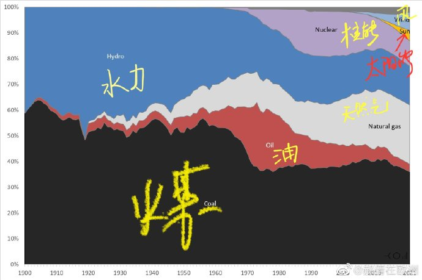
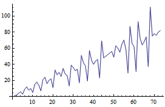

啰里啰唆周刊第54期：故穿庭树作飞花

# 科技日常

## 1. Musify-安卓上的Youtube音乐下载和播放软件
Musify 用于从Youtube下载音乐，无需登录，支持在线歌曲搜索和Top歌单浏览和下载。无广告，无订阅收费，支持中文界面。体积25M。


主打英文歌单，但是也支持中文歌曲搜索下载，可以把自己喜欢的歌曲加入个人歌单。Youtube的音乐是比较全的，不用担心搜不到中文歌曲。但是在线下载的歌曲实际上都是m4a格式，音质不高。但其主要优势还是能播搜到各种英文歌曲和一些在中国被封禁的歌曲且不用忍受广告。一般认为，256kbps的aac编码不输给320kbps的mp3编码。

> Does the app really support FLAC?
No, there are just added various file extensions for supporting different devices, the quality is the same.

也就是说，设置里虽然可以设置多种格式，m4a/mp3/flac，但实际上只是改了个后缀，作者在github上的[issue](https://github.com/gokadzev/Musify/issues/83)上有解释：

> Here is the problem, since we use youtube as provider service, it gives as audio with m4a format originally and there's not any flutter plugin which can edit m4a meta tags. We just change its extension to mp3/flac, that's why available plugins gives me error that it's not mp3. It needs to be converted with ffmpeg or something, but another problem: ffmpeg needs api version 24 (Android 7.0) and it will slow down the download process. Currently I prefer to remain everything the same, as it is.

自然，该app需要连接到国际互联网才能正常使用。如果想要下载国内网易云和QQ音乐的歌曲，那就有太多软件了，不过大多有广告或需要订阅，这里就不做介绍了。
移动的超级 SIM 卡
官网：[https://gokadzev.github.io/Musify/](https://gokadzev.github.io/Musify/)

## 2. 移动的超级 SIM 卡
我的 OnePlus 8 原本是Color OS 13系统，功能丰富，广告也多，动辄更新就给我新安装不可卸载软件，于是用了两年后就刷了原生 ROM ，于是也就失去了OnePlus 自带的门禁卡和公交卡。在不Root的前提下，要实现模拟NFC，通常只有写实体NFC贴纸的方案或者佩戴支持NFC的手表/手环。  超级 SIM 卡不是新技术，而是10年前的古老技术了，虽然市场反馈不佳，但也算是原生系统的一个补充方案。不需要的人有不需要的理由，需要的人有需要的理由。

其尺寸与传统 SIM 卡没有区别，但拥有了刷公交地铁、小区门禁、开通银行 SIM 卡盾（支持浦发与中国银行）的功能，但这些功能，均需要安卓手机同样支持 NFC 才能实现。还有另外一种超级 sim 卡，是紫光开发的带TF卡功能的，不过没有在市场推广开，已被淘汰。

在中国移动App上办理的超级SIM卡补换方案，不到3天就到货了。充值和写卡需要通过移动的一个叫“和包”的 APP 。（充值可以用话费） 写完卡以后就跟普通 NFC 的刷卡没什么区别了，而且“和包”APP 也不要常驻后台。 

一些注意事项：
1.需要手机本身支持NFC功能。
2.必须是安卓手机。IOS手机不开放NFC。
3.一张超级SIM卡支持模拟最多10张门禁卡，比手机自带的钱包支持要多（5张）。
4.仅支持在手机归属地开通公交卡，外地卡不能办理本地公交卡。
5.不能根据地理位置自动切换门禁卡，需要手动切换（其实国内手机自带钱包这个功能很鸡肋，譬如OnePlus钱包支持自动切换，但经常出错导致所有NFC都无法使用）。
6.双卡手机必须装在卡槽1.

吐槽：
“和包”估计是我见过最烂的APP了，体验就两个字，卡慢。。好在刷门禁不需要打开APP，用快捷方式即可。**忍受一坨可以卸载的屎总比忍受一个粪坑要好。**

总结：
给原生系统或非大陆版ROM等没法刷公交、门禁，但是支持 nfc-sim 的手机用。

> 为什么非官刷会丢失NFC模拟功能？
NFC有三大功能，读写存。NFC硬件不会因为刷机丢失，即读写依然正常，但是模拟NFC功能（存）会丢失。因为从NFC实体卡读取来的卡号，也就是模拟的关键，被存储在加密分区，必须使用手机官方钱包和账号登录才能解密。上述为我自己的理解，如有误还望纠正。

ref:[https://www.ifanr.com/app/1440352](https://www.ifanr.com/app/1440352)

## 3.memos-开源自托管的 flomo 替代

**memos** 是「一个具有知识管理和社交网络的开源、自我托管的备忘录中心」。这是一个类似私人微博的产品，支持标签、过滤、搜索、多账户，可以自用也可以和朋友一起使用，用来碎片化的记录信息，就像 flomo 一样。

那flomo 是什么？

[**flomo**](https://flomoapp.com/) 是一款在线笔记工具，主打**无压力记笔记**，像聊天一样记录笔记，支持标签、每日回顾等功能，并且可以在微信中记录，非常灵活、快速。

memos 可以算作开源版本的 flomo，毕竟两者的界面太像了。


主要特征：

- 🦄 开源且永久免费
- 🚀 使用 Docker 几秒内安装托管
- 📜 纯文本，支持 Markdown 语法
- 👥 将备忘录设为私人或公开给
- 🧑‍💻 支持 RESTful API
- 📋 使用 iframe 在其他网站上嵌入备忘录
- 🏷️ 支持标签
- 📆 GitHub 式的交互式日历视图
- ☁️ 数据库可保存至 S3 API（AWS S3、Cloudflare R2、MinIO）
- 👮 支持 SSO 登录（OAuth 2.0）
- 💾 轻松迁移和备份数据

Memos也有不少[客户端](https://memos.moe/)，支持IOS/Android，当然不要客户端也可以，memos本来页面就很简单也适配了手机，客户端相当于是个网页套壳了。

想要玩memos，你需要自行安装，门槛也不高，支持docker一键部署。

官网：[https://usememos.com/](https://usememos.com/)

## 4.FSF 公布 2022 年度自由软件奖得主
自由软件基金会 (FSF) 3月18日宣布了 2022 年自由软件奖的获奖者，该奖项每年在 FSF 的 LibrePlanet 会议上颁发。由于今年的 LibrePlanet 2023 是一场现场和在线混合会议，因此颁奖仪式以现场和虚拟方式进行。

今年的获奖者是 Eli Zaretskii、Tad (SkewedZeppelin) 和 GNU Jami。

- Eli Zaretskii（自由软件进步奖）
- Tad (SkewedZeppelin)（杰出的新自由软件贡献者）
- GNU Jami（社会福利项目）

Eli Zaretskii （Stallman 的老朋友）是 2022 年自由软件进步奖的获得者。 Zaretskii 目前是 GNU Emacs 的共同维护者，三十多年来，他一直是 Emacs 的贡献者，作为共同维护者协调 200 多个活跃贡献者的工作。

Tad（SkewedZeppelin）是[DivestOS](https://divestos.org/)系统的维护者，DivestOS 是 LineageOS 的分支，它删除了许多专有二进制文件，并将自由、安全和设备寿命作为其主要关注点。

[GNU Jami](https://jami.net/) 是一款完全去中心化和加密的视频会议工具，让全世界成千上万的人可以自由和安全地进行交流。

ref:[https://www.fsf.org/news/free-software-awards-winners-announced-eli-zaretskii-tad-skewedzeppelin-gnu-jami](https://www.fsf.org/news/free-software-awards-winners-announced-eli-zaretskii-tad-skewedzeppelin-gnu-jami)

## 5.Google 将拼多多应用标记为恶意程序
Google 周一将拼多多的多个应用标记为恶意程序，Android 手机使用的安全机制 Google Play Protect 将阻止用户安装拼多多应用，对于已经安装的应用，Google 将建议用户卸载。随后，Google 同时出于安全理由从官方应用商店 Play Store 下架了拼多多应用。在这之前，中国安全研究人员披露拼多多应用包含有恶意功能，能利用漏洞提权阻止卸载并能监视用户。拼多多尚未对此次事件发表评论。 

另外，Play市场下载的拼多多版本部分客户端出现强制升级提示而无法使用（强制升级可能违反 Google Play 规定的）。

3 月 21 日，针对有关「谷歌因拼多多存在恶意软件问题已将其下架」的报道，拼多多在电邮声明中表示谷歌的声明不具有决定性。拼多多并未对此详细说明。

[https://techcrunch.com/2023/03/20/google-flags-apps-made-by-popular-chinese-e-commerce-giant-as-malware/](https://techcrunch.com/2023/03/20/google-flags-apps-made-by-popular-chinese-e-commerce-giant-as-malware/)

## 6.谷歌Pixel手机和Windows自带截图应用存在泄露原图的漏洞
继 Google [Pixel](https://t.me/xhqcankao/4336) 截图工具之后，Twitter 用户 [David Buchanan](https://twitter.com/David3141593/status/1638222624084951040) 指出，Windows 的系统自带截图工具也存在可被还原全屏图片的问题，即snip截屏后保存截图，然后裁剪部分区域后保存同名文件，依然可能从源文件还原出整个屏幕的截图。

注：
1.指windows 自带的snip & Sketch 软件，不是print scr 快捷键截屏。
2.[https://acropalypse.app/](https://acropalypse.app/) 可以恢复使用pixel 手机截图的原图，但对于windows的截图恢复不支持。
3.聊天工具如张小龙和Tg发送图片默认会压缩原图再发送，压缩过的图片无法恢复。
# 读书与影视分享

## 1.2023奥斯卡获奖名单「最佳动画短片」：《男孩、鼹鼠、狐狸和马》 

查理·麦克西的同名绘本改编的手绘动画，关于善良、友谊、勇气和希望，通过一段辛酸而真挚的旅程，讲述了一个男孩、一只鼹鼠、一只狐狸和一匹马，四个孤独的灵魂在寻找家的过程中结伴而行，并在彼此身上找到了自己存在的意义。 英语动画片，全长32分钟，英文名《The Boy, the Mole, the Fox and the Horse》。

和《至爱梵高·星空之谜》（Loving Vincent ，2017）以手绘油画方式完成类似，本片也都是以手绘方式完成的。本动画由来自 20 多个国家/地区的 120 多人参与创作完成。和绘本一样，影片的每一个场景都得到精心设计和制作，线条详略得当、细节满满，观影时的感受就像在看绘本一样。观众观看时会发现，每个角色都有复杂的细节，纹理细致入微，十分耐看。


> 不同物种间的美好与柔软，同舟共济对抗孤独？这只是书呆子式的梦幻乌托邦。知道为何影片停留在34分钟吗？因为再过10分钟狐狸就该饿了，它会向鼹鼠露出獠牙，一切虚幻的假象都会被撕碎。

> 刚开始看的时候只觉得画风好可爱，绘本风格，鼹鼠真的是戳到萌点。但是随着对话开展，感受会越来越伤感，鼹鼠、狐狸、马一直陪在男孩儿身边，鼓励着他，陪着他找到家，我感觉鼹鼠、狐狸、马都是男孩本身，是自己内心坚强善良的一面，我有过害怕、有过善良，有过奔跑，有过飞翔，这些都是我成长的一部分，追寻梦想的路上，依靠的只有自己。

## 2.网络小说《簪中录》
虽然本周刊通常推荐的偏名著和严肃文学，但是偶尔也会推一些比较轻松，文笔尚可的网络小说和电影。

唐朝懿宗年间, 名闻天下的女探黄梓瑕,一夜之间从破案才女变为毒杀全家的凶手，成为海捕文书上各地捉拿的通缉犯。李舒白贵为皇子，却身遭“鳏残孤独废疾”的诅咒，难以脱身。皇帝指婚之时，准王妃却形迹可疑，“鳏”的诅咒应验在即。

黄梓瑕只身出逃到京城伸冤，途中阴错阳差巧遇夔王李舒白。识破黄梓瑕身份的李舒白，答应帮黄梓瑕重新彻查家中血案，作为交换，则要她以王府小宦官的身份，去调查自己身边的团团迷雾。风起春灯暗，雨过流年伤。李舒白与黄梓瑕沿着断断续续的线索，走遍九州四海。江南塞北，宫廷荒村，在各种匪夷所思的悬案尽头，真相足以倾覆整个大唐王朝…

作者侧侧轻寒，80后网络作家。

关于这本小说，可能更为人所知的吴亦凡，吴亦凡和杨紫共同出演的《青簪行》即改编自此小说。也是我早期完整看完的一本网络小说。情节紧凑不拖拉，文字也较少网络小说的通病“情节牵强无脑，词汇单调，无病呻吟”。

# 图论

## 1.train


Scribbly G, a talented digital artist hailing from South Africa, has taken the webcomic world by storm with his unique and humorous illustrations. He has been sharing his art on his social media profiles for quite a bit of time now, and he has already established himself as a favorite among South African audiences and people all around the world.


ref:[https://www.instagram.com/scribbly_g/](https://www.instagram.com/scribbly_g/)

## 2.人类近代121年发电史：1900-2021，我们都在拿什么发电 



图片来源见水印。

# 谈天说地

## 1.What Makes Us Bold
> 寄生虫感染可以造就狼群中的领导者或死狼.

Among the forests of Yellowstone National Park, some wolf packs share their territory with cougars. Generally, the two species leave each other alone, although wolves may occasionally run a cougar up a tree and steal its kill—or poke around its feces, which the felines use to mark their territory.

Whether from this scat or the water contaminated with it, some wolves manage to pick up a strange feline parasite. This parasite, Toxoplasma gondii, doesn’t make the wolves ill, but it does change their behavior, making many of them bolder and more inclined to take risks—for better or for worse.

ref:[https://nautil.us/what-makes-us-bold-264300/](https://nautil.us/what-makes-us-bold-264300/)

## 2.从第一性原理开始，了解归纳与演绎的前世今生
如果你是某家汽车企业的 CEO，作为一家新兴的电动汽车企业，你需要让汽车足够便宜，才能在残酷的市场竞争中存活下来。

但是你发现，汽车中电池包的价格非常高，且很难降低下来，你会怎么做呢？

- 系统设计负责人说：想办法改善汽车电池管理系统的效率，用更少的电池保持续航；
- 产品设计负责人说：砍掉一些不重要的功能，为汽车减重，用更少的电池保持续航；
- 市场负责人说：我们不把电池卖给顾客，而是采取换电的方式，租给他们，这样单车的价格就降低了。

这几个方案都有一定的可行性，但作为 CEO，你必须要想明白哪一个才是最好的方式？
特斯拉的 CEO 埃隆马斯克面对上述问题的时候，他并没有在几个方案中选择，而是用第一性原理的思维重新思考了「电池价格很贵」的问题。

「第一性原理」并不是新造出来的「黑话」，而是古希腊哲学家亚里士多德在《形而上学》一书中提出的：

>     In every systematic inquiry (methodos) where there are first principles, or causes, or elements, knowledge and science result from acquiring knowledge of these; for we think we know something just in case we acquire knowledge of the primary causes, the primary first principles, all the way to the elements.
每个系统中都存在第一性原理，它的存在是最基本的命题和假设，不能被省略，也不能被违反。

ref:[https://sspai.com/post/78279](https://sspai.com/post/78279)

## 3.心电图数列

心电图数列 (EKG Sequence) 的定义简单而有趣：第一项为 1 ，第二项为 2 ，以后的每一项都是最小的和前一项不互质并且不曾出现过的数。换句话说，数列 a(1)=1 ， a(2)=2 ，且当 n>2 时取 a(n) 为所有满足以下两个条件的数中最小的那一个：该数与 a(n-1) 有大于 1 的公约数，并且该数与前面 n-1 项都不相等。心电图数列的前面 20 项为
```bash
1, 2, 4, 6, 3, 9, 12, 8, 10, 5, 15, 18, 14, 7, 21, 24, 16, 20, 22, 11 ...
```
为什么它叫做心电图数列呢？原因很简单——因为把它描绘在图象上时，看上去像一张心电图。


心电图数列有很多有趣的性质。例如，考虑某个素数 p ，如果数列中第一个能被 p 整除的数是 t·p ，那么 t 一定就是前一项的因子了。由于 t·p 满足最小性，因此我们可以进一步得出， t 是 t·p 前一项的最小素因子。

心电图数列有一个很漂亮的数学事实：所有的自然数都出现在了这个数列中。

> 作者是北大中文系的一位数学大佬，matrix67这个博客是个比较知名的数学博客。

[https://www.matrix67.com/blog/archives/2839](https://www.matrix67.com/blog/archives/2839)

## 4.臭菜
在云南，有一种野菜，叫“臭菜”。
这和浙江一带的臭菜不一样，不是经过特殊的制作方法处理以后才变臭的食物。浙江臭菜是用臭卤坛浸泡过的发臭的苋菜梗，而云南臭菜是天生的。东北也有一种叫臭菜的植物，实际上是芝麻菜的俗称，芝麻菜本身并不算臭。

而云南的臭菜学名叫羽叶金合欢，浑身长刺，是一种多年生的攀援木质藤本植物，在当地一般叫它蛇藤、南蛇梗、南蛇筋藤等，特别是对臭菜爱不释手的云南傣族人，给它取了一个专属的名字——“葩哈”或者“帕拉”。食用部分为它的嫩芽嫩叶，采收食用时可闻到一种特殊的臭味。这种臭味其实也是一种独特的臭，不是腐臭的那种味，喜欢的觉得是清香味，不喜的人觉得是刺鼻臭味。


臭菜这种植物在我国南方分布较广，在四川、云南、广西和福建等省份都有，但食用地区主要在云南西双版纳和昆明一带。臭菜的臭就和榴莲一样，都是与生俱来的。这是因为它的茎叶中含有大量的气味浓烈的挥发性的油。

当然，臭菜虽然闻起来臭，但是吃起来却很香，这种野菜非常的奇怪，只要煮熟了以后，不仅闻不到一点臭味，反而鲜美可口，回味无穷，关键是还非常下饭。其吃法也很简单，跟香椿一样即可。一个香椿，一个臭菜，吃法基本一样。很多不认识的人，也会把臭菜跟香椿混淆。臭菜煮番茄、臭菜煮苦笋、臭菜煎鸡蛋、臭菜煮鱼是最常见的烹调方式。

> 前几日刚在北方吃了春天的第一把香椿

酸甜苦辣皆是味道，南方很多地区偏爱苦味和臭味，并不离奇。
# 一句话快讯

1.美国前总统特朗普表示，他认为自己将在周二（3月21日）被捕，并呼吁支持者举行抗议活动。

2.路透社3月17日消息，一份名单显示，包括SpaceX、Netflix和波音在内的50多家国防、制药和科技等领域企业将参加由美国-东盟商务委员会组织的代表团，计划下周访问越南，探讨在该国的投资与销售机遇。

3.3月19日，中非瓦卡省的钦博洛金矿被袭击，9名中国人被杀，2人受伤 。

4.国际知名民调机构益普索集团(Ipsos)发布了一份有关全球幸福指数的调查报告，结果显示，在32个国家中，幸福感指数最高的国家是中国(91%)，其后是沙特阿拉伯(86%)和荷兰(85%)。 

5.东航MU5735 132人遇难坠机事故一周年调查进展公布，无进展。

# 联系方式

啰里啰唆是一份针对互联网和生活爱好者的数字杂志，旨在发现和分享一切有趣的东西。话题不固定，每期大约十五分钟阅读量，暂定每周四发布。部分内容来自互联网采编，如果为有来源的转载，均会注明转载地址或保留水印。

这是一个关注人文和科技的newsletter。

使用方法建议或素材提供

tg频道：notonlyshare

邮箱：auokyob@outlook.com

github地址：[https://github.com/iminto/luoliluosuo-weekly](https://github.com/iminto/luoliluosuo-weekly)