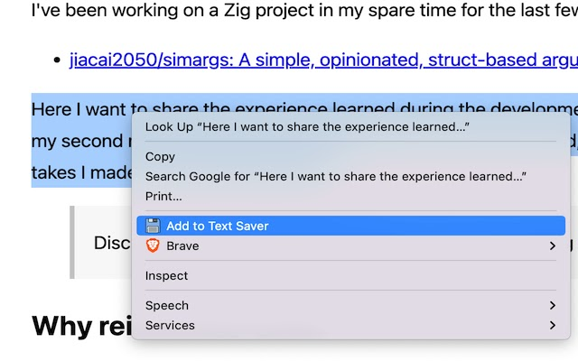
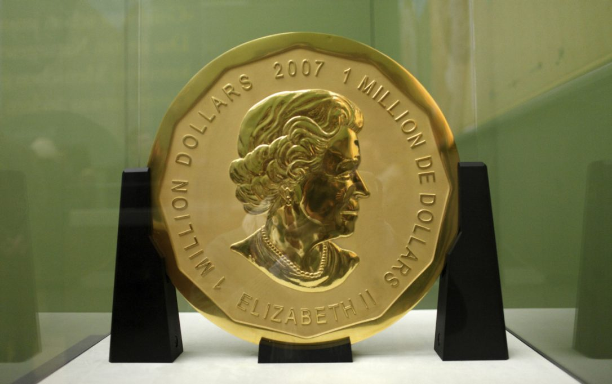
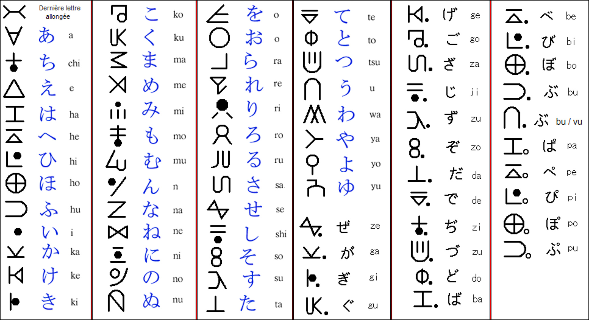
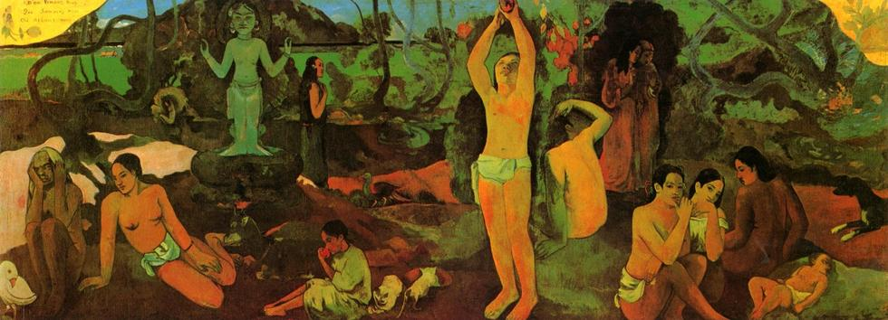
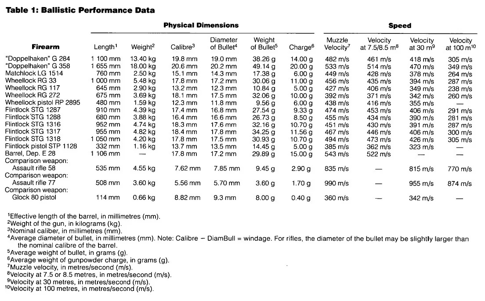

啰里啰唆周刊第55期：当你梦到了太多阳光，就会忘了树

# 科技日常

## 1. Iceraven-隐私友好的Android手机端浏览器

Iceraven Browser is a web browser for Android, based on Mozilla's Fenix version of Firefox, GeckoView and Mozilla Android Components.

特性：
1.支持安装扩展（Firefox Release版不支持安装扩展，需要nightly版才支持）。
2.支持about:config选项以修改浏览器底层配置。
3.相比Fennec等其它第三方Firefox fork，对网页和视频兼容性更佳。

**强烈建议不要使用Firefox 中国官方版浏览器**

[https://github.com/fork-maintainers/iceraven-browser](https://github.com/fork-maintainers/iceraven-browser)

## 2.Neo-Store 一个比F-Droid资源更丰富的FOSS仓库

Neo Store是一个F-Droid客户端，但是比F-Droid拥有更多的仓库。比如支持[IzzyOnDroid](https://android.izzysoft.de/intro.php)和KDE仓库。如果不是Neo Store，我还不知道KDE居然也有这么多安卓App。常用软件如播客，music播放器，Todo软件，阅读器、IM等，KDE都有对应的PC端和Android端。部分基于KDE框架开发的App列表可以在此找到：[https://plasma-mobile.org/zh-cn/](https://plasma-mobile.org/zh-cn/)

[https://github.com/NeoApplications/Neo-Store](https://github.com/NeoApplications/Neo-Store)
## 3. HTTP 和 HTTPS 能同时使用同一个端口吗

通常我们都说，一个端口只能被一个进程绑定，如果另一个进程要绑定就会提示“ Address already in use:bind”,但是一个端口只能绑定一个进程，并不意味着一个端口只能提供一种服务/协议。

HTTP和 HTTPS开在同一个端口，其实原理很简单，就是在一个进程里解析协议，根据协议来走不同的服务。比如套个 haproxy 这种四层代理来做端口复用。对于很多web服务器，天然地同时支持HTTP和websocket协议，这也是一个端口使用多种协议的代表。理论上，你甚至可以在一个端口实现 http https mysql 等等，可以直接识别协议头进行转发。

ref:
[Nginx 如何把 HTTP 和 HTTPS 开在同一个端口？](https://v2ex.com/t/894781)
[WebSocket是如何与HTTP共存80端口的?](https://mp.weixin.qq.com/s/pSg7gl0VMuyIr1MstBxJYg)

## 4.开源认证和访问控制的利器Keycloak
Keycloak provides user federation, strong authentication, user management, fine-grained authorization, and more. 

Keycloak是一个开源的进行身份认证和访问控制的软件。是由Red Hat基金会开发的，支持标准的OpenID Connect, OAuth 2.0 and SAML 2.0协议。我们可以使用keycloak方便的向应用程序和安全服务添加身份认证，非常的方便。
Keycloak还支持一些高级的特性，比如身份代理，社交登录等等。

最新版本21.0.1，基于 Quarkus 开发。如果你的开发环境无法升级Java版本，可以选用早期的版本（V17），早期版本基于WildFly框架+Java 8。
> In Keycloak 17.0.0 the new Quarkus based distribution of Keycloak, while the WildFly based distribution was deprecated. With this release the WildFly distribution has been removed, and is no longer supported.

Quarkus定位是轻量级的微服务框架,基于GraalVM，实现native-image的打包方式。

如果要使用早期的CAS协议，则可以参考[apereo CAS](https://apereo.org)项目。当然Apereo CAS项目同样支持OAuth 2.0 and SAML 2.0等协议。相比而言，Apereo CAS使用更简单，网上能找到的资料较多，但管理功能较弱。而Keycloak功能更强大，项目较新，意味着可以借鉴的案例不多。

[https://www.keycloak.org/](https://www.keycloak.org/)

## 5.可编程智能手表T-Watch-2020
T-Watch 可编程智能手表是深圳芯元电子最新推出的一款自主开发产品。

它不是一个消费类的手表，待机时间短（默认程序待机不到1天），需要二次开发，比手环贵，不防水。其实它是一块ESP32开发板（240 MHz 主频双核处理器+Wi-Fi+蓝牙的soc）+触摸屏+电源模块（350mA电池）+三轴加速度传感器+RTC时钟+震动马达+扬声器+红外信号发生器+表壳表带（作为开发板它是很值得的）+外置falsh（16MB）+PSRAM（8MB），才160多人民币！要玩转这块手表，需要一定的ESP/Arduino/Python开发经验和动手能力。

T-Watch-2020能做什么？

- 智能手表
- MP3
- 遥控器，智能家居（蓝牙，Wi-Fi和红外线）
- 计步（运动类应用）
- 游戏

官方已经发布了最新的[T-Watch-2021](https://github.com/Xinyuan-LilyGO/T-Watch-2021)的设计图和源文件。

购买途径：淘宝或拼多多。

官网:[http://www.lilygo.cn/](http://www.lilygo.cn/)

类似产品：[墨水屏Watchy](https://watchy.sqfmi.com/)，如果硬件动手能力不足又想尽量DIY智能手表，可以尝试下华米手表，华米相对其它国内智能手表较开发，可以以个人身份上传第三方apk文件。

## 6.Text Saver-随时随地保存文本的浏览器扩展
选中网页中的文字，右键add to text saver 随时随地保存文本，数据存储在本地，支持导出数据与copy文字。
支持chrome/edge/firefox 浏览器。

[https://github.com/jiacai2050/text-saver](https://github.com/jiacai2050/text-saver)

## 7.eSim.me-eSIM卡容器
国行版手机不支持eSIM，如果你想要使用eSIM功能，只能购买海外版手机。而eSim.me是这么一种解决方案，它是一个可以容纳多个 eSIM profiles 的物理 SIM ，可以让原本不支持eSIM的手机支持eSIM。一张卡可以添加10个 eSIM 号码。

把这张物理SIM卡插入不支持eSim的手机，然后下载一个app，即可使用eSIM功能了。最低30欧（邮费另付）一张，可存5个号码。

> 另有一种技术叫无卡技术叫iSim，这是高通在2022年搞出来的一套SIM无卡方案，芯片体积小（1平方毫米），比eSIM(2.4mm x 2.6 mm)还要袖珍许多，耗电更少。

[https://esim.me/](https://esim.me/)
[esim.me “反向” eSim卡评测](https://unique-ptr.com/archives/225)

## 8.小米Redmi Note 12 Turbo开启预售
3月28日消息，昨天小米官方正式发布了Redmi Note 12 Turbo新机，现已开启预售，首发1999元。这款手机被小米官方称为性能小金刚，全球首发二代骁龙7 ，性能强劲，3月31日10点首卖，首销用户送一年碎屏保。

机身采用超细四窄边，无屏幕支架设计，厚度仅为7.9mm，重量为181g。屏幕采用6.67英寸类钻屏，采用中置挖孔屏设计，2400*1080分辨率、93.4%屏占比、120Hz刷新率、相机方面，采用三摄设计，6400万像素主摄，搭载 OIS 光学防抖，支持 In-Sensor Zoom、小米影像大脑 2.0、film（Camera）胶片相机。

16G+1TB最高配置仅2599。
# 读书与影视分享

## 1.2013年电影《雪国列车》
《雪国列车》改编自获得1986年昂格莱姆国际漫画节大奖的法国同名科幻漫画原著《Transperceneige》，由韩国著名导演奉俊昊执导，片长125分钟。

故事讲述2031年，人类试图阻止全球变暖的实验失败，极寒造成地球上绝大部分生命死亡。在冰河灾难中幸存下来的所有人登上了一辆如同诺亚方舟的列车，列车依靠永动机绕着地球不停行驶。作为地球上最后幸存的人们，“雪国列车”成为了他们最后的归宿、最后的信仰也是最后的牢笼。生活在末尾车厢的底层人民一直饱受压迫，为了争取自由和权力，他们在过去发起过多次暴动，但无疑例外均以失败告终。这一次，拥有领袖气质的柯蒂斯试图找到被囚禁的安保设计师南宫民秀，借助他之手打开通往首节车厢的重重大门，推翻威尔福德的统治。

> 片子不很血腥，却建立在黑色压抑、灭绝人性至绝望的背景下，寒意来自想象空间。这是人类的寓言，关于革命与阶级，甚至搞出些圣经启示录之类的感觉。影片野心太大，电影多少有些承担不了，只能草草收场，靠几段独白讲出核心。

> 相当精彩，看似过关战将的模式，内容极为丰富与深刻。一辆列车封闭的小社会、完整的生态系统，人类善恶美丑，贫富贵贱包罗万象。后工业时代质感，蒸汽朋克、反乌托邦精神内核，到头来却发现是上帝与魔鬼的契约。整体震撼，结尾稍显弱，是奉俊昊的妥协，假如让队长最终登顶进入死循环是极佳的政治寓言
## 2.悬疑小说《周四推理俱乐部》
英国乡间高档养老社区里，前特工伊丽莎白拒绝“穿着纸尿裤，坐在轮椅上变老”，她联络同住在这里的推理迷护士乔伊丝、工人罗恩、心理医生易卜拉欣，组成了“周四推理俱乐部”，每周四聚会，研究警方多年未破的悬案、疑案。
没想到，身边真的发生了连环命案。社区的建筑商被人袭击而亡；头号嫌疑人突然倒地而死；墓园里挖出了50年前的无名白骨……案情越来越复杂。

四位平均年龄77.5岁的“安乐椅神探”，各显神通：伊丽莎白用特工技能挖出关键线索；罗恩在不断否定中，先警察一步筛选出嫌疑人；易卜拉欣和乔伊丝用专业的敏锐性，寻找案件的突破口。
真凶到底是谁？这部新式推理小说（Cozy Mystery）带领读者在破解罪案的同时，抚慰心灵，寻找人生的极乐与极智。

作者 理查德·奥斯曼 ，英国电视名人，除了主持超人气节目，还身兼导演、制片人和喜剧演员数职，但他的终极梦想是当一名作家。奥斯曼中年开始写作，处女作《周四推理俱乐部》助他一举拿下英国国家图书奖（British Book Awards)2021年度最佳作家奖。

> 算是对马普尔小姐和大侦探波罗的致敬吧，浓浓的英式晚年风。阅读体验就像听老奶奶讲故事一样，开始可能有些拖沓啰嗦不得要领，但是当往事一一呈现，总有打动你的千回百转。

## 3.纪录片《这货哪来的》
一部关于中国小商品和小生意人们的纪录片《这货哪来的》，自 2 月 22 日播出后口碑出圈，成为 2023 年 B 站第一部高分纪录片。这部纪录片共六集，每周三晚八点播出。

由淘宝和方寸印象出品的《这货哪来的》，通过多位小卖家的生活故事，展现本土制造背后的视觉奇观、百态人物、千奇门道、万般交情，比如一闪而过的手机壳、假发、不锈钢雕塑、鱼缸造景、殡葬用品…… 总导演陈英杰将这些小卖家和小商品形容为 “大国制造的毛细血管”：他们看起来不起眼，却是承载我们生活的浮萍。

在豆瓣评论中，有观众将这部纪录片称为 “诗意版 made in China”。

Bilibili网可观看。
# 图论

## 1.Why feel bad

Life can be tough, and I have certainly never felt like the lucky one. Despite my doubts about the awesomeness of life, I have found a way to infuse joy into this boring existence: I draw comics and share them with others. With comics, even a breakup can become a joke, and a lost job can be a source of laughter. Since life already sucks, why not create a world that makes everyone laugh and allows them to escape this f**king world?

ref:[https://www.instagram.com/miss.w.diary/](https://www.instagram.com/miss.w.diary/)。

## 2.Big Maple Leaf

大枫叶（BML）是一种价值100万加元（CAD）的金币，重100公斤（220磅）（3，215金衡盎司）。2007年，加拿大皇家铸币局（RCM）在渥太华工厂生产了一套6枚 硬币，第一枚BML硬币仍在储存中。截至2017年3月 ，单个Big Maple Leaf的市场价值已达到约400万美元。2017年3月27日，其中一枚硬币在柏林博物馆被盗。

大枫叶厚度为2.8厘米，直径为50厘米，纯度为999.99/1000。

直到2011年，大枫叶一直是有史以来最大的金币，直到铸1吨（1000公斤）的澳大利亚金块（“金袋鼠”）的出现。

[https://en.wikipedia.org/wiki/Big_Maple_Leaf](https://en.wikipedia.org/wiki/Big_Maple_Leaf)
[The Big Coin Heist](https://hazlitt.net/longreads/big-coin-heist)
# 谈天说地

## 1.Inside the Dissident Fringe

> 末日论者、技术人员、嬉皮士和雅皮士正在向美国西部汇聚，这是“退出”一个失控社会的最安全的地方。

It was a clear morning in the Tetons, and with binoculars it was possible to see all the way across the valley known, since prehistory, as one of the most secure and comfortable little basins in all of the Mountain West—named, for one of the first white trappers to winter there, Jackson’s Hole. The landscape may have looked like wilderness to the caravanning tourists in $200,000 Sprinter vans and thousands more in athleisure who now flood Teton County year-round. But it is also a kind of hyperreality of money—tens of thousands of acres and hundreds of millions of dollars worth of conservation easements—in what may be the world’s most unequal political jurisdiction. Above the ospreys and eagles, there was a constant traffic of small jets and private aircraft, humming into and out of a town that has become a modern refuge for people with remote jobs and portfolios fattened by one of history’s great asset bubbles, many of them driven to the Northern Rockies by a worry or wariness that the rest of America is on its way toward environmental, political, or economic breakdown. Or some combination of the above.

[https://www.vanityfair.com/news/2023/02/new-right-civil-war](https://www.vanityfair.com/news/2023/02/new-right-civil-war)

## 2.从虚构世界的文字说起
虚构世界（fictional universe，也称 “架空世界”）是电影和游戏等作品中的常设舞台。让故事发生的背景脱离现实而存在，能够最大限度地减轻束缚、解放创造力。基于小说改编的美剧《权力的游戏》（Game of Thrones，2011– ）就是虚构世界作品的典型例子。

但与此同时，完全创作一个新世界所需的设定（setting）工作量也会非常可观。从自然地理到历史文化，这个世界中的方方面面都需要有所考虑，这样得到的结果才能够令人信服——那么，对于大多数世界设定而言，“居民们使用怎样的文字” 也是一个难以回避的问题。 

[https://3type.cn/3typezine/typebites/01.html](https://3type.cn/3typezine/typebites/01.html)

## 3.城堡里的马原
城堡的主人老了。大部分时间，作家马原只能躺卧。半躺在客厅向外望，他看不到城堡最醒目的那座四层红色圆形砖楼，它就矗立在西双版纳姑娘寨高处，像是旧日土司的碉楼。

这座占地超过2000平方米的城堡中，马原日常起居在一座八角楼里。楼是三层，一楼的70多平方米没有隔断，全做了客厅，大幅玻璃窗一扇扇展开，下正上尖，像童话里的式样。站在室外，西双版纳2月的阳光很温煦，让人觉得这间拥有7扇窗、360度视野的客厅明亮通透。这也是主人的设计初衷。
...
这似乎是一个完美桃花源的故事：作家归隐山水间，建起自己的城堡，过着贴近自然和诗意的日子。他的身体得以恢复，迎来一生中第二个创作高产期。爱人相伴，孩子在优美的环境里生长。九路马堡，是都市人向往的理想生活的标本，也是一位以奇崛、浪漫风格著称的作家的精神外显。媒体纷至沓来，先锋作家马原借抗癌和隐居的双重光环，重回了文学和大众视野。

但事后看来，有些隐隐的不安藏在这浪漫动人的故事背后。2022年6月1日，儿童节当天，13岁的马格猝然离世。一周后，马原在自己的朋友圈公布了这个不幸的消息，措辞是：「马格没出任何意外，没有任何痛苦。是上天突然接走他。」

这篇文章和故事的主人争议很多。

> 茨威格死于昨日世界:这种关上门做皇帝的疯逼还高高兴兴出来接受采访，说明他疯完全没有意识到自己有什么问题，但你说他疯吧，他还每天给自己测血糖，儿子死了就死了，他可是要惜命。 

> 闫红erlintu:人物那篇文章，我没有觉得有问题，那种笔法制造的效果就是，哪怕对你保持足够的善意，顺着你说，也是完全不行的。
人物的写作手法一向很高级，比破口大骂更能让人感同身受。写小花想出家那段我看哭了，她说自己就是个普通女人，我感觉意思是她理解不了马原若无其事的“大宇宙观”，只是凭着母性本能，感觉熬不下去了。太痛苦了。
文中写到孩子想上学也让人心疼死了，那么短暂的人生，也没能按照自己的心意生活 

ref:[https://mp.weixin.qq.com/s/LUPFKUrqd3KWAk1eB2uGaQ](https://mp.weixin.qq.com/s/LUPFKUrqd3KWAk1eB2uGaQ)

## 4.村里的疯女人
小学三四年级的时候，村里来了个疯女人住在了废弃的窑洞旁的一间破屋，村里人都叫她“疯精美”。

年纪还小的我们，即不知道她是谁，也不知道她来自哪，为何到了我们村。我们只知道她有时候会去捡垃圾卖，也捞街上的泔水桶吃。那时我们都很怕她，单独一个人都不敢接近她，只有三四个人一起的时候，才敢去破屋里围观。屋子很破很矮很黑，里面就一张床，几个瓦罐和一带粮食。

过了三四年，搬来了一个疯男人跟她住一起。没过多久，听人说疯精美养了一个小孩，我们都猜测，疯子肯定不会生娃，肯定是哪里捡来的，兴冲冲地跑去看热闹。两个疯子抱着一个小孩在屋前玩耍，小孩看着就满月的样子，很虚弱，脸很黄，疯女人把不知从哪里捡来的月饼嚼碎了喂她。村子里大人都唏嘘，可怜的孩子，落在了她的手里，肯定养不活。

窑洞附近有几个水塘，有深有浅，浅的不到一米，深的有七八米，都是很多年前挖土烧窑留下的。塘里鱼很多，富裕点的村民还会把病死的猪和鸡扔到塘里。自从有了小孩后，疯女人从池塘里捞死猪死鸡越发频繁了，有一两次去，看见她把死去的小猪捞出来，胡乱切了几块扔在锅里煮，锅里飘着肉香。

谁也没料到，两年后，小女孩已经能脏兮兮地跟在疯女人身后在村子里转悠了，只是疯男人不知道去了哪。再后来，上了高中，就很少去了那，再后来村子里就再没提过这个疯女人，有人说小孩养死了，也有人说，不仅小孩死了，疯女人也死了。

19年回到老家，村子已被推土机推成一片废墟。这时我才发现，村子好小。小时候分明觉得很遥远的窑洞，每去一次都要翻过田埂，绕过茅厕和水田，其实和村中心的直线距离不到150米。当年的窑洞和水池早在多年前都已被填满，盖上了小别墅，只是被破旧的瓦房，杂草和大树挡住了才不是那么起眼。村子的四周，不知不觉都被小别墅围住了，村子真的好小，方圆不到500米。

这也让我想起**我们从哪里来？我们是谁？我们到哪里去？** 这句话。

这不是一个网络梗，这是高更的一幅名画。《我们从哪里来？我们是谁？我们到哪里去？》是高更所创作的最大的一幅油画，创作于1898年上半年，尺寸为139.1cm*374.6cm，这幅巨大的油画，不仅被高更自己认为是一幅空前绝后、艺术创作登峰造极的作品，而且还是向世人表现艺术家高更个人内心思想、精神世界、艺术理念，以及对世界对生命本身的沉思和哲学认知的一个最佳的窗口。

高更于1895年9月第二次为了追求艺术灵感而自我放逐来到南太平洋的塔希提岛，时年47岁。当时高更的处境非常不乐观，作品没有销路、贫穷、脚踝骨折、心脏病、酗酒成性，而且还患上当时很流行的一种病：梅毒。1896年底，高更被一位相恋的土著女子抛弃后，跟他另一个土著模特兼伴侣（14岁左右的帕胡拉）生育的一个女儿不久便不幸夭折了。1897年1月19日，高更最宠爱的女儿艾琳因肺炎去世，终年20岁。他5月份从妻子梅特那里得知消息后，一下子整个人生跌入谷底，身体和精神都被打击到崩溃的地步。就是在这样的背景下，高更完成了《我们从哪里来？我们是谁？我们到哪里去？》这幅画。

毛姆的《月亮与六便士》一书即于高更有关。

> 由马原把13岁小孩养死的故事想起。

## 5.早期火器威力究竟如何？35年前的这项实验告诉你答案
1988年，奥地利施蒂利亚州格拉茨市的施蒂利亚州军火库（本身是施蒂利亚州博物馆下属的一个军事主题馆）馆长Peter Krenn和奥地利军方人员Paul Kalaus、多伦多大学的Bert Hall进行了一项比较实验，来测试19世纪中期（也就是火枪性能成为学科之前）前的火枪相比后代的枪械性能如何。这项实验的参与者从格拉茨的军火库（藏有超过7800把手枪和步枪）选择了最具有代表性的16个样品，并且额外选择了3个对比例，在排除了一切人工因素的环境下，进行了非常著名的一次火枪性能测试。

选取的16个样品从横向和纵向涵盖了16-18世纪不同种类的枪械，同时这些枪械均为有大量生产的型号，可以被认为代表当时的平均水平。其中有2个样品被认为金属结构存在缺陷，因此在开火时有出现意外的风险而被放弃，剩余的14个样品进行了325次射击试验，由奥地利军方主持，所有的射击均在可控条件下进行。

文章主要翻译自 [Material Culture and Military History:Test-Firing Early Modern Small Arms](https://journals.lib.unb.ca/index.php/MCR/article/view/17669/22312)。

ref:[https://www.gcores.com/articles/163899](https://www.gcores.com/articles/163899)
# 一句话快讯

1.Valve 正式宣布它最受欢迎的团队竞技游戏《反恐精英》系列的最新版本将在夏天发布，从今天开始封闭测试。《反恐精英2》将取代《反恐精英：全球攻势（CSGO）》，游戏将免费升级。

2.美国移民局3月22日在推特上表示，美国将允许持旅游或商务签证前往该国的个人申请新工作，甚至接受面试。

3.2023年3月21号财政部决定，发行2023年记账式附息（七期）国债（50年期），是继英、法之后，第三个发行50年期国债的国家。

4.中国大陆与洪都拉斯建立外交关系。

5.此前外媒传闻马云拒绝回国，但据悉，27日马云突然现身杭州。

6.3月27日，美国商品期货交易委员会（CFTC）起诉全球最大加密货币交易所币安及其CEO赵长鹏涉嫌违反监管措施。

7.美国国会众议院于当地时间27日以415票支持0票反对的结果，通过了一项旨在剥夺中国“发展中国家”地位的立法草案。

# 联系方式

啰里啰唆是一份针对互联网和生活爱好者的数字杂志，旨在发现和分享一切有趣的东西。话题不固定，每期大约十五分钟阅读量，暂定每周四发布。部分内容来自互联网采编，如果为有来源的转载，均会注明转载地址或保留水印。

这是一个关注人文和科技的newsletter。

使用方法建议或素材提供

频道：notonlyshare

邮箱：auokyob@outlook.com

github地址：[https://github.com/iminto/luoliluosuo-weekly](https://github.com/iminto/luoliluosuo-weekly)
