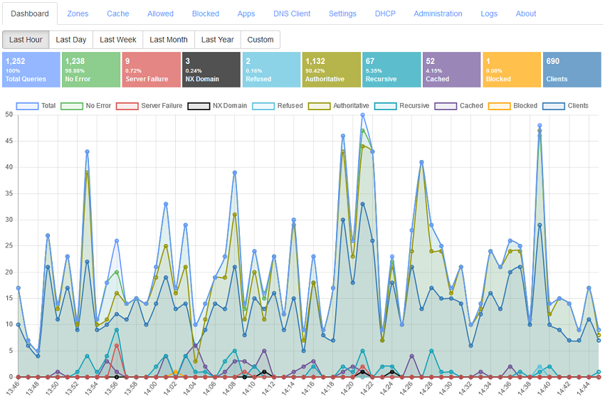

啰里啰唆周刊第56期：走马川行雪海边

# 科技日常

## 1. Android without Google: Shiftphones

对Shiftphones的一篇介绍。

和[Fairphone](https://www.fairphone.com/)一样，Shiftphones是一款模块化设备，易于维修。带有自己的 Android 版本，称为 ShiftOS-G 并已通过 Google 认证，预装了Mini Gapp(谷歌对认证设备要求必须安装谷歌框架)，也可以刷官方ROM去掉谷歌依赖，某些型号也支持LineageOS。

GApps 各版本差异可参考此处：[https://github.com/opengapps/opengapps/wiki](https://github.com/opengapps/opengapps/wiki)
总体来说就是分为pico、nano、micro、mini、full、stock、super，aroma版本，通常最小可用是micro，到了stock就可以算是谷歌全家桶了。

[https://android.izzysoft.de/articles/named/android-without-google-8](https://android.izzysoft.de/articles/named/android-without-google-8)

## 2. 一文说清linux system load 

很多程序员和运维都知道load这个概念，load越小越好，最大不超过系统核心数，但再多就不清楚了。

这篇文章讲的比较透，load值从哪来，怎么排查load异常飙升都说的很详细。

[https://mp.weixin.qq.com/s/DQrsdroZUAFvtZ9bdPiPTA](https://mp.weixin.qq.com/s/DQrsdroZUAFvtZ9bdPiPTA)

## 3.dragonfly-取代 Redis 而生的内存数据库
一款为取代 Redis 而生的内存数据库，作者是一位前谷歌、前亚马逊的工程师。它与当下最流行的两款内存数据库 Redis 和 Memcached 的 API 完全兼容，所以无需修改代码即可完成迁移。性能上更是爆炸，官方表示单实例可支持数百万量级的 QPS，而且吞吐量是 Redis 的 25 倍，并可以应对 TB 级别的内存数据集。

Dragonfly支持约185个Redis命令以及除cas之外的所有memcache命令，达到了Redis 5 API的水平。

** 注：据反馈单机版开源，集群版收费。**

[https://github.com/dragonflydb/dragonfly](https://github.com/dragonflydb/dragonfly)

## 4.llama.cpp
在笔记本上运行 LLaMA 大模型。该项目实现了在 CPU 上流畅运行 LLaMA 模型，支持 macOS、Linux、Windows 操作系统。

在PC上最低只需要4G内存，甚至可以在Android（通过termux）上运行。

[https://github.com/ggerganov/llama.cpp](https://github.com/ggerganov/llama.cpp)

## 5.DnsServer 一个开源的DNS 服务
一款适用于多平台的 DNS 服务。它开箱即用无需配置，并提供了友好的 Web 界面和监控。基于Windows上的.NET技术开发，但也支持 Docker 部署Linux、macOS 和树莓派操作系统。可以在DNS级别为您的整个网络阻止广告和恶意软件。

主要功能：
- Block ads & malware using one or more block list URLs
- Self host DNS-over-TLS, DNS-over-HTTPS, and DNS-over-QUIC DNS services on your network.
- Advanced caching with features like serve stale, prefetching and auto prefetching.
- Web console portal for easy configuration using any web browser.

[https://technitium.com/dns/](https://technitium.com/dns/)

## 6.gorss-命令行 RSS 阅读器
一款用 Go 编写的命令行 RSS 阅读器。它简单易用隐蔽性强，支持预览内容、浏览器打开链接、自定义快捷键、主题、单词高亮等功能。

一步到位，还有[carbonyl](https://github.com/fathyb/carbonyl)这个项目，这是一个运行在终端里的基于 Chromium 的命令行浏览器，可以在终端里用浏览器的方式访问网页，支持图片、动图、视频、音频等内容。
[https://github.com/Lallassu/gorss](https://github.com/Lallassu/gorss)

## 7.orbstack-macOS上的Docker和虚拟机管理工具
OrbStack 是一个可以在 macOS 上快速运行 Docker 容器，和 Linux 虚拟机的工具，资源占用率低，高带宽，速度快，采用类似WSL的设计结构。
OrbStack 主要有两个作用：替代 Docker Desktop、替代 Linux 虚拟机。

根据官网描述，OrbStack 比 Docker Desktop 启动速度快、网络快、Rosetta x86 模拟、低 CPU 占用、低电量消耗。创建Linux也只需要一分钟。

当然，OrbStack仅支持创建Linux虚拟机，不支持图形化界面和K8S等特性，更不支持Windows。

目前的OrbStack 处于测试阶段，免费。预计未来收费。

[https://orbstack.dev/](https://orbstack.dev/)

## 8.Twitter 公开推荐算法源代码
Twitter 公开了推荐算法源代码，源代码托管在 GitHub 上，采用 GNU Affero General Public License v3.0 许可证。推荐算法的一个主要目的是筛选出流行推文，利用机器学习模型进行排名，应用过滤器过滤掉 NSFW 推文和已屏蔽用户推文等，最后展示到用户的时间线。Twitter 的算法引发了用户的强烈兴趣，用户很快发现 Twitter CEO 马斯克（Elon Musk）得到了特别对待。上个月马斯克的推文曾一度展示给几乎所有 Twitter 用户。相关算法代码特别提到了 author_is_elon、author_is_power_user、author_is_democrat、author_is_republican...代码注解声称这些用户 ID 只是用于数据收集的目的。对于这一发现，马斯克本人在 Twitter 上表示将会移除，声称他也是才知道。 

[HomeTweetTypePredicates.scala#L225](https://github.com/twitter/the-algorithm/blob/7f90d0ca342b928b479b512ec51ac2c3821f5922/home-mixer/server/src/main/scala/com/twitter/home_mixer/functional_component/decorator/HomeTweetTypePredicates.scala#L225)

# 读书与影视分享

## 1.2012年电影《壁花少年》
《壁花少年》改编自同名畅销原著，由作者史蒂芬·克伯斯基自编自导，《朱诺》原班监制倾力打造，集合90后一众人气偶像，在自杀、霸凌、性向、毒品等诸多敏感争议的话题中，书写一篇献给LOSER的励志日记。
英文名《The Perks of Being a Wallflower》，英文片，全长102分钟，豆瓣评分8.0分。
查理是个害羞和孤独的高中新生，拥有超越年龄的敏感和泪腺，总是默默观察身边的家人和朋友，是个典型的「壁花少年」。他的青春期充满各种挫折，先后经历了阿姨为给他买生日礼物去世、最好朋友自杀、受同侪排挤欺负、单恋没有回应等各种事情。然而查理还不是最惨的，因为和他一样被生活逼入墙角罚站的人实在太多。他幸运的拥有一个开明的老师和两个高年级的好友：叛逆娇俏的少女珊和自信满满的同志男生帕特里克，他们让查理明白了有时候不能永远旁观，必须要参与进来才能拥有属于自己的精彩。

> 你不能只是坐在那里，把所有人的生活看得比自己的重，然后把这叫做是爱。

> 同性恋+公交车+童年性侵犯受害者+朋克佛教徒，简直一个青少年Weirdo大合集，却做得既不矫揉造作也不顾影自怜，加上洛基恐怖秀的模仿和那些老派摇滚，看着真舒坦；另外这片子摄影得记一大功：暗背景下祭出大光圈，迷幻到直接秒杀我。

## 2.《第五号屠宰场》

《第五号屠宰场》是美国作家库尔特·冯内古特1969年创作的长篇小说。该小说以二战为背景，描述一名凡人，在一天晚上，做了一个内容十分复杂多变的恶梦，梦中他经历了纳粹集中营与未来星球世界的生活，在过去和未来之间，他想到了很多的问题，并在过去和未来的世界里去找寻答案。
《第五号屠宰场》跨越时空的界限，将战争的真实与科幻的奇异交织起来，在新奇的视野中揭露真实，成为20世纪美国重要的小说之一。
《第五号屠宰场》，揭示了当人面对荒诞的死亡，人要成为“死亡”的主人这一深刻主题。“死亡”在《第五号屠宰场》中，由一种被动的悲观等待变成了一种主动的生存美学。把“死亡”看作是重塑和再生的必经之路。由该作品改编的同名电影《第五屠宰场》，于1972年在美国上映。

> 读冯内古特，让我想到了王小波，都能在荒诞的生活里找到离奇的幽默感，每当他描述了一个人或一个动物的死亡或者一个瓶子的破碎，他都会在后面附上“事情就是这样”。 让我想起前几天听外婆聊了很多从前的事，也许等亲历那些事的人逐渐消失，事情本身就会变得模糊不堪，就是这样。

# 图论

## 1.The App

The creator of these cartoons, Sean, has a knack for twisting absurd situations into humorous and unexpected illustrations, providing a much-needed escape from the stresses of daily life. With his clever blend of wit and dark humor, Sean's latest comics are sure to entertain even the gloomiest pandas out there.

[https://www.instagram.com/deliberatelyburied/](https://www.instagram.com/deliberatelyburied/)

## 2.菲律宾 106 岁老人成为 Vogue 最年长封面模特

Vogue》菲律宾版宣布 Apo Whang-Od 成为其 4 月刊的封面明星，此举使这位来自菲律宾的 106 岁纹身艺术家成为《Vogue》封面上出现的最年长的人。

她居住在距离马尼拉以北约 15 小时车程的卡林加省布斯卡兰山村，她被认为是该国最古老的曼巴巴托克——或传统的卡林加纹身师。现在，寻求她标志性几何设计的国际游客构成了她的大部分客户。“她被誉为她这一代的最后一位曼巴巴托克，她将卡林加部落的象征——象征着力量、勇敢和美丽——印在了成千上万前往布斯卡兰朝圣的人的皮肤上.

# 谈天说地

## 1.科学对母亲的暴政
How parenting became "optimized" and made mothers miserable.

In spaces where scientific evidence is incomplete or unclear, the default is to subject women to more — not fewer — restrictions.

No coffee. No seafood. No bicycles. No deli meat. No alcohol. Almost as soon as she sees the telling double lines, the pregnant woman in modern America is bombarded with new regulations for her body. The dynamic, ever-changing nature of pregnancy seems to induce a state of risk aversion that demonstrates a key argument of our book “Optimal Motherhood and Other Lies Facebook Told Us” quite well: In spaces where scientific evidence is incomplete or unclear, the default is to subject women to more — not fewer — restrictions.

单靠医学和技术的发展并不能使我们走到今天。究竟是什么让我们相信存在一个最理想的母亲？我们是如何开始相信任何育儿问题都有一个完美的答案的呢？这些完美的标准是什么时候专门与母亲联系在一起的？

[https://thereader.mitpress.mit.edu/the-tyranny-of-science-over-mothers/](https://thereader.mitpress.mit.edu/the-tyranny-of-science-over-mothers/)
## 2.藤三七
藤三七（拉丁学名：Boussingaultia gracilis Miers var.Pseudo，别名：洋落葵、藤七）是落葵科落葵薯多年生缠绕藤本植物。长可达数米；根状茎粗壮；叶具短柄，叶片卵形至近圆形，长2~6厘米，宽1.5~5.5厘米，顶端急尖，基部圆形或心形，稍肉质，腋生小块茎（珠芽），繁殖能力惊人。

落葵薯最初起源于南美热带地区，自20世纪70年代作为观赏植物被引入中国,中国江苏、浙江、福建、广东、四川、云南及北京等地有栽培。2022年12月，落葵薯被列入《重点管理外来入侵物种名录》。

藤三七适宜的温度在25-30℃，它就喜欢这种温暖而略阴的环境，不适应强光照射，其对土壤没有过多的要求，这种植物耐得了炎热，也受得了旱涝，但不耐寒，在北方其地上部分无法过冬。藤三七叫“三七”，其实和中药里的“三七”，在植物学上没有关系，仅仅是其腋生块茎有点像晒干的三七地下茎而已。

在中国，藤三七也享受了作为食物的待遇，其嫩叶和块茎均可以食用，不过据说味道并不是很佳。吃藤三七的地方应该也不多。

小时候没有百科书，院子四周有很多但一直不敢吃，只是把其珠芽捣烂了当“胶水”用。

## 3.看傻了系列之bicycle篇
高质量季更博主，特点就是每篇文章都有多张使用webgl实现的可交互动图，内容详实。

> In this article, I’ll focus on the delicate interplay between many of the forces that act on a bicycle and its parts when riding. We’ll witness how forces applied through tires make a bicycle accelerate, brake, and turn, and we’ll also investigate how the wheels and the frame handle those different forces without breaking.

在这篇文章中，我将集中讨论在骑自行车时作用在自行车和其部件上的许多力之间的微妙相互作用。我们将见证通过轮胎施加的力如何使自行车加速、刹车和转弯，我们还将研究车轮和车架如何在不断裂的情况下处理这些不同的力。

[https://ciechanow.ski/bicycle/](https://ciechanow.ski/bicycle/)

## 4.1983，抢救民营企业家信心 
1982年12月，温州市委书记袁芳烈遇到了一件蹊跷的事。

当时温州正准备召开“两户”（重点户和专业户）代表大会，表彰那些勤劳致富的先进分子。然而令袁芳烈万万没想到的是，受到邀请的人根本不敢来，有人连夜逃到外地避难，有人索性带着铺盖脸盆来开会，做好随时“进去”的准备。

这似乎不太像温州人的风格。改革开放之初，温州是全国经济发展最迅猛的地区之一，曾经消失在历史洪流中的民营经济在这里肆意生长，全国第一张个体营业执照也被温州人拿下，十万温州人走南闯北，给全国人留下了“敢为天下先”的印象。

领导亲自邀请参加表彰大会，本应是一件光荣自豪的事儿。但恰恰相反，这一部分“先富起来”的温州人彷佛被吓破了胆子，不仅不敢去参会，还在私下议论纷纷：“上面政策像月亮，初一十五不一样”，“小富可以，大富不许”。

[饭统戴老板](https://view.inews.qq.com/k/20230401A07EHJ00)

# 一句话快讯

1.全国新就业形态劳动者已有8400万人，主要是货车司机、网约车司机、快递员、外卖配送员等群体，以男性青壮年为主，农业户籍人员比例较高。

2.著名音乐家坂本龙一因病去世，享年 71 岁。坂本龙一于 3 月 28 日在医院去世，他逝世的消息 4 月 2 日才传出。他曾先后诊断罹患咽喉癌和直肠癌。他在 1987 年因在《末代皇帝》中的配乐而获得奥斯卡最佳原创配乐奖，他最成功的电影作曲作品包括《末代皇帝》（1987）、《遮蔽的天空》（1990）、《小活佛》（1993）和《神鬼猎人》（2015）等。

3.网信办在一份简短声明中宣布对美国内存芯片制造商美光启动网络安全审查。

4.温州警方通报一名中国公民在泰国遭遇绑架并遇害案件，三名中国籍嫌疑人在湖北襄阳被警方抓获归案。

5.中国原乒乓球运动员、奥运冠军张继科，最近因被指欠债和泄露女演员景甜的私密视频，陷入舆论风暴。中共中央政法委微信公号“长安剑”就此点评，要查清三件事，包括有没有人违法犯罪、有没有人造谣诽谤，以及有没有人浑水摸鱼。

6.4月4日晚间消息，三六零发布公告称公司实际控制人周鸿祎先生与胡欢女士经友好协商，已办理解除婚姻关系手续，并就股份分割等事宜作出相关安排，周鸿祎先生拟将其直接持有的公司6.25%股份分割至胡欢女士名下，截止2023年4月4日收盘三六零市值1435亿，按6.25%测算，分给胡欢女士的股份价值近90亿元。 

7.当地时间4月4日，在比利时布鲁塞尔北约总部举行的北约外长会上，芬兰正式加入北约，成为其第31个正式成员国。这也是自2020年北马其顿加入北约以来，北约首次扩容。

# 联系方式

啰里啰唆是一份针对互联网和生活爱好者的数字杂志，旨在发现和分享一切有趣的东西。话题不固定，每期大约十五分钟阅读量，暂定每周四发布。部分内容来自互联网采编，如果为有来源的转载，均会注明转载地址或保留水印。

这是一个关注人文和科技的newsletter。

使用方法建议或素材提供

频道：notonlyshare

邮箱：auokyob@outlook.com

github地址：[https://github.com/iminto/luoliluosuo-weekly](https://github.com/iminto/luoliluosuo-weekly)
