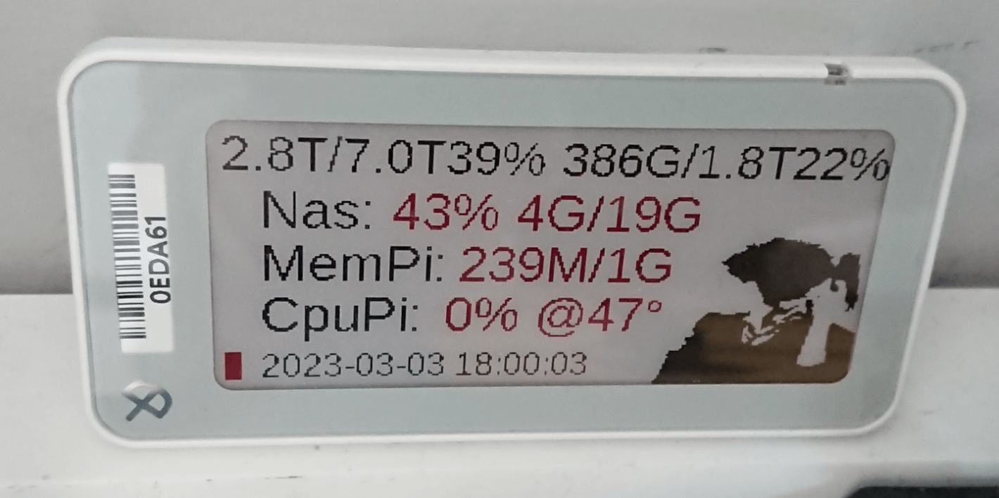
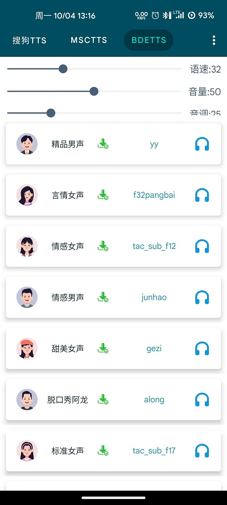

啰里啰唆周刊第57期：中国版肖申克

# 科技日常

## 1. B4X-全平台RAD
B4X是一套用来开发跨平台应用的工具，包含针对安卓的B4A、针对iOS的B4i以及针对Java的B4J。它使用现代化的Basic语言，可以快速开发应用(RAD)。所编写的Basic代码会被转译到对应平台的代码，比如Java、Objective-C、C、JavaScript等等。

其安装包只有10几MB，IDE功能强大，支持智能提示、自动补全、断点调试、调试代码热交换等等，有很好的图形化界面设计器。

这个软件其实就是基于Java生态的，它的B4J生成的跨平台图形界面就是基于Java，包括这个软件自身，也是基于Java开发，但是体验不错，使用者几乎感觉不出来。用它开发安卓也不错，打包出来的Apk体积很小。

能适应basic语法的，不想使用Android Studio的可以体验下，懂Android的应该很容易理解，配置很简单。
[https://www.b4x.com](https://www.b4x.com)
## 2. 抓包解协议，代码造布局：电子墨水价签改造 NAS 监控屏小记 

超市用的电子墨水价签，一块 65，带支架，有 App 控制，可以批量添加。

硬件上控制不容易，不兼容树莓派接口。这类墨水屏走的都是低功耗蓝牙控制的路子，手机蓝牙发送数据都是可以通过 logcat 这个工具进行抓包，说干就干。

> logcat 是安卓抓包和排错的利器。

[https://gadore.top/archives/1677915050714](https://sspai.com/post/78993)

## 3.Github Action 精华指南

前几周，用上了一个记事和todo的App，叫做[quillpad](https://github.com/quillpad/quillpad/)，这是一个fork自不活跃项目的app，但是有一些bug没有解决，于是我就准备自己动手。

这是一个安卓项目，bug很影响使用但也很容易解决，甚至在公司就能几分钟搞定代码，但是搭建环境有点麻烦，就想到了利用github action，正好这个项目本身有带相关配置，看了五分钟入门，用半小时解决了App签名问题，顺利打包完成。

然后发现最新版，作者已经悄无声息解决了这个bug，但是在release里没有提及。。。不过Github Action算是入门了。

[https://zhuanlan.zhihu.com/p/164744104](https://zhuanlan.zhihu.com/p/164744104)

## 4.AI goes to the shrink
这个网站让 AI 随便生成一段文本，再将这段文本输入 Stable Diffusion 模型，生成配图。网页每10秒就自动刷新，相当于每10秒看一张完全由 AI 创造的图片。

首页是一些挑选过的humanly的图片，其随机自动生成的图片大部分都很诡异甚至恐怖，尤其是人脸部分。。

官网：[https://shrinkai.di.unimi.it/](https://shrinkai.di.unimi.it/)

想要自己搭建AI画图的话，可以参考此开源项目：[https://github.com/AUTOMATIC1111/stable-diffusion-webui](https://github.com/AUTOMATIC1111/stable-diffusion-webui)，效果优于上面那个网站。

## 5.MultiTTS-安卓小说离线tts语音引擎语音包
MultiTTS 是一款离线tts语音引擎语音包，软件不需要联网，支持离线阅读，解决了微软TTS的卡顿抽风问题。最重要的是，里面的AI语音同样接近真人发音，能接近微软晓晓的效果。

首次启动软件内是空白的，你得手动导入语音包文件。首先下载MultiTTS.apk，然后下载voice.zip语音包，内置各种高质量AI主播语音。点击界面右上角三个点按钮，再点“导入数据”，选择voice.zip就行。

软件由酷安“阅读app”爱好者[双子T369](http://www.coolapk.com/u/1624131)个人开发，无官网，下载地址之一[https://www.xitmi.com/11313.html](https://www.xitmi.com/11313.html)，安全性需自行判断。

使用方式：在支持TTS的阅读类软件使用，实现听书的效果，这只是一个TTS引擎，不是文字转语音软件。如果你想要实现输入一段中文，输出一段音频文件的话，你还需要安装[TTS Util](https://f-droid.org/zh_Hans/packages/com.danefinlay.ttsutil/)这个软件。
# 读书与影视分享

## 1.2022年动画电影《铃芽之旅》
日语动画电影，片长121 分钟,中国大陆院线已引进。

故事讲述生活在日本九州田舍的17岁少女・铃芽遇见了为了寻找“门”而踏上旅途的青年。追随着青年的脚步，铃芽来到了山上一片废墟之地，在这里静静伫立着一扇古老的门，仿佛是坍塌中存留的唯一遗迹。铃芽仿佛被什么吸引了一般，将手伸向了那扇门…
不久之后，日本各地的门开始一扇一扇地打开。据说，开着的门必须关上，否则灾祸将会从门的那一边降临于现世。 为了弥补自己的过失，铃芽踏上了横跨日本关门的旅途。

> 《你的名字》的空前成功后，尝试复刻「恋爱×民俗×灾害」的公式之余，新海诚也在尝试做出新突破。而打着「集大成」旗号的新作《铃芽之旅》，似乎在正反两种层面上，都担得起这个评价。以 311 大地震为要素，本作更加注重人文关怀，融入多条叙事线索，却也令作为短板的情节和角色的割裂显得愈发严重，好在依然强势的美术和氛围一定程度上消解了这一点。

关于本片中的民俗部分，可以参考此文：[《铃芽之旅》剧情与民俗深度解读](https://www.gcores.com/articles/163919)帮助理解这部电影。

## 2.网络短剧《租赁部下》

日本导演上田慎一郎拍摄的网络短剧：《租赁部下》引发了热议。全长2分多钟的作品，除了不断反转，脑洞大开的日剧手法外，也道出了现代社会中，那些说不明、道不白的人情世态。 

[https://k.sina.com.cn/article_6094846964_m16b47fbf4033016y9l.html](https://k.sina.com.cn/article_6094846964_m16b47fbf4033016y9l.html)

## 3.《冲出劳改营》
1954年徐洪慈以调干生的身份进入上海第一医学院学习，曾是年轻的地下党员、被公认为医学院的高材生。1957年，他的命运突变，成为右派，被驱出校门，分别在安徽和云南劳改、入狱。为了洗刷清白，徐洪慈14年中四次越狱，亡命三万里，最终在1972年逃到外蒙古。

该书详述了徐如何从中共宠儿变为众所唾骂的右派，以至劳改营囚徒，并向读者展示了营内饥饿、奴役等等骇人听闻的惨况。作为全国五十五万名右派分子中唯一能逃亡国外的人。

此书在简中地区为禁书。

> 用了几个小时的时间看完了一本禁书，哭到不能自已。
为了真理和正义，四次逃狱，亡命万里，由南向北穿过中国，经历千难万险越过国境线，这样的传奇硬汉，在整个人类历史上都是不多见的。在越国境线的时候，只有千分之一的概率可能停电，这都被他碰上了。
既往关于越狱的小说和电影跟这样真实的事件相比，实在是相形见绌，因为作家的想象力是有限的，他编出来的故事是符合逻辑的，而现实世界里发生的事，往往全无逻辑。就像小说《基督山伯爵》电影《肖申克救赎》美剧《越狱》中有关越狱的情节，跟徐的真实经历相比，都未免过于花哨而轻佻了。
我甚至因为这本书对蒙古国都好感倍增，正是这个国家在那样一个特殊的历史时期为徐这样灵魂高贵的人提供了庇护。

> 按世俗的标准，徐洪慈没有贡献出什么发明创造，没有贡献多少物质财富，他不是一个成功人士。但对他自己而言，保持了自己人格的完整，昭示了精神不屈不挠的倔强，维护了一个平凡生命的尊严，他的生命，在另外一个维度上企及了一种神圣庄严的意义。
# 图论

## 1.这个提醒不错

有点“Sometimes pickpockets yell "watch out for pickpockets" so people will check, telling the pickpockets where the good stuff is”的感觉了

STEVE 是一个喜剧作家和插画家，住在英国布莱顿。他擅长愚蠢的笑话和有趣的彩色插图，INSTAGRAM有10W粉丝。 

More info: [Instagram](https://www.instagram.com/snelse_/) | [snelse.co.uk](https://www.snelse.co.uk/)

## 2.当AI普及后

AI的逐渐普及，以后我们的后代如何分辨历史照片的真伪。

# 谈天说地

## 1.When Worlds Collide
Wit, irony, and the imperial minister’s poignant gesture that helped forge my family

刘成禺在美国的孙女写的自己祖父的一些轶事。

刘成禹（1876～1952）亦名问尧，字禹生，笔名壮夫、汉公、刘汉，湖北江夏（今武昌）人。自幼随父课读。1893年肆业武昌两湖书院，1900年参加革命。刘生平著述三百余万言，已刊遗著有《先总理旧德录》、《中国五大外交学者口授录》、《太平天国战史》、《东西史考广义》等。

下面这段记录很有意思。

> An American classmate said to me: “When we give a speech in Europe and America, only one person talks. When you Chinese give a speech, two people speak. Can you tell me the reason?”
I composed a reply: “This is China’s ancient code of respect. In cases of important ceremonies, the junior speaks and the elder supervises. These two were showing the utmost reverence to the university, in accord with China’s most ancient etiquette.”
The classmate relayed my fabrication to the chancellor, and in a long letter afterward the chancellor thanked the two ministers.

[https://authoraimeeliu.medium.com/when-worlds-collide-1f821460dcc](https://authoraimeeliu.medium.com/when-worlds-collide-1f821460dcc)

## 2.如何达到X高潮的数学模型
受到利用数学分析和改善运动表现的启发，苏塞克斯的研究人员结合了数十年的生理和心理兴奋数据，模拟出达到高潮的最佳条件。

研究人员通过跟踪和分析男性周期的四个阶段——兴奋、平台、高潮和恢复——来实现这一点。他们发现，在周期早期有过多的心理刺激的参与者更不可能达到高潮。

因此，研究人员创建了两个数学方程来代表他们的发现——一个涵盖达到高潮的生理方面，另一个涵盖心理方面。

[https://phys.org/news/2023-04-sexual-satisfaction-math.html](https://phys.org/news/2023-04-sexual-satisfaction-math.html)

## 3.云南咖啡狂热之年
咖啡采摘季接近尾声，云南的天气一天比一天炎热，可雀巢的咖啡豆采购员没能完成今年的采购任务。这是从来没有过的情况。
要不是亲眼看见那个采购员愁眉紧锁，没人相信雀巢会买不到咖啡豆。往年，一到采摘季，雀巢采购站门口就排了长长的车队。曾有人在那队伍里排了四天，却等到他们宣布收购结束。
今年局面不一样了，采摘季才刚开始，那些满载咖啡鲜果的大货车只要开在去普洱市的必经之路，就会遇到人伸手拦截。
“卖不卖？比雀巢（每公斤）加 2 元。”
最夸张时，一条路上能伸来七八只各路新晋咖啡品牌、采购商的手。
普洱市的豆子一售而空，人们来到它管辖下的县城孟连，它位于中国西南角的边境，云南最南处，是近年后来居上的新晋咖啡产区。

除了雀巢、星巴克这种九十年代就来云南寻豆的采购方，一股雀跃、生猛的新势力汇集在云南，争抢咖啡。去年年末，瑞幸创始人陆正耀的新项目 “库迪咖啡” 横空出世，并宣布已签约 1000 家门店 —— 他还是想通过咖啡来成功。过去一个月，库迪在云南的咖啡采购量一再提高，已经接近三年前刚来云南采购的瑞幸咖啡的水平。

> 可能很多人不知道，云南是中国最大的咖啡种植区和产地，占全国产量的95%。

[https://mp.weixin.qq.com/s/W1iTJBMd66S51pD0nzfwgA](https://mp.weixin.qq.com/s/W1iTJBMd66S51pD0nzfwgA)

## 4.王莫之谈老上海时代曲的百年兴衰
“我爱这夜色茫茫，也爱这夜莺歌唱”《夜来香》一曲曾被批评家称为“靡靡之音”，却是很多人心中华语流行歌曲的瑰宝。从黎锦晖《毛毛雨》黑胶片心“时代”二字聊起，时代曲一词从港台文化回流，其发展始终与时代人物命运交织在一起。最早的唱片公司百代几经更迭、时代曲元老黎锦晖等几经浮沉。那些耳熟能详的名字：聂耳、周璇、李香兰、陈歌辛、徐来…关于他们的人生往事与时代曲的发展脉络，请听本期节目王莫之的精彩分享。

[https://podcasts.apple.com/cn/podcast/忽左忽右/id1493503146](https://podcasts.apple.com/cn/podcast/%E5%BF%BD%E5%B7%A6%E5%BF%BD%E5%8F%B3/id1493503146)

## 5.养蚕那些事
> 又到本专刊的乡土栏目了

前几日有人问过我养蚕的事，作为在万能省长大的，养了十多年蚕的我说下。

养蚕的单位是“张”，一张蚕大概就是A5纸（A4纸的一半）那么多的蚕卵，最低养蚕单位是半张。一张蚕长到最大的时候，铺满地面的话，大概要占据50-60平方米，这个值区间主要看你的密度和成活率了。密度越低，蚕进食越多，结的茧也就越大。

一条蚕从孵化到结茧的生命周期大概是20多天，加上前期蚕室消毒加待茧变干、摘茧，洗窝、晒干消毒等工作，整个养蚕周期是一个月多点。一张蚕从占地A5纸到50平方米，也就20天，可以看出其生长速度之恐怖。从最初的一个手提袋装桑叶到七八个化肥编织带装桑叶，工作量也是指数级增加的，养活一张蚕最低需要1.5亩桑田。到最后一个星期是最忙的，每天要摘桑叶六七个小时。养蚕的日常工作就是每日给蚕喂食，消毒。一般每天都需要用生石灰粉消毒一次，不然容易患病。上面说一张蚕占地50-60平方米，但是养蚕是不能养在地上的，需要养在专门的竹簸箕里，理由同样为了保持干燥防患病。

蚕的生长周期叫做“龄”，也就是换皮，四五天一次。养蚕到最后关键一龄，可能就最后一两天，最容易发生食物不足问题，如果买不到桑叶，就只能给蚕喷射蜕皮激素，加快其吐丝结茧进度。一张蚕结茧并干燥后，大概有50-70公斤，一公斤蚕茧收购价25元左右，有时候也能涨到30左右，一般来说，一张蚕毛收益是1200-1500左右。这是2008年我最后一次养蚕的物价，这么多年其实也没多少变化。养蚕资金投入不多，主要是劳动力，尤其是后期每天摘桑叶100多公斤，换蚕50多簸箕。除了蚕茧可以赚钱外，每年剪下的枝条可以卖给造纸厂，但一吨也就一百多，还不够工时费。蚕粪和僵死的病蚕可以卖给中药商，但还需要晒干筛选，一公斤2-3块钱，愿意处理的农户不多，市场也不大。

一年通常可以养4季蚕，每一季养完会休整7-10天，大概也就6个月，三月下旬到九月末。我家养蚕最初是从一年养一季，一季半张养起，到最多的时候一年养三季，最多一季养两张。养的多一年可以收入三四千，少的话有五六百。因为养蚕比较耗劳动力，通常是在我在校读书的时候养半张到一张，暑假可以养一季半，正好用上我这个劳动力，扩张到一张或一张半。因为我家地不多，两张就必须租借别人的桑田了，即使是一张蚕，到最后几天也得跟别人买桑叶。

还有人问过，摘桑叶的时候是不是有很多桑椹吃……养蚕是吃不到桑椹的，一个都吃不到。每年秋天都要把桑树齐着地面剪枝，才能让新长的桑叶更大更厚，这种桑树是不可能也不能结桑葚的，所以养蚕+卖桑葚这种某些小青年想象中的“创收”模式是不存在的。要让桑叶更大更肥，光剪枝还不够，还得嫁接。

嫁接很简单，也是一门技术活。每年二月份的时候，给齐着地面给所有桑树剪枝，留下一捆枝条，放在水里泡几天，直到长出芽孢，就能给桑树嫁接了。嫁接过的桑树长出的叶片又肥又厚，能有脸盆那么大，真可谓神奇又实用，简单的操作就能让产量提高很多，一个熟练的劳动力嫁接一棵桑树只需要10分钟，就能接上3-4个芽孢。嫁接也不是一劳永逸，每两三年要重新嫁接一次。

因此，第一季养蚕是最苦的，因为桑树刚贴着地长出新枝叶，需要弯着腰摘桑叶，伤腰。
# 一句话快讯

1.法总统马克龙和欧盟委员会主席冯德莱恩访华后，中欧合作迅速进入快车道，空客在中国市场再次收获丰厚，签下了160架飞机的大单，其中包括150架A320系列飞机和10架A350-900宽体飞机，总价接近200亿美元。 

2.路透社4月8日报道，伊朗警方周六宣布，为了进一步遏制越来越多违反伊朗强制着装规定的女性，当局正在公共场所和道路上安装摄像头，以识别和惩罚未戴头巾的女性。在确认身份后，违规者将收到“关于不戴头巾后果的警告短信”。 

3.据4 月 7 日消息，抖音集团与腾讯视频宣布达成合作，双方将围绕长短视频联动推广、短视频衍生创作开展合作。

4.字节首次超过了长期排名第一的腾讯和阿里巴巴，后者报告的2022年EBITDA分别为239亿美元和225亿美元。凭借营收大增30%以上，字节跳动2022年实现了创纪录的息税前利润，首次超过了长期排名第一的腾讯和阿里巴巴。

5.国家网信办就《生成式人工智能服务管理办法（征求意见稿）》公开征求意见。
# 联系方式

啰里啰唆是一份针对互联网和生活爱好者的数字杂志，旨在发现和分享一切有趣的东西。话题不固定，每期大约十五分钟阅读量，暂定每周四发布。部分内容来自互联网采编，如果为有来源的转载，均会注明转载地址或保留水印。

这是一个关注人文和科技的newsletter。

使用方法建议或素材提供

频道：notonlyshare

邮箱：auokyob@outlook.com

github地址：[https://github.com/iminto/luoliluosuo-weekly](https://github.com/iminto/luoliluosuo-weekly)