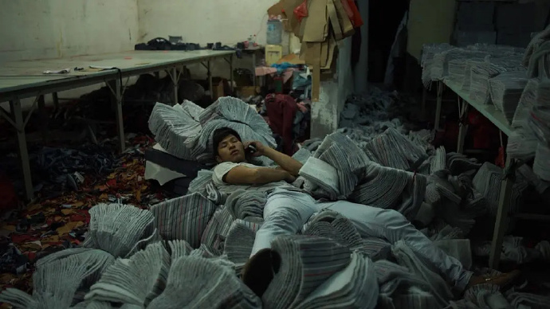
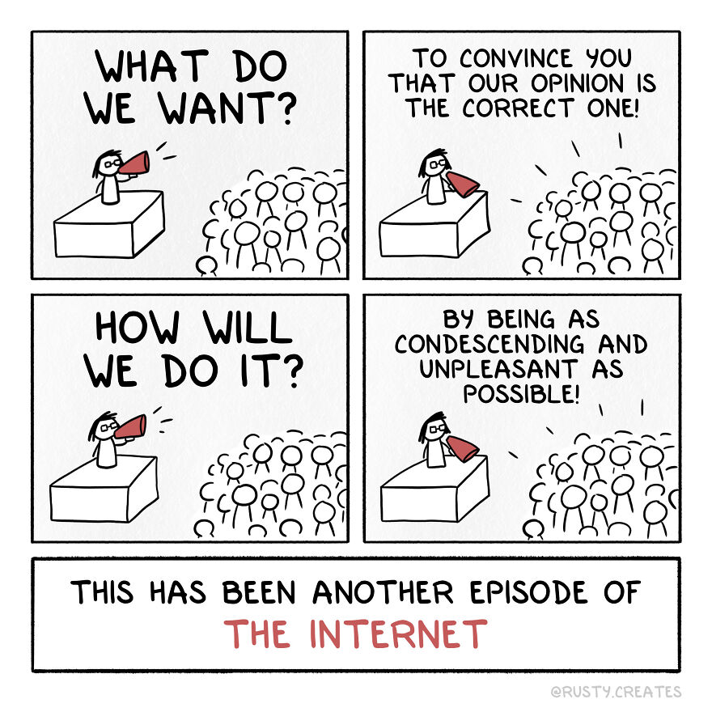
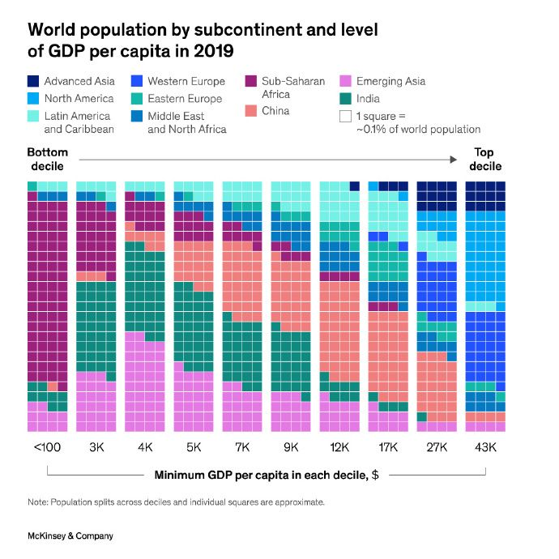
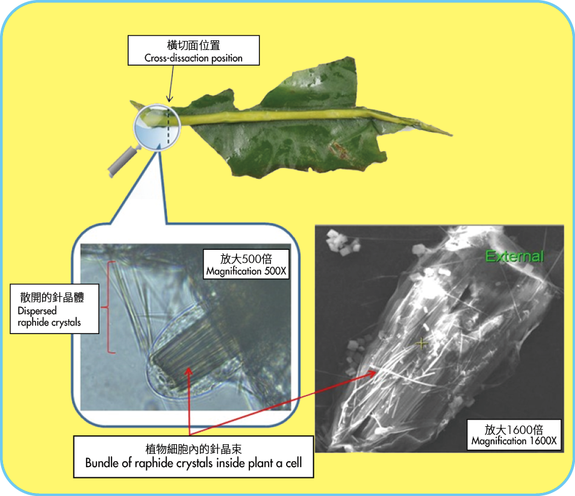

啰里啰唆周刊第58期：昆乱不挡

# 科技日常

## 1. Weawow天气App
国外开发者开发的天气App。

特性：
1.无广告和弹窗，免费软件无会员。
2.支持10多种桌面小组件样式。
3.GPS定位准确，可精确到街道（有时也存在抽筋现象）。
4.支持中文和中国城市，可切换天气数据来源，无需科学上网。
5.自动根据天气切换背景摄影图片，你也可以上传自己的图片出售。

对于第三条，可能有读者有疑惑，手机不是有GPS吗，定位准确不是手机硬件GPS的事情吗，为什么会说天气软件定位准这个问题。这里需要说明下，天气软件定位通常并不是单纯依赖GPS的，GPS只能得到经纬度。天气软件定位是混合定位，还依赖地图SDK，IP等。气象数据通常也是根据街道地址和区县去反查，光有GPS，通常是无法实现定位的，只能手动指定到地级市一级的粗略位置。

国内接入地图SDK是需要成本的，很多小的天气软件提供商无法承担成本，要么放置广告，要么放弃维护地图SDK，只提供手动定位方式。

[https://weawow.com/](https://weawow.com/)
## 2. Login 和 Non-Login Shell 的区别
这个算基础知识了吧，只是很多人觉得这个概念比较枯燥，并不会注意其区别，在遇到问题的时候，也没有思路。

前几天就有人问过我，命令行能执行，但是ansible却报错找不到文件很是奇怪，其实就是这个原因导致。ansible这类远程执行的non-login shell 并不会加载/etc/profile和~/.bash_profile下的环境变量，只是加载~/.bashrc和/etc/bashrc。

[https://segmentfault.com/a/1190000037521283](https://segmentfault.com/a/1190000037521283)
[https://www.jianshu.com/p/c0d69b324dc5](https://www.jianshu.com/p/c0d69b324dc5)

## 3.Aleph Reader: 集 RSS 阅读器和 Podcast 客户端于一体的 App
Feed 和 Podcast 都是基于 RSS 技术，Aleph Reader 把这两个整合起来，可以边阅读边听播客。
使用 openAI 自动给文章添加标签，方便用户基于兴趣选择性阅读；
可以通过 openAI 生成文章概要，方便快读阅读；
支持使用自己的 API Key，并给 openAI 反馈，告诉 AI 你喜欢什么样的文章；
支持IOS/Android系统。

实际使用下来，功能目前还比较简陋，不支持opml文件导入。至于AI，很难说对阅读有多大意义。

> 整合RSS和播客技术上没有任何难度，但类似软件除了AntennaPod外,其它App要么只支持RSS阅读，要么只支持播客。实在搞不懂为何如此设计

官网: [https://noncelabs.xyz/aleph](https://noncelabs.xyz/aleph)
附，播客推荐平台：[https://getpodcast.xyz/](https://getpodcast.xyz/)

## 4.EteSync 用于自建的移动端对端同步
Secure, end-to-end encrypted, and privacy respecting sync for your contacts, calendars, tasks and notes.

EteSync 用于同步用户的通讯录、日历和笔记，使用了端对端加密的方式。EteSync 本身覆盖全平台，由于开放源代码，它支持自建，能防止某些私有软件植入后门破坏加密的恶意行为。官网服务针对个人收费$2/月，提供两周试用期。

因为这是一套跨平台、开源的软件，因此也被作为一套协议被第三方App所支持，比如[openTasks](https://opentasks.app/)和[KDE](https://www.etesync.com/user-guide/kontact/)平台均支持该协议。可以认为是更安全的CalDAV和CardDAV。

[https://www.etesync.com/](https://www.etesync.com/)

## 5.hnet-自建在线云浏览器
所谓云浏览器即匿名浏览网页工具，在线浏览器代理。

此文基于 [hnet](https://github.com/Hideipnetwork/hideipnetwork-web/tree/v2)  搭建。博客作者还提到了另外一个服务[neko](https://github.com/m1k1o/neko)，neko是一个在Docker中运行并使用WebRTC技术的自托管虚拟浏览器。使用 Neko，您可以像在常规浏览器上一样浏览 Web、运行应用程序以及执行其他任务，所有这些都在安全且隔离的环境中完成。

[https://blog.tanglu.me/web-browser/](https://blog.tanglu.me/web-browser/)

## 6.FerretDB-兼容MongoDB的PostgreSQL扩展
FerretDB 1.0正式GA，FerretDB是一个开源的 MongoDB 替代品，建立在 PostgreSQL 之上，并在 Apache 2.0 许可下发布。

FerretDB不依赖MongoDB，依靠底层实现了Mongo的大部分功能，可以用mongosh、studio3t等工具直连。底层支持pg、tigris、sqlite（计划）。

看起来是个很奇怪的架构。

[https://blog.ferretdb.io/ferretdb-1-0-ga-opensource-mongodb-alternative/](https://blog.ferretdb.io/ferretdb-1-0-ga-opensource-mongodb-alternative/)

# 读书与影视分享

## 1.纪录片《青春》
中国独立纪录片导演王兵入围2023戛纳电影节主竞赛单元的新作中文名确定为《青春》，这部纪录片讲述一群云南青年人在上海打工的经历和生活。 

现年55岁的王兵导演以纪录片见长，曾拍摄《铁西区》《三姊妹》《疯爱》《方绣英》等作品。他的前作《和凤鸣》和《死灵魂》都曾作为展映作品亮相戛纳电影节，但入围主竞赛单元还是第一次。新作《青春》聚焦一群从云南来到上海务工的年轻人。这是时隔四年后再度有华语片入围戛纳主竞赛单元，上一部入围的是刁亦男的《南方车站的聚会》。

> “你现在出门去，扛着一台摄像机，随便找一个外卖员、一个流水线普工、一个扫地工或一个贫困学生帮你拍纪录片。你甚至不需要剪辑、不需要解说、不需要旁白、不需要滤镜、不需要任何后期制作，仅仅只需要把镜头摆在那里，拍摄他们的日常生活。之后，你就会得到一个东西。” “什么东西?”  “一部禁片。”
## 2.小说《屠夫十字镇》
《屠夫十字镇》讲述的是一个在1873年从哈佛辍学的年轻人安德鲁斯，受爱默生和梭罗等人的自然观念影响，带着寻找美好、希望和活力的冲动，来到屠夫十字镇，并跟随猎人米勒和其他两人（剥皮人施耐德和随营干杂活的查理•霍格）进入科罗拉多山区猎捕野牛。他们各自带着不同的目的和想法，踏上了这次前途未卜的旅程。他们经历重重困难，还丢掉了一个人的性命，才重回屠夫十字镇，但这里却发生了翻天覆地的变化……

作者约翰•威廉斯（John Williams，1922-1994），美国作家、诗人、学者。一生只写了四部小说：《惟有黑夜》（1948）、西部小说《屠夫十字镇》（1960）、学术小说《斯通纳》（1965）、历史小说《奥古斯都》（1973，本书获得当年美国国家图书奖）。

兽皮商麦克唐纳在故事的最后跟主人公安德鲁斯说过：

> “你出生，别人哄你吃奶，别人哄你断奶，你在学校学会说各种各样的谎言。你就靠谎言生活。或许你临死之时，才意识到原来你一无所有，除了你自己和你本来可以做到的事情，你一无所有。可是你没有做，因为谎言告诉你，还有其他事情可以做。那是你才明白你本来拥有这个世界，因为你是唯一知道这世界秘密的人，可是为时已晚，你已经老了。”

年轻人总是以为，去了西部就能获得自我，总以为遇到一件事情，就会获得一样技能。

该小说在2022年有一部改编的同名电影。

> 四星半，一曲西部的冰与火悲歌，结构暗示意象都能找到不少名作的影子，明明是个在科罗拉多人迹罕至的山谷里剥野牛皮、离我们的生活十万八千里的故事，却承袭了约翰·威廉斯先前作品带来的普世性，不管你是选择走向荒无人烟之路，还是选择留在屠夫十字镇，无论你是否能成功收获到大量牛皮，任何抉择到头来都是万火归一，生活总能在意想不到之处给你一拳绝妙的反讽，尽管前路总是悲观的暗色，策马扬鞭，蹈过地狱之火，重新踏上自我探索与救赎之路仍是我们仅存的远方

> 约翰•威廉斯的小说一向犀利冷静，不留情面，但都同时传递着这样一份乐观，它相当坚定而强韧：他相信我们有能力从生活的绝境中拯救某些价值。

## 3.抖音最受欢迎当代作家出炉
4月13日，抖音发布《2023抖音读书生态报告》称，过去一年，读书类视频播放量同比增长65.17%，时长≥5分钟的读书类视频数量同比增长279.44%。抖音读书类直播场次同比增长66.23%，观看总人次同比增长96.73%+，场均观看人次2700+。在抖音最受欢迎的新书Top10中，文学类书籍占据了半壁江山。

抖音根据视频播放量公布了最受欢迎当代作家TOP10，金庸位居第一，刘慈欣位居第七。其他入选TOP10的作家还有路遥、余华、莫言、余秀华、古龙、王朔、刘震云、史铁生。

报告显示，截至2023年2月，入驻抖音的出版社超300家。在抖音最受欢迎的新书TOP10中，《生死疲劳》《长安的荔枝》等文学类书籍占据了“半壁江山”，《南明史》《翦商》等人文社科书入选。

pfd报告可在此查看：[https://www.mofile.net/item/0a6240f8c88a4eff96893a0b862930b1.html](https://www.mofile.net/item/0a6240f8c88a4eff96893a0b862930b1.html)
# 图论

## 1.correct one

> See, I disagree. I also find your grammar to be improper. You don't even use punctuation.You're such an idiot, you couldn't even spell [trendy abusive term] right. Get a life [redacted for your safety].

作者 :[instagram](https://www.instagram.com/rusty.creates/)|[reddit](https://www.reddit.com/user/Casual_Deviant/)
## 2.GDP

2022年，中国的人均GDP是1.27万美元，美国是7.6万美元，中国要跨过中等收入陷阱有多难？

麦肯锡这张图非常直观。可视化反映了中国不同阶层（地区）的人均GDP的巨大差异。10个区间全部有中国人分布，最低的一组大概有700万-800万中国人，最高的一组3000万中国人。而日韩、北美和西欧发达国家基本上在最右边三个区间段。这些发达国家的人口加起来可能10亿出头，还没中国人口多。所以，庞大的人口基数导致中国要跨越中等收入陷阱太难太难。有时候全国层面的人均数字显得就没什么意义。因为贫富分化太大了，区域差异显著。
# 谈天说地

## 1.影子的艺术：几个世纪以来画家们是如何弄错的
长期以来，画家们一直在与描绘阴影的困难作斗争，以至于阴影-在古罗马绘画和马赛克中短暂而壮观的展示之后-几乎没有出现在文艺复兴时期的绘画艺术中，然后在传统的西方艺术之外几乎不存在。

Shadows do not continue from the floor up the wall on the right. Piero della Francesca, Polittico di Sant’Antonio (detail), 1460–1470. Perugia, Galleria Nazionale dell’Umbria. Image credit: © Galleria Nazionale dell’Umbria.

Shadows can do some adventurous, sometimes malignant, poetic things: They move, rebel, hide, refuse to be identified, vanish. All these visual aspects provide fertile ground for complex metaphors and narrations. Shadows are so visually telling that it takes little to move into emotionally tinged narratives. But it is the visual aspects that we primarily deal with here, with a special focus on several types of misrepresentations of shadows — shadows doing impossible things — that nevertheless reap a payoff for scene layout and do not look particularly shocking.

> The goal is not to expose the “slipups” of the masters but to understand the human brain.

[https://thereader.mitpress.mit.edu/the-art-of-the-shadow-how-painters-have-gotten-it-wrong-for-centuries/](https://thereader.mitpress.mit.edu/the-art-of-the-shadow-how-painters-have-gotten-it-wrong-for-centuries/)

## 2.如果真的要去面对死亡，你知不知道该做什么？
在医院里，医生总是想给患者“最好的治疗”，这通常意味着最先进的治疗方案、技术和药物。但先进的医疗技术并不总是能把病人从死亡手里抢救回来，在实际治疗中，因为不同的科室划分，一个病人接受到的医疗技术是碎片化的，病人的痛苦总是“被切成一块一块”。

作为肿瘤内科医生的宁晓红时常会陷入面对病人的痛苦自己无能为力的挫败感中。带着这样的困惑，宁晓红从2012年起赴新加坡、英国等地学习安宁缓和医疗，并回到协和医院开始推广。

让病人有尊严地面对死亡，这不仅意味着把病人从死神手里抢回来，也意味着即使在病人无法医治、一定会走向死亡的时候依然施以援手，陪着病人与家属一起面对这个过程。在宁晓红看来，当一个病人有权利选择自己面对死亡的方式的时候，医学才能回归它更完整的样子。

[https://www.ximalaya.com/sound/614782779](https://www.ximalaya.com/sound/614782779)

## 3.聊聊 ICU 病房限制家属探视的为什么与该不该 
重症监护病房（ICU）应该算整个医院里面除手术室以外最神秘的地方，很少有家属了解 ICU 里面的真实情况。国内 ICU 病房大多数都限制探视策略，每日仅有 20 分钟到 1 小时不等的探视时间；在过去疫情肆虐的两年期间，几乎所有的 ICU 都采用了完全拒绝家属的探视，每日仅与患者家属使用电话沟通。
到底 ICU 病房限制家属沟通的具体原因是什么呢？简单说来，最主要的原因无非以下几点：
- 家属探视可能干扰正常的医疗工作；
- 家属探视可能会增加院内感染发生；
- 患者病情无探视的必要性。

实际上真的如此么？接下来我将分别站在医院、医生和家属的立场，以大家比较关心的一些问题作正反两方的解释，让大家明白不同的决策源自于怎样的考量。而之所以这样做，是因为我希望大家明白我们任何一方与病人及家属都不应该是对立关系，希望大家都能彼此理解互相配合，让我们可以更高效的工作，病人也能得到更好的照顾。
[https://sspai.com/post/79319](https://sspai.com/post/79319)

## 4.芋头花有毒？
芋头花是一种流行于云南的特有美食。

吃花是云南饮食的特色，不仅美容养颜而且养生。我们平时所吃的芋头是吃其块茎，而在云南，芋头花也是一款美食。芋头花又名芋苗花、花芋、红芋，紫芋，为天南星科植物芋的花蕾。是云南特有的食用花品，以花茎的味道最为鲜美，由于其具有一定的药用价值，因此种植面积很广，几乎一年四季都能吃到。

云南人把土豆叫做芋头，但是芋头花不是土豆的花，云南人说的芋头花，特指红芋、青芋、紫芋这类植物的花。芋头这种叫法比较笼统，说以很难说清在植物分类上芋头花到底是谁的花。实际上，市场上常吃的芋头花是紫芋的花。

芋头花分紫杆和绿杆的，紫杆的麻性较重，必须炒熟或蒸透才能吃，不然吃了会嗓子痒，入口也比较麻嘴。其实，芋让人麻嘴是因为草酸钙针晶导致，类似菠萝一样的原理。芋头花主要是吃的花竿和花瓣，花蕊一般会摘除，因为花蕊的草酸钙针晶含量太高。最简单的做法就是将芋头花杆的皮撕掉，掰成小段，洗净，锅入油烧热，入蒜片炒出香味，入芋头花中火慢炒至软塌熟透，加适量盐和海鲜酱油调味即可。其实芋头花的烹饪也很简单，不复杂。

很多人由于缺乏植物学经验带来的偏颇观念，“未出现在我家菜市场的蔬菜，就说明不适合食用”。比如芋头花，外地人烹饪方法不对，很容易脑袋发麻甚至瘙痒不止，留下芋头花有毒的说法。但草酸钙并不算有毒物质，除了芋头花外，菠萝也有，菠菜也有（菠菜里的草酸钙是块状物，不易伤人）。草酸钙针晶是草酸钙的一种物理结晶形式，其对人体的伤害主要是物理伤害。但是波萝里的草酸钙针晶易溶于盐水，所以吃菠萝需要用盐水浸泡，但是芋头花里的针晶用盐水是去除不了的，需要烧煮去除。

我甚至看到有人说芋头全株有毒不可食用，这是错误的。事实上，芋头全株皆可食用，芋头能吃，芋头花也能吃，芋头叶也能吃。你不能说不能生食就叫毒物，毕竟菜市场上不能生食的蔬菜也不少，比如四季豆。再比如云贵地区爱吃的鱼腥草，其是否有毒还有争议。还有的野生菌，也不是所有云南人都敢食用，甚至专业的书籍和植物学家都认为其有毒，但实际是无毒的，常规做法即可安全食用。至今，就算是云南，也有不少野生菌缺乏食用经验。

生物碱类型很多，对人体的中毒机制是复杂的，所以有没有毒，最终还是得依赖验证。

另外，还有一种叫海芋的植物，和芋头比较像，这是有毒的，同样含草酸钙针晶，但不容易去除，吃了容易嘴肿。海芋可能听说的人不多，但是作为观赏植物时则称其为“滴水观音”，这下听过的人就多了。但海芋可不仅仅是含有草酸钙针晶，海芋还含有氢氰酸及生物碱。误食会引致舌头麻木、肿大及中枢神经中毒。皮外接触会引致痕痒、麻木及发疹。 咀嚼一小块块茎后即可引起喉部肿痛及嘴部麻痹。曾有报导，一位8岁的小女孩因嚼食花序而中毒，昏迷12小时，24小时后才恢复。

当然，我也是不建议外省人去所谓云南菜风格饭店吃云南菜，主要是根本吃不到正宗的云南菜花了冤枉钱，安全性倒不至于因为大概率吃的都是当地菜。这也是正宗云南菜无法普及到外省的一个最重要原因，食材看似简单但却独特难于复制，烹饪方法也很注重。火遍全国各地的过桥米线，其实吃到的并不是云南米线，而是当地“米线”，往往即不是“米”，也不是“线”。

ref:
[有些植物全身都是宝，而芋头，全身都是毒](https://www.guokr.com/article/448301/)
[草酸钙 – 植物中会刺人的晶体](https://www.cfs.gov.hk/sc_chi/multimedia/multimedia_pub/multimedia_pub_fsf_170_01.html)
[https://www.zhihu.com/question/499991416](https://www.zhihu.com/question/499991416)

> 总结，如果你在云南，芋头花放心吃。如果你不在云南，反正你也吃不到，同样不需要担心😂

## 5.杭州 “美食荒漠” 成因考
春天，是吃货最爱的季节，因为各种时令蔬菜源源不断，吃都吃不过来。趁此时机，有 “美食荒漠” 之称的杭州，最近也行动了起来，决定拿出一百万元，对主导制定完成杭帮菜国际标准的单位进行奖励。

身为半个杭州人，虽然小时候每年清明都会来杭州扫墓，但因为每次都是吃住在乡下亲戚家里，土灶土菜、塘鱼放鸡，倒也嚼得起劲、吃得欢畅，不时还会从被食物塞得鼓鼓囊囊的嘴里挤出一句：“灶头烧的饭菜就是香啊！”

真正让我对杭州 “美食荒漠” 这点有所感触，还要等到来杭州工作、定居以后。印象比较深的有这么几件事：

一是杭州两大 “美食 IP”—— 吴山烤禽和南方大包的店门口，永远排着长队。本以为能有多好吃，结果费时排队买过一次，品尝了下感觉也不过如此（虽然吴山大包的价格确实很亲民），于是只好安慰自己，大城市里人多，哪里都得排队，有队伍不能说明问题。

二是有次跟同事去扫街，在其推荐下品尝了他们儿时放学后必吃的垫饥食物葱包烩 —— 一种将油条和大段大段小葱裹在面饼里油煎而成的 “奇怪小吃”。咬了几口就开始怀念我自己小时候吃的臭豆腐、油墩、萝卜丝饼、猪油大饼…… 那时不觉得如何，现在回味起来，比葱包烩不知强到哪里去了。

> 可能很多人不知道，杭州的饮食有不少传承于宋朝南迁时，另一个美食荒漠-河南。

ref：[微信公众号-秦朔朋友圈](https://mp.weixin.qq.com/s/c_QL70dg_Pg4jWkI-bpLiQ)

## 6.一生就这么“刷”的一下
朋友去废品收购站，看到角落里摆着一大包整整齐齐的相册和纪念册，花30块钱买了回来。
是一个男人的一生。
有他父母亲的几本相册，有他中学、大学的相册，和大学毕业纪念册。工作之后，相册还在不断增加。同时增加了一本养生剪报本。
从那些相册推测，他生于1970年，中学在兰州外国语学校，毕业后考上军方的外国语学院，1988年入学，1992年毕业。毕业时申请回乡工作，因此被列入支援大西北毕业生的名单。整个年级，到西北工作的只有5个人。回到兰州之后，他在部队工作，随后和他的大学同学结婚，没多久生了一个儿子。
喜欢踢足球，打篮球，弹吉他，在他同学眼中他才华横溢。但很少出去旅游，没有旅游的照片。唯一一张景物照片，是2006年在不知名山顶拍到的落日。他显然很喜欢这张照片，用不同尺寸冲印了几张。
家里应该有多病的老人，也有可能他本人比较多病。那本剪报本，从90年代末开始，就已经有了老年病的内容。假冒伪劣药品的广告，电话都被圈了出来，显然是准备联系。
所有这些，在2021年7月戛然而止。那本养生剪报本的最后一份剪报，是2021年7月的报纸上的一篇药品广告，他用碳素笔在剪报上做了标注，来自哪份报纸，几月几号。
他怎么了？他的相册为什么会被完整丢弃了？
一生就这么“刷”的一下。 

[@韩松落](https://weibo.com/u/1152440821)
# 一句话快讯

1.美国联邦调查局（FBI）逮捕了一名21岁的空军国民警卫队队员，相信他与大量美国高度机密军事情报文件在网上泄露有关联。 

2.北京长峰医院火灾已致29人遇难 12人被刑拘。

3.2023年4月14日晚，中国在境内进行了一次陆基中段反导拦截技术试验，试验达到了预期目的。

4.国家统计局新闻发言人付凌晖4月18日说，总的来看，当前中国经济没有出现通缩，下阶段也不会出现通缩。。

5.日本首相岸田文雄星期六（4月15日）到和歌山市进行助选演说，被人抛掷爆炸物，他险些被击中。

# 联系方式

啰里啰唆是一份针对互联网和生活爱好者的数字杂志，旨在发现和分享一切有趣的东西。话题不固定，每期大约十五分钟阅读量，暂定每周四发布。部分内容来自互联网采编，如果为有来源的转载，均会注明转载地址或保留水印。

这是一个关注人文和科技的newsletter。

使用方法建议或素材提供

频道：notonlyshare

邮箱：auokyob@outlook.com

github地址：[https://github.com/iminto/luoliluosuo-weekly](https://github.com/iminto/luoliluosuo-weekly)