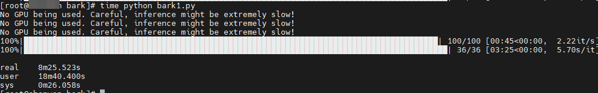

啰里啰唆周刊第59期：脐带

# 科技日常

## 1. 如何在 Linux 下 使用 Progress 显示命令执行进度
Linux 下的命令高效简洁，但同时很多命令进度显示不是很友好，比如：mv、cp、dd 等命令。

在没有进度显示的情况下，我们就无法判断是正在执行、还是执行缓慢，Progress 命令很好的解决了这个问题。

Progress 进度查看器是一个简单的程序，它可用于显示命令的进度。它使用来自文件描述符的信息来确定命令的进度。Progress 的优点在于它可以与其他 Linux 命令一起使用，比如 watch。

progress支持如下命令：cp、mv、dd、tar、cat、rsync、grep、fgrep、egrep、cut、sort、md5sum、shaxxxsum、adb、gzip、gunzip、bzip2、bunzip2、xz、unxz、lzma、unlzma、7z、7za、zcat、bzcat、lzcat、split、gpg、rclone、ffmpeg

[https://github.com/Xfennec/progress](https://github.com/Xfennec/progress)
## 2. SuperImage-手机上的AI图片修复工具

Sharpen your low-resolution pictures with the power of AI upscaling

SuperImage is a neural network based image upscaling application for Android built with the MNN deep learning framework and Real-ESRGAN.

支持安卓7以上设备，体积仅150M，离线使用。高通855处理器上，处理一张图片需要10秒-1分钟，如果是像素比较高照片的话，则需要3-10分钟。当然，像素高的照片不适合使用此AI工具，这种工具对动漫这种色彩简单，界限分明的图片处理效果更好。

其处理效果可参见官网示例，跟AI修复的场景还是不一样的，效果也不如专业的AI老照片修复。

[https://github.com/Lucchetto/SuperImage](https://github.com/Lucchetto/SuperImage)

关于AI修复老照片，可以参考这篇博文：[少数派-5 款 AI 老照片修复工具的横向比较 ](https://sspai.com/post/79376)

## 3.acr-类原生系统上的通话录音软件
ACR通话录音是谷歌市场Play Store上最好的录音软件之一，它不仅可以让用户在打电话的同时进行通话录音，还能对微信通话进行录音。不需要root权限即可使用。

默认情况下，ACR 会开启自动录音（手动录音需要 Pro 版本），所有的通话都将被录音，你可以将录音保存在本地或者云服务里，比如 Dropbox、One Drive、Google Drive、FTP、WebDAV 等地方，或者通过邮件自动发布。

基本功能免费版就够了。

通话录音通常都需要系统级支持，而ACR不需要root的原因就是ACR的本质是对通话过程中的听筒进行录音，所以其必然存在两个缺点，一个是对方的声音较小（但是效果尚可），二是不支持蓝牙录音（因为蓝牙通话，听筒没有发出声音，自然无法录音了）。

这是类原生不支持，且不愿root的一个妥协的最佳选择。

然而，前几天换了LineageOS,通话录音是内置了，但是和包App不能用了，点到“卡包”页面报错“客户端不支持 -client 4”，这个报错莫名其妙，上[Matlog](https://github.com/pluxoid/matlog)也看不出端倪，百度搜了下，隐约有人提到是缺乏SmartCardService服务导致的。这个服务中文名通常叫“智能卡服务”，说了又好像没说，其实这个是个系统底层软件，用来处理SIM卡读写和加密的，通常情况下是用不到的，但是NFC-SIM功能却依赖它。

当然，下载个SmartCardService.apk是肯定不行的，因为它需要root权限，丢进/system/分区。向社区反馈等更新？这肯定不行了，自己动手，丰衣足食。

起初想法是在国产ROM中提取system.img等镜像，然后挂载，搜索相关apk，发现并不存在SmartCardService.apk这类文件，最终找到了[platform_packages_apps_SmartCardService](https://github.com/johnzweng/platform_packages_apps_SmartCardService/releases/tag/jz_android_6.0_OMAPI-2.05)这个项目，进入recovery模式，用adb命令push到对应目录并设置权限即可。至于root权限，在recovery下自然都是浮云了。

## 4.browsertunnel-一种依赖DNS的隐私泄露工具
browsertunnel是一种使用 DNS 协议从浏览器中泄露数据的工具。它通过滥用 dns-prefetch 来实现这一点，该功能旨在通过在后台对指定域进行DNS查找来减少网站的感知延迟。DNS 流量不会出现在浏览器的调试工具中，不会被页面的内容安全策略 （CSP） 阻止，并且通常不会受到公司防火墙或代理的检查，使其成为在受限情况下走私数据的理想媒介。

这是一种古老的技术——DNS tunneling本身可以追溯到 90 年代，[Patrick Vananti](https://blog.compass-security.com/2016/10/bypassing-content-security-policy-with-dns-prefetching/) 在 2016 年写过关于使用 dns-prefetch 的文章。由于 dns-prefetch 不会将任何数据返回给客户端 javascript，因此通过浏览器隧道的通信只是单向的。此外，某些浏览器默认禁用 dns-prefetch ，在这些情况下，browsertunnel无法工作。

工作机制：
1.用golang编写的服务器充当权威DNS服务器，收集和解码browsertunnel发送的消息。
2.位于 html/ 文件夹中的小型 JavaScript 库对客户端进行编码和发送消息。

ref:[https://github.com/veggiedefender/browsertunnel](https://github.com/veggiedefender/browsertunnel)

## 5.BGM猫-背景音乐生成工具
一个在线的免费生成30秒-5分钟时长背景音乐工具,可自定义场景、风格和心情等标签。

[https://bgmcat.com/home](https://bgmcat.com/home)

## 6.Bark-让文本转语音更简单
Bark 是由Suno创建的基于转换器的文本到音频模型。Bark 可以生成高度逼真的多语言语音以及其他音频 - 包括音乐、背景噪音和简单的音效。该模型还可以产生非语言交流，如大笑、叹息和哭泣，唱歌。

功能概况：
- 非常真实自然的语音 
- 英文效果最佳，其他语言还欠佳，中文有股广东味
- 支持通过文本生成歌曲
- 支持生成背景噪音、简单的音效支持大笑、叹息、哭泣

Bark支持在GPU/CPU上部署，在GPU上接近实时。

在一台4核16G的普通vmware虚拟机上使用CPU的运行结果，生成一段30字的中文，用时大概8分钟，背景中的电流声比较明显，或许用GPU效果会好很多。

[https://github.com/suno-ai/bark](https://github.com/suno-ai/bark)
# 读书与影视分享

## 1.2022年电影《脐带》
2022年中国导演作品，时长96分钟，豆瓣评分7.8。

导演乔思雪1990年出生于内蒙古呼伦贝尔市鄂温克旗的一个小镇，她是达斡尔族，在草原生活了18年，尔后离开家乡前往巴黎求学，像鸟儿一样越飞越远。《脐带》是她在巴黎留学期间构思的剧本，也是她的长片处女作。

《脐带》的故事很简单，讲述了“北漂”的音乐人、蒙古族青年阿鲁斯，因为母亲患上阿尔兹海默病回到故乡内蒙古。他不满哥哥将母亲关在家中的照顾方式，决心带母亲返回呼伦贝尔草原，去寻找她记忆中的家。为了防止母亲走失，阿鲁斯用一根绳子系在两人腰间，似脐带一般的连接，牵引着两人向草原深处漫游。在漫天的星光中，母亲带着谢意与儿子告别，她终于回到自己心中的故乡，阿鲁斯也在水草丰茂的家乡获得了平静和爱的力量。 

> 优缺点都很突出的电影。视听水准相当拔群，曹郁的摄影、当代新潮化的蒙古民乐，都是那种眼睛和耳朵“可识别”的高规格质感。巴德玛老师的演技，伊德尔的个人魅力，也是非常大的加分项。在林林总总的硬软件维系下，整体影调气质是稳定统一的，这对新导演来说已经蛮难得了。但就是剧本和表达…这，很难评，就不评了吧。

> 死亡在窗外的黑夜里举着火把经过，月光点燃湖面，被风扬至半空。你总有一天会回家，你总有一天要放手。

## 2.外卖人诗集《赶时间的人》
本书作者王计兵是一个外卖员，奔跑的行程累计15万公里，相当于沿着万里长城跑15个来回。在城市穿梭的日子里，他看到更多跟他一样为生存奔波的人，外卖员、农民工、保洁员、保姆。他们匆匆忙忙，慌慌张张地奔波，却跑丢了自己的身份：既不能在城市中找到一个落脚之地，故乡和父母又在不断远去。

如同一个来自底层中国的行吟诗人，王计兵记录下自己和他们的狼狈，以及作为劳动者的自尊。他写道：我也有自己独立的国度，我沸腾的血，就是我奔流不息的江河，我嶙峋的瘦骨，就是我耸立的山川。

这些在赶时间的间隙，写在烟盒上、废报纸上的诗句，是来自劳动现场的民歌，生机勃勃，粗粝尖锐。有些被偶然传到网上，引发了意想不到的共鸣，单首诗歌阅读多达2000万人次。本书于2023年二月出版。

> 从空气里赶出风
从风里赶出刀子
从骨头里赶出火
从火里赶出水
赶时间的人没有四季
只有一站和下一站人世界是一个地名
王庄村也是
每天我都能遇到
一个个飞奔的外卖员
用双脚锤击大地
在这个人间不断地淬火

# 图论

## 1.Exploring The Boundaries Between Genius And Stupidity

"好科学家"漫画探索了天才和愚蠢之间的界限。它有时很搞笑，有时很严肃，然而总是荒谬的。
风格都比较一致，On top of that, it contains factoids of the "Ripley's Believe it or Not" style, and elements similar to topics on QI.

更多信息：[https://www.youtube.com/watch?v=lubpwMKEB4A](https://www.youtube.com/watch?v=lubpwMKEB4A)
## 2.star

来源见水印
# 谈天说地

## 1.中国最热门的社交应用如何将杜塞尔多夫变成美食目的地
The trendiest food city in Europe isn’t Paris or London. It’s Düsseldorf — thanks to Xiaohongshu.

At 10 a.m. on a Saturday, all the deep-fried youtiao at Wenzhou Dim Sum are sold out. Customers queuing inside the casual eatery, located across the Rhine river from Düsseldorf’s Old Town, groan in disappointment. Some consider meat buns instead. A cover of Taiwanese star Cyndi Wang’s classic song “Love You” plays in the background. 

Shen Chao and Liu Ying, a Chinese couple based in the Netherlands, drove three hours from The Hague to sample Wenzhou Dim Sum’s youtiao — fried dough sticks often eaten for breakfast. They have planned an entire day around eating and shopping for Chinese food: Start the morning with youtiao, pick up pre-cooked dishes at the Hao You Duo Supermarket, and then get da pan ji (“big plate chicken”) at Tengri Tagh Uigur Restaurant for lunch. Their plans, marked out by Shen Chao on Google Maps, were curated by Liu Ying on the Chinese social media and e-commerce platform Xiaohongshu.

[https://restofworld.org/2023/xiaohongshu-users-make-dusseldorf-destination/](https://restofworld.org/2023/xiaohongshu-users-make-dusseldorf-destination/)

## 2.武洲：改完这个厕所，隔壁咖啡馆老板追着要给我一张vip卡
一顿饭可以不吃，但厕所不能憋着不上。盘一盘我们经历的公共厕所吧：在农村，臭气辣眼睛、蚊虫满天飞，墙上还有各种咒骂狠话；在城市，女厕永远排队，男厕聚众吸烟。

马桶圈上永不消失的脚印，洗手台前抽盲盒一样的感应，更不用说来也匆匆根本不冲。

厕所应该怎么改？拿着纳税人钱的公共厕所应该怎么改？

武洲，清华大学无锡应用技术研究院生态设计与技术研发中心主任。

十余年来，武洲与团队查询了大量厕所设计的文献资料，也调研了全国各地大大小小的公共厕所。除了使用新材料新技术等手段之外，他们也会拿着计数器去统计某个位置公厕的男女如厕比例；收集居民和一线保洁人员的反馈意见，在对北京胡同一千多座厕所改造时，还贴心地考虑到了居民倾倒、清洗尿盆的需求。

[一席播客](https://www.ximalaya.com/7418817/sound/627026287)

## 3.易经
我心目中认为中国人最需要袪魅的一本书是《易经》，它被编订出来，只是作为原始占筮的参考书，里面没有什么高深的学问和智慧。所有后来以它为基础的各种术数应用、哲学思想，都是后来人的借题发挥。换句话说，即便你认为它代表了“老祖宗”的智慧，至少这些祖宗也没有你想象得那么老。
如果要再做一个稍形象的比方，《易经》就相当于一本字典。

虚线的阴爻和实线的阳爻相当于“笔画”，三根爻线可以排列组合成八个单卦，相当于“偏旁”，每两个单卦叠在一起可以排列组合成六十四个重卦，这就组成了《易经》这本字典里的“生字”。卦辞和爻辞，就是用这个生字“造句”的例句。这本字典是工具书，是给人仿照着去造句使用的。当然，作者怎么编排这本工具书，肯定是有其一定的体例和意图的，但比较基础和原始，并没有特别高深。

后来出现了一些人，试图对例句加以阐述，认为编字典者为什么用这些例句而非其他，必定含有深意，随之又加入很多自己的理念阐述，这种流派就成为《易经》的哲学流派。
还有一些人，在字典之外又编了一些“造句教程”，说我教你怎么造出真正的好句，但是这些人在教程里加了很多“阴阳、五行、纳甲、世应、用神”这些新概念，其实和原来的“生字”和“例句”没多大关系了，这些就成为四柱、六爻、六壬之类的各种数术流派。

还有一些人，在研究“例句”时认为，古作者在造这些例句时，能够反映出一些符合那个时代的特征和生活面貌，甚至可以还原出一些真实的史事，这些就成为了《易经》的史学流派。

通过这个比方，你大致可以了解《易经》的原始工具书性质，以及它和后来各种流派的关系。 

ref：[@唐不闻](https://weibo.com/u/1800591743)

## 4.女子独居70米深洞穴500天

你愿意与世隔绝般地独自生活500天吗？有些朋友可能会回答：“有Wi-Fi的话，1000天都可以哦！”
这个问题，西班牙的极限登山运动员Beatriz Flamini比特丽姿·芙拉米尼帮大家亲身体验了。
不过，她选择的“独居”路线真的很极限：在距地面70米深的洞穴里独自生活500天，没有阳光，没有网，没有人交流，对时间毫无概念，甚至一年半都没能洗澡。 

2021年11月20日，比特丽姿携带装备独自下到山洞生活，一待就是500天之久！ 直到今年4月13日，整整500天后，她才戴着墨镜缓慢升上洞口，宣布独居结束。她入洞的这500天，对外界发生的新闻一无所知。她进入洞穴时，俄乌还未爆发战争、世界仍深陷疫情漩涡、欧洲生活成本危机还没有这么严重、英国女王还没去世…… 

[https://i.ifeng.com/c/8P0jx9h9D42](https://i.ifeng.com/c/8P0jx9h9D42)
# 一句话快讯

1.国务院第1次全体会议通过新版《国务院工作规则》，由2018年版的64条缩减至43条，包括删除原第六章“推进政务公开”。

2.此前，北京地铁曾将所有的英文翻译换成了拼音。如将“XX Station”更改为“XX Zhan”，近日，北京地铁又将拼音改回了英文。

3.北京时间4月20日晚，SpaceX刚刚点火发射了新一代运载火箭星舰（Starship），这也是它的首次轨道飞行测试，21点35分，星舰在得克萨斯州布朗斯维尔（Brownsville）郊外的SpaceX试验场发射升空，随后在空中发生爆炸。

4.网传体彩开奖时彩球卡在出口 福建体彩客服：属意外情况，目前开奖结果有效

# 联系方式

啰里啰唆是一份针对互联网和生活爱好者的数字杂志，旨在发现和分享一切有趣的东西。话题不固定，每期大约十五分钟阅读量，暂定每周四发布。部分内容来自互联网采编，如果为有来源的转载，均会注明转载地址或保留水印。

这是一个关注人文和科技的newsletter。

使用方法建议或素材提供

频道：notonlyshare

邮箱：auokyob@outlook.com

github地址：[https://github.com/iminto/luoliluosuo-weekly](https://github.com/iminto/luoliluosuo-weekly)