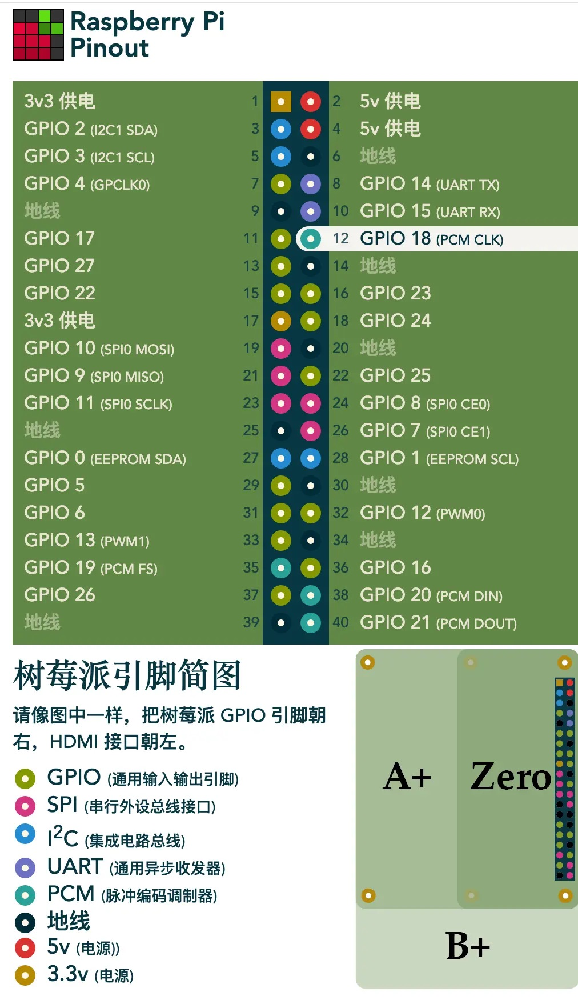
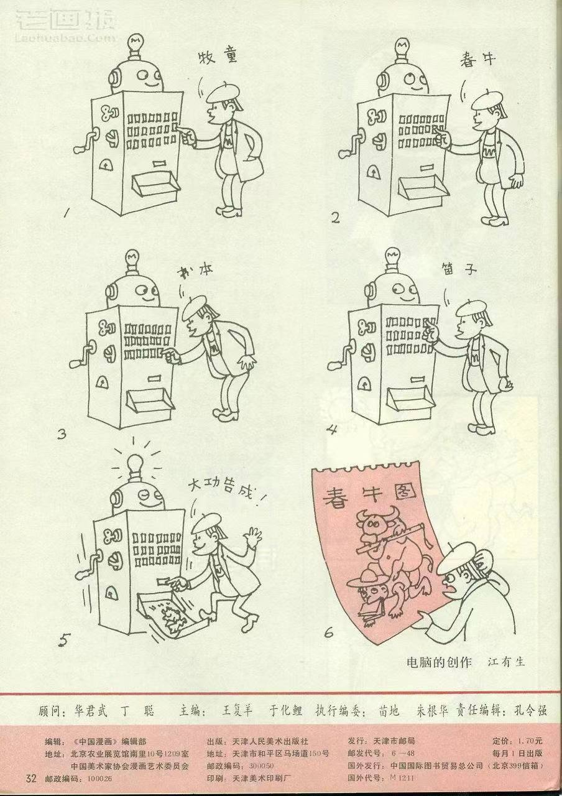

啰里啰唆周刊第61期：望族留原籍，家贫走四方

# 科技日常

## 1. OPNsense-多功能高可靠易使用的防火墙
OPNsense是由Deciso开发的开源、基于FreeBSD 的防火墙和路由软件，这不是类似firewalld这样的服务方案，更常用的做法是单独作为一套OS部署的，带有web界面。
除了充当防火墙之外，它还具有流量整形、负载均衡和虚拟专用网功能，其他功能可以通过插件添加。

一般常用场景就是家庭布网Home Assistant，当然也可以用于企业级网络中。

[https://opnsense.org/](https://opnsense.org/)
## 2. restic-备份工具
Restic is a modern backup program that can back up your files.

功能特性：
1.跨系统支持，开源软件,基于Golang开发；
2.支持多种数据存储方案，包括自己的文件系统或者是 S3/OSS 之类的对象存储；
3.提供快照式的备份模式，相同目录的多次备份可以用快照查看历史版本；
4.支持增量备份，在同一目录多次备份中只上传差异；
5.支持加密，承载数据的云服务商无法感知；

[https://restic.net/](https://restic.net/)

## 3. foobar2000 正式发布 2.0
经过漫长的测试，foobar2000 正式发布了 2.0 版本 —— 又是一个有生之年系列，标志着 foobar2000 发布 21 年后终于进入 2.0。

foobar2000 是一款免费的高级音频播放器软件，包含了一些播放增益支持、低内存占用等基本特色，以及内置支持一些流行的音频格式，支持强大的界面扩展和插件以及出色的音效。其开发者是波兰人 Piotr Pawłowski（英文名 Peter Pawlowski，原 Winamp 公司 Nullsoft 成员），最早发布于2002年。

除了播放之外，它还支持生成媒体库、转换媒体文件编码、提取 CD 等功能。foobar2000 之所以出现，在于 Peter 不满 Winamp2.x 的插件体系架构和更倾向于图形、朝向外观方向发展的 Winamp 3。

[Version_2.0_Release_Notes](https://wiki.hydrogenaud.io/index.php?title=Foobar2000:Version_2.0_Release_Notes)

## 4.blocker-打断流氓软件的腿
Blocker是一款操作Android应用程序四大组件的程序。它支持多种不同的控制器控制组件，目前支持的有使用软件包管理器方式（PackageManager）和意图防火墙模式（Intent Firewall）。支持无缝切换使用模式，导入导出Blocker规则，导入导出纯IFW规则，兼容MyAndroidTools规则导入，或是将其转换为Intent Firewall规则导入。
优点
- 轻量级程序，不会给系统增加负担。
- 易于使用，界面直观。
- 兼容多种方法禁用。

> 七八年前就在倒腾的技术，现在依然有它的市场，而且与时俱进。

[https://github.com/lihenggui/blocker](https://github.com/lihenggui/blocker)

## 5.notekit-支持手绘笔记的 Markdown 编辑器
一款支持手绘笔记的 Markdown 编辑器。这是一个基于 GTK+ 3 开发的笔记工具，支持所见即所得的 Markdown 内容，以及通过鼠标、触摸屏或数字转化器添加手绘笔记。

[https://github.com/blackhole89/notekit](https://github.com/blackhole89/notekit)

## 6.veloren-像素风 RPG 游戏
一款 Rust 写的像素风 RPG 游戏。它的灵感来自《塞尔达传说：旷野之息》、《矮人要塞》和《我的世界》等游戏。虽然这款游戏的画质低，但拥有广阔的开放世界，玩家在游戏里可以打造道具、合成物品、战斗、升级、驯养宠物，还可以探索地牢洞穴、在空中滑翔、与 NPC 交易。

[https://github.com/veloren/veloren](https://github.com/veloren/veloren)

## 7.I want to talk about WebGPU
一篇关于 WebGPU的技术文章。WebGPU是新的WebGL，这是在网络浏览器中绘制 3D 的新方法。WebGL是围绕OpenGL ES设计的。

文章梳理了Vulkan、DirectX 12 和 Metal、 WebGL等技术名词，内容详实，值得一读。

继5月初Chrome 113 发布后，默认已启用 WebGPU。

[https://cohost.org/mcc/post/1406157-i-want-to-talk-about-webgpu](https://cohost.org/mcc/post/1406157-i-want-to-talk-about-webgpu)

## 8.闲鱼被骗经历与支付宝漏洞
我想买两张张杰武汉演唱会的门票。在小红书上和骗子联系好后，骗子首先发来了闲鱼宝贝的链接（是真的在闲鱼平台上的），我在闲鱼将其拍下之后。骗子以要我付运费为理由，发给我一个二维码，要我在闲鱼平台打开扫描。

这个二维码通过闲鱼扫描之后会跳转到支付宝，支付宝支付一元之后，闲鱼突然自动收货了，此时骗子收到钱了之后把我拉黑了。

网友分析：
> 闲鱼交易不要扫描任何对方发来的二维码，通常是以补快递费等理由发的付款码。目前支付宝存在逻辑漏洞，一个精心构造的虚假页面可以直接拉起确认收货提示框，如果此时确认收货会钱货两空。虽然确认收货需要二次验证(密码、指纹、面容)，但如果使用了 Face ID，这个二次验证基本等于自动确认。

>  淘宝系App本身并不提供担保服务，担保交易功能由支付宝提供。这个接口是公开的Jsbridge 接口，不管是阿里系还是第三方都在调用这个接口接口设计之初并没有考虑到根据调用域名来鉴权，所以并不容易改动。看起来调用这个接口时支付宝并没有做二次确认，直接触发了确认流程 (FaceID)，连付款都是假的。

[https://zhuanlan.zhihu.com/p/625230704](https://zhuanlan.zhihu.com/p/625230704)

## 9.基于树莓派+红外管的伪智能家居实现
租住的公寓提供的是美的空调，很遗憾，并不支持智能家居的接入。

随着天气转热，每天又陷入了开关空调的微妙琐事之中。虽然大部分时间只是伸伸手，但依旧很打断上网的冲浪体验，加上这倒霉设备不能自动记住上次风速，所以开关后又要额外调节风速到自己喜欢的程度，对其不满便更是与日俱增起来。

终于在上周，上了一天班回来发现出门忘记关掉，更是心疼起电费。于是看了下架子上充当旁路由吃灰的树莓派，干脆折腾一下。
额外材料
- 红外接收管（录制遥控器红外信号编码）
- 红外发射管（发射控制信号）
- 杜邦线（连接作用）
- 三极管（可选，看着说是可以增强信号，自己并没有用到）

> 硬核技术文，干了我一直想干，又没空深入的事

[https://zsakvo.xlog.app/lirc-on-raspi](https://zsakvo.xlog.app/lirc-on-raspi)
# 读书与影视分享

## 1.2006年9.7分纪录片《蒙古草原，天气晴》
1999年秋天，日本探险家关野吉晴正骑着脚踏车横越蒙古，偶遇了年仅6岁、桀敖不驯的蒙古女孩普洁。他想用相机拍摄她的模样，但她拒绝了：“如果你只是来这儿拍照的，那走开吧！” 然而，这却开启了他们之间的友谊。普洁很小就学会牧羊、骑马，蒙古社会与经济形态的转型为生活带来更大的考验。普洁在妈妈的坚持下到学校上学，这让她的梦想多了一双翅膀，飞跃蒙古草原…… 

此片为日语片，时长109分钟。

> 「你好吗？我们都很好。有没有安然返回日本呢？我们今年冬天过得很开心。天气虽然冷，你的黑白花马却安然度过。我们还没找到失窃的马。普洁今年要上学了，她对你念念不忘。又是新的一年，祝你和你的亲友都健康快乐。请找人翻译成日文。下次再见咯！珍重。」

## 2.电影《沙丘 2》公布正式版预告片
5 月 3 日，电影《沙丘》系列公布了第二部作品《沙丘 2》的正式版预告片，影片将接续首部的故事，继续讲述保罗·厄崔迪的冒险之旅。《沙丘 2》此前已确认将于 11 月 3 日在北美院线上映。

ref:[https://www.bilibili.com/video/BV1sL411a7hk/](https://www.bilibili.com/video/BV1sL411a7hk/)

## 3.经典小说《遥远的救世主》
这是一部可以傲然独尊的长篇小说。也是一部可遇不可求的完美佳作。

豆豆，以她的才华，探索一个有机的、无定形的、陌生的、暧昧的和未曾臻达的世界。男女主人公那浓墨重彩的经历以及令人欷歔的爱情故事创造出了一种超然背叛的意志，而这意志是那样的静谧、清明。

效力于德国一家私募公司的商界怪才丁元英，用他超出常人的手段，将从德国募集的资金投进中国股市，用“文化密码”疯狂掠夺中国的钱财，后来又良心发现，退出了公司，但退出是要受到惩罚的，为此，他付出了惨痛的代价，他的所有分红被冻结，甚至穷到天天吃方便面。回到古城“隐居”时，认识了从小在法兰克福长大、如今在古城刑警队任职的女刑警队员芮小丹。两人从相识到相知，从一对音响发烧友演变成了一对爱情发烧友，上演了一出精彩、浪漫、传奇的天国之恋。

《遥远的救世主》被改编拍摄成电视连续剧《天道》，是不可多求的一部“神作”，经典语录频出，豆瓣评分9.2，可谓非常高了。

> 豆豆并非是在写小说，而是在用小说的方式证道。芮小丹有着完美人格，她的性格天然拥有神性的光辉。书中丁元英多次说小丹层次更高，不是男女调情的恭维，是作者在借他口表达。丁元英是玩转社会规则的人，芮小丹是实践自己心中规则的人。修之于身，其德乃真，我为她的行为深深震撼。以往此类型人物小说中通常都会写作为男性，感谢作者创作了这样一位女性人物。

>  这是一本奇书，看得进去的人会在里面看到好多东西，或深刻或肤浅，或简单或晦涩，但肯定有所收获。看不进去的人会觉得里面的人都不说人话， 不办人事，故作高深，自以为是。你是什么样的人，就看到什么样的内核。

# 图论

## 1.1994年的AI设想

1994年对生成式人工智能的预言，来自《中国漫画》1994年3月号

## 2.1981年

1981年，杭州，外国摄影师镜头下的小两口。相机、手表、长筒丝袜，色彩鲜艳的皮包与伞.

作者应该是1981年来华的34岁意大利小伙阿德里亚诺·马达罗（Adriano Madaro）
# 谈天说地

## 1.为什么面料欺诈如此容易隐藏
In 2016, US retailer Target severed ties with textile manufacturer Welspun India after discovering that 750,000 sheets and pillowcases labelled Egyptian cotton were not 100% Egyptian after all.

Egypt has long been known for producing long- and extra-long-staple cotton, a variety of the crop with especially long threads that results in softer and more durable fabric – so products labelled Egyptian typically command a higher price. But the year after the Welspun incident, the Cotton Egypt Association estimated that 90% of global supplies of Egyptian cotton in 2016 were fake.
...
In contrast to forensic tracers, additive tracers use artificial signatures to track a fabric as it travels through the supply chain, typically relying on adding artificial DNA or pigments to the fibres that act as an "invisible ink". The tracers are applied to the fabric, usually through a spray or printing process, and then detected later on in the supply chain to verify the authenticity of the products. Unlike forensic methods, additive tracers do work for synthetic materials.

With Gots and Textile Exchange, the Organic Cotton Accelerator (OCA) developed a method to extract DNA from cotton and screen for genetic modifications known to have been made to the crop in countries like the US, India and China. 

> 由于复杂供应链的关系，面料的来源难于追溯，造假也普遍存在。纺织行业也在研究各种手段来检验产品真伪。

[https://www.bbc.com/future/article/20230206-fabric-fraud-how-to-spot-fake-fabric-claims](https://www.bbc.com/future/article/20230206-fabric-fraud-how-to-spot-fake-fabric-claims)
## 2.中国非法移民 
Lihua Wu's journey to the United States started when she scrolled past the words "The Route," one of several common hashtags on Douyin, the Chinese counterpart of TikTok, advising migrants on the irregular overland trek across Latin America to the United States, also known online as "the Big Beautiful."

By the time the single mother and her five-year-old daughter were apprehended by U.S. Border Patrol on a dirt road near the U.S.-Mexico border just before midnight on April 2, Wu said she had relied on social media for detailed instructions for her trip, including footwear (Crocs as well as hiking boots) and how to find and pay for a reliable local guide.

近期路透社发表了一篇长篇的图文互动调查文章，采访了很多从巴拿马徒步穿越著名死亡沼泽Darién Gap到美国的穿越者，十分值得一读。这篇文章指出仅在2023年4个月，在美墨边境逮捕的国人迁徙者就有6500人之多。这篇文章说很多国人都是从中国免签国厄瓜多尔入境，然后从那里徒步的。信息都是来自于推特和YouTube等自媒体。这些人每人给蛇头交1230美元。 

[Migrants find tips on Chinese version of TikTok for long trek to US-Mexico border](https://abcnews.go.com/International/migrants-find-tips-chinese-version-tiktok-long-trek/story?id=98943298)
## 3.苦瓜这个物种为什么没有被大自然淘汰？
只能说，人们对苦瓜是苦的这种误解，和黄瓜被 “绿” 是一样一样的！

因为，真相是：成熟苦瓜不仅不苦，还是甜的；完全成熟的黄瓜也不绿，只是被 “绿” 而已。
以前，在农村，夏秋季节小孩子在田间地头闲逛时，会看看谁家菜园子攀出翠绿翠绿的黄瓜，谁家地头瓜架上的苦瓜又 “红炸” 了。

是的，以前农村，绿黄瓜、红苦瓜，是农村小孩最易得的零食水果。
不同于平常我们在菜市见到的绿苦瓜，成熟后的苦瓜，外皮肉质那层，会变成橙红色，肉质变软。
而更为熟透的苦瓜，橙红的外皮肉层还会炸裂开来，露出鲜红色瓜囊籽粒，一颗颗地挤挨在一起。

> 很多时候，很多东西并不是你认为的那样，因为你看到的可能只是其中一个片段，而不是它的全过程。

来源：[知乎](https://daily.zhihu.com/story/9761099)

## 4.卡申银矿
今年 6 月份，全球最大的互联网百科全书 “维基百科” 曝出一个巨大的造假丑闻。一个名叫折毛的网友在中文维基百科编撰了 206 个词条，修改 4800 多次，“创作” 了浩瀚而自洽的古罗斯历史。

在她创造的世界里，莫斯科公国和特维尔公国为了世上最丰富的银矿斗争了两百年。尽管事情很荒谬，但这个骗局在最近才被揭穿，而这位网友在维基百科上造假已有十多年。

十多年的骗局东窗事发是因为这段被架空的历史与现实有了交汇……

维基百科收录内容难道这么不严谨吗？确实，为了审核内容的真实性和可靠性，维基百科是有专门的巡查员对网民上传资料进行复核的。

可谁能想到折毛作假手段严谨到匪夷所思的地步，甚至获得了维基百科的 “巡查豁免”。

由于她辛苦编撰了数百万字，凭一己之力生生打造出一个“折毛版古罗斯宇宙”，有的人物的确是历史上真实存在的，有的则完全不存在，可她依然给所有人物创造了维基词条，甚至背后的势力和家族都一一列举了出来。有读者为了感谢她而赠送星章，其中还不乏专门研究相关历史的研究者。

造假丑闻被曝光之前折毛自称是俄国史专业毕业，父亲是驻俄外交官，老公也是俄罗斯人，目前自己也已更换国籍成了俄罗斯人。在道歉信中，她说自己不仅不懂俄语，连英语也不懂，所有外文资料都是靠机器翻译而来，自己即将临盆，经济压力也很大，将退出维基圈。

网友们经过对折毛和百科一些词条的调查，发现她从 2010 年起就用小号篡改清史词条，之后一路糟蹋日本史到如今的古俄罗斯史。小号的人设各不相同，有的是台湾人，有的是澳门人，有的是香港人，但无一例外都对历史表现出浓厚的兴趣，甚至演起互相认识捧臭脚的戏码，折毛把这种行为称作自我 cosplay，一玩就是 12 年。

维基恶作剧列表如此写道：
>     这是维基百科上已知历史骗局。它存在的目的是记录维基百科上的骗局，以提高我们对骗局的检测能力。如果一个骗局超过一个月都没被发现事实错误，或者在权威媒体上被报道过，我们会认为它是值得被注意，足以列入这个列表。

ref:
[https://zhuanlan.zhihu.com/p/532437087](https://zhuanlan.zhihu.com/p/532437087)
[https://weibo.com/1726294583/MgjZ7kw8h](https://weibo.com/1726294583/MgjZ7kw8h)
# 一句话快讯

1.网信中国表示，针对斗鱼平台存在的色情、低俗等严重生态问题，5月8日，国家互联网信息办公室指导湖北省互联网信息办公室派出工作组，进驻斗鱼平台开展为期1个月的集中整改督导。

2.中国在酒泉卫星发射中心成功发射的可重复使用试验航天器，在轨飞行276天后，于5月8日成功返回预定着陆场。

3.据多方信源确认，著名藏族导演万玛才旦去世，享年53岁。他的代表作有《撞死了一只羊》《塔洛》《老狗》《回南天》《静静的嘛呢石》等。

4.综合杜克大学校报、温哥华港湾等国外媒体报道，美国杜克大学一名29岁的中国博士后因涉及非法下载复制传播儿童色情视频于4月被捕。他面临15项指控，最高刑期可达110年。

# 联系方式

啰里啰唆是一份针对互联网和生活爱好者的数字杂志，旨在发现和分享一切有趣的东西。话题不固定，每期大约十五分钟阅读量，暂定每周四发布。部分内容来自互联网采编，如果为有来源的转载，均会注明转载地址或保留水印。

这是一个关注人文和科技的newsletter。

使用方法建议或素材提供

频道：notonlyshare

邮箱：auokyob@outlook.com

github地址：[https://github.com/iminto/luoliluosuo-weekly](https://github.com/iminto/luoliluosuo-weekly)