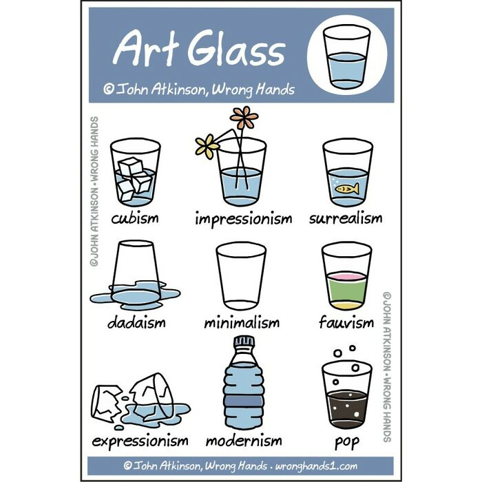
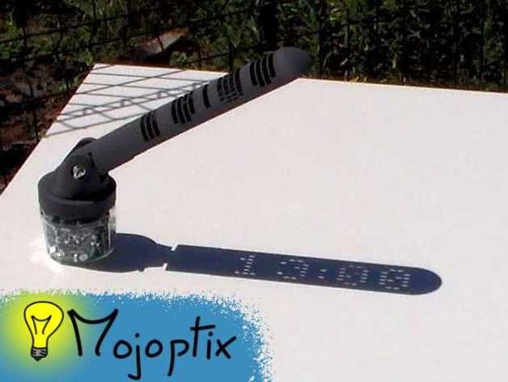
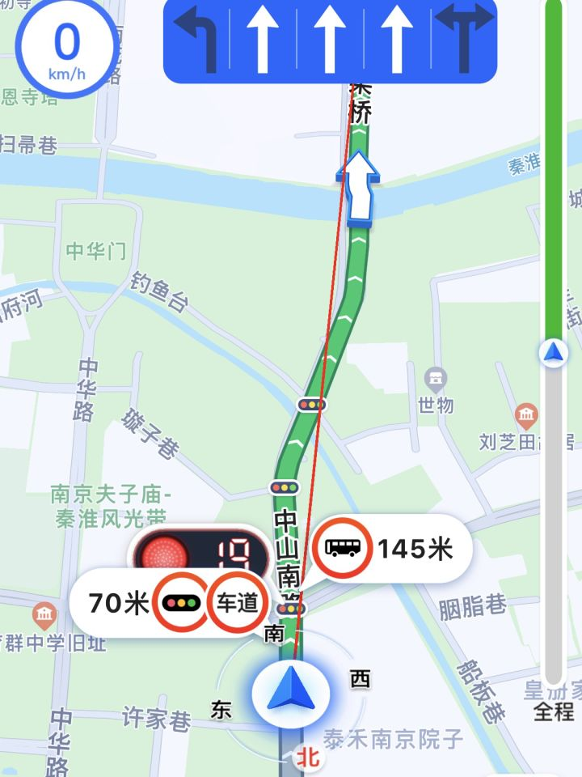

啰里啰唆周刊第62期：翻云覆雨手

# 科技日常

## 1. static-marks 将浏览器书签转换为静态网站的工具

将浏览器书签转换为静态网站的工具。该项目能够将本地的浏览器书签，生成一个方便部署的独立 HTML 文件，轻松实现在线分享浏览器书签的功能。

[https://github.com/darekkay/static-marks](https://github.com/darekkay/static-marks)

## 2.LAMDA-逆向及自动化的辅助框架
LAMDA 是一个用于逆向及自动化的辅助框架，它设计为减少安全分析以及应用测试人员的时间及琐碎问题，以编程化的接口替代大量手动操作，它并不是一个单一功能的框架。为了让你大概了解它的用处：你是否会在手机上安装各类代理、插件或者点来点去的设置来完成你的工作？你是否要在异地操作远在千里之外的手机？你是否有编程控制手机的需求？是否还在某些云手机厂商那里购买昂贵的IP切换、远程ADB调试、RPA自动化甚至连 logcat 日志都要付费的服务？如果有，那么对了，只需一个 LAMDA 即可解决这些问题。并且，LAMDA 更注重分布式，事实上，你可以在一台公网服务器上管理散布在世界各地各种网络环境中的设备。当然，LAMDA 可以做到的不止于此。

功能特效：
- 中间人流量分析
- Http服务器搭建，反向代理等
- 逆向破解
- 大规模远控，远程桌面连接
- 自动化

[https://github.com/rev1si0n/lamda](https://github.com/rev1si0n/lamda)

## 3.Pho - 一款可以替代系统相册的照片上传/同步开源 app
Pho 是一款无服务端的应用，旨在替代你手机上的自带相册应用。它简洁实用，不仅可以查看本地照片，还能将照片同步到多种协议的网络储存, 不依赖任何服务, 没有多余功能。

除了查看本地和云端照片，它还支持增量同步照片到云端，即只同步新添加或更改的照片，避免重复上传。此外，Pho 还有后台定期同步的功能，可以在你不使用手机的时候自动同步照片，让你的手机相册始终保持最新状态。

Pho 无需数据库，无需服务端，操作简单易用。它按时间组织云端存储的目录结构，方便你快速找到需要的照片。而且，Pho 支持的网络储存包括Samba 、Webdav 和 NFS，即将支持阿里网盘等多种网络储存，满足了你不同的需求。

目前，Pho 仅支持安卓端.
[https://github.com/fregie/pho](https://github.com/fregie/pho)
## 4. 推荐系统工程实践
介绍推荐系统/搜索等架构和系统实践工程问题，内容涉及推荐系统架构、曝光去重实践、向量检索、特征平台架构、样本工程等。

[https://www.zhihu.com/column/c_1443320385803091968](https://www.zhihu.com/column/c_1443320385803091968)

## 5.放着不用，数据会丢？浅谈SSD的数据保持力问题
最近，在知乎、论坛经常看到有人提出这样的疑问：SSD长时间断电不用，里面的数据会丢失吗？SSD放了几年，会无法启动吗？在此做个简单的分析与解答。

之所以有这样的疑问，是因为SSD的核心元件——NAND Flash工作原理导致的“数据保持力（Data Retention）”问题，它也是所有基于NAND Flash的SSD共有特性。
什么是“数据保持力”

SSD也好，U盘也罢，它们都是我们最为常用的“非易失性存储器（non-volatile memory，即NVM）”。从名字不难看出，它并非数据绝对不会丢失，只是不易丢失。根据NAND Flash自身工作原理，其上面的存储单元在长时间不进行读写操作的情况下，浮栅门级中存放的电荷会逐步漏电，导致原本存储的数据发生变化，如图示中数据 “0” 可能变为 “1”。当数据错误达到一定数量，超出SSD的纠错能力时，数据将彻底损坏。

> 掉电后保持时间长短与颗粒寿命一样，SLC>MLC>TLC>QLC，筛选过优质颗粒自然也更好一些，eMLC>MLC。

[https://zhuanlan.zhihu.com/p/516267581](https://zhuanlan.zhihu.com/p/516267581)

有人认为SSD就是大U盘，关于这个可以看这篇比较专业的文章[https://farseerfc.me/flash-storage-ftl-layer.html](https://farseerfc.me/flash-storage-ftl-layer.html)

## 6.网工专有名词大全
这是张工花了三天三夜整理的，网络工程师专有名词大全，目前总共有600多个，主要涉及网络协议、技术、网络有关的名词缩写，还有广域网、无线、接入网、存储相关的专有名词，有这些专有名词的英文解释和中文解释，常用的不常用的都有。

我还做了多种类型的文档，有excel的，有pdf的，有图片格式的，毫无保留的分享给大家，大家可通过这个专有名词大全，查询记不住的专有名词，经验丰富的网络工程师，也可以看一下自己还有哪些知识没有掌握的，可以有针对性的学习，如果这600多个专有名词都全部熟悉了，那就是大佬无疑了。

[http://www.wlts.cc/index.php/2022/11/06/zymc/](http://www.wlts.cc/index.php/2022/11/06/zymc/)

# 读书与影视分享

## 1.中国大陆版《忠犬八公》
这是一只小狗感动全球数亿人的故事。

故事发生在山城重庆，讲述一只中华田园犬自幼被陈教授收养回家，尽管一开始受到妻子李佳珍的反对，但在陈教授的坚持下最终八筒成为家庭一员。后来八筒长期坚持陪伴陈教授在乘坐过江缆车上下班的车站门口等待与守护，它也见证了陈家女儿晓舟出嫁，陈家儿子新桥乘坐列车远赴北京工作。直至有一天陈教授突然因病离世，陈家也经历搬迁等变故，但是八筒依然十年如一日坚持在车站门口等候盼望见到陈教授归来的感人故事。

片场124分钟，2023年3月底上映，由徐昂执导，冯小刚、陈冲、白举纲等主演。中国大陆首周三天收获6124万人民币排名第三位，最终成绩为2.83亿。 

本片改编自日版《ハチ公物語》,这是忠犬八公最早的电影版，1987年8月1日上映。 

原版忠犬八公（日语：忠犬ハチ公，1923年11月10日－1935年3月8日）是一只日本秋田犬，它以其对主人上野英三郎教授的忠诚而闻名于世。

八公于1923年11月10日出生在秋田县大馆市附近的一个农场，原名阿八（ハチ），它于1924年被上野英三郎带到东京涩谷作为宠物饲养，八公每天都会前往涩谷站迎接主人回家。然而，上野于1925年因脑溢血在工作场所去世，但这并没有打散八公对主人的忠诚之心。八公继续每天前往车站等待尚未归来的上野，直到它于1935年3月8日逝世。

随着八公在日本文化中被视为忠诚的典范。1934年，日本犬保存会发起了筹款活动，募集资金兴建八公的铜像。同年4月21日，忠犬八公像在涩谷站前落成，而八公的故事也被拍成电影和书籍，持续影响着日本及海外的流行文化，并被人们所铭记。

[忠犬八公-wiki](https://zh.wikipedia.org/zh-cn/%E5%BF%A0%E7%8A%AC%E5%85%AB%E5%85%AC)

## 2.乡下人的悲歌
《乡下人的悲歌》中，J.D.万斯真实讲述了社会、地区和阶层衰落会给一生下来就深陷其中的人带来什么样的影响。万斯的外祖父母从肯塔基州的阿巴拉契亚地区向北迁居到俄亥俄州，希望逃离那可怕的贫穷。他们通过努力跻身中产阶层，最后他们的外孙从耶鲁法学院毕业，这是传统意义上成功实现一代人向上流动的标志。但是随着家族故事慢慢发展，我们发现万斯的外祖父母、阿姨、叔叔、姐姐，以及最重要的他的母亲，都在极力适应中产阶级生活的要求，却从没完全逃离过药物滥用、酗酒、贫穷和精神创伤。万斯便是在这样混乱又令人心碎的环境中成长，但也是这群“乡下人”的爱与忠诚，使他取得了今日的成就。

然而综合来看，像作者一样成功脱离贫困的案例，屈指可数。大多数的美国白人蓝领仍旧摆脱不了世袭的贫穷与困顿，仿佛是一条与生俱来的枷锁，牢牢套在他们的脖子上。究竟是什么样的原因，让他们无法在美国这个以自由为豪的国度中，找到合适的出路？

《乡下人的悲歌》是一部极其动人的回忆录，包含了栩栩如生的人物形象和诸多幽默元素，记述了向上流动到底是怎样的感觉，也对一大批人丧失美国梦的现象作了思考。这本书同时也是一部深刻的社会评论，通过作者的成长故事与经历，以“局内人”的角度，带领我们以更宏观的视野，深入探视美国蓝领阶层所面临的困境与危机。

> 本书在美国出版于川普获胜的第二天，据説失落而茫然的精英阶层争相阅读这本无名人士的回忆录，大约是想为川普的离奇胜选找到一些理由吧。之后JD也成为一位社会名人。

# 图论

## 1.glass

John Atkinson is a cartoonist from Canada, who creates the series "Wrong Hands". Atkinson's cartoons are often inspired by classic books, which he humorously summarizes in tweet-sized synopses suitable for dinner parties or functions. The artist’s sense of humor is shaped by British comedies such as Blackadder, PG Wodehouse, and Monty Python. His inspiration comes from various sources, also including Charles Schultz's Peanuts, and Gary Larson's The Far Side.

[https://wronghands1.com/](https://wronghands1.com/)
[https://www.instagram.com/wrong.hands/](https://www.instagram.com/wrong.hands/)

## 2.Digital sundial

没有电池，没有电机，没有电子设备...这一切都只是一场非常超级花哨的皮影秀。日晷的形状经过数学设计，只能在正确的时间/角度让正确的阳光通过。这允许在日晷的阴影内用阳光照射的数字显示实际时间。

日晷显示从10：00到16：00的时间（带有实际数字），每20分钟更新一次。可3D打印，含STL文件。

[https://www.thingiverse.com/thing:1068443](https://www.thingiverse.com/thing:1068443)
[原理和介绍视频讲解](http://www.mojoptix.com/2015/10/25/mojoptix-001-digital-sundial/)
# 谈天说地

## 1.Please Eat in the Library
The United States is sleeping on more than just universal health care and widespread bidet usage. In cities from Helsinki, Finland, to Canberra, Australia, libraries offer more than just a place to take a break between using fast and free internet and researching ancient Martian glaciers. They’re stocked with cafés and wine bars (yes, really!) that encourage lingering with a culinary experience all their own. Think: chickpea bánh mì, wild mushroom soup made from sheathed woodtufts foraged in a nearby forest, and cask Côtes du Rhône on tap. Not a shrink-wrapped cake slice, lukewarm Styrofoam cup of drip coffee, or soggy egg salad sandwich in sight.

> 文章主要讲述了美国图书馆的进化，从单纯的图书借阅变成一个混合的兼具娱乐和餐饮的社区。

[https://tastecooking.com/please-eat-in-the-library/](https://tastecooking.com/please-eat-in-the-library/)
## 2.高德地图红绿灯读秒怎么实现的？
> 既不是跟城市交通部门购买数据，也不是用摄像头偷拍红绿灯😓（过于离谱）

事实上，红绿灯倒计时功能的落地，并非接入现实中的红绿灯数据那般直接简单，而是高德地图多年来在交通领域深耕创新，算力进化的成果——用户在高德地图中看到的红灯倒计时，以及红灯等待轮数，都是“算”出来的结果。

具体可见此专利：[CN114463969A 红绿灯周期时长的挖掘方法、电子设备及计算机程序](https://www.patentguru.com/cn/CN114463969A)

专利中说的已经比较详细且可行了。

> 
本公开实施例在挖掘红绿灯周期时长的过程中，首先获得目标时段内的样本数据，该样本数据包括目标时间段内等待目标红绿灯的样本车辆的轨迹数据；基于轨迹数据确定在目标时间段内第一个启动的起始样车辆，进而再将起始样本车辆的启动时间作为起始时间，确定目标时间段内其他样本车辆的启动时间距离起始时间的偏移时长，统计在偏移时长维度上样本车辆的数量分布信息，基于该数量分布信息的周期性特征确定目标红绿灯的周期时长。本公开实施例通过将一天进行切片后得到多个时间段，针对每个时间段统计样本车辆在目标红绿灯前停车的时间，统计得到的数据利用率较高，相较于仅依据同一周期内的数据确定红绿灯周期的已有技术，本公开实施例依据的是一个时间段内多个周期的数据，并且本公开实施例所使用的周期性数据是样本车辆在目标时间段内，相较于起始样本车辆结束等待红灯并启动的时间的偏移时长，该偏移时长所反映的红绿灯周期特征更加准确，因此最终挖掘得到的红绿灯周期的准确率更高。

可以认为是99% 算法，1%交管合作接入。

另外类似交通拥堵路段，也是可以利用手机加速度传感器分析出来，结合多个用户进行大数据分析，甚至对于临时红绿灯和施工路段也能分析出来。

有一个类似的行为艺术也可以说明导航软件的这种行为

> 德国一个艺术家，西蒙·维克多，用平板车拉着99部手机，全部打开导航，走上街头，结果周围很多打算开车经过这条路的人，他们的谷歌地图上竟然显示这条路非常拥堵，甚至到了交通瘫痪的地步！

## 3.东北伤痕文学
 看《漫长的季节》，你们有没有觉得，东北伤痕文学其实就是《红楼梦》？是一群天真的人，突然被一种巨大的不可抗力搞到一无所有的故事。

计划经济下的东北老工业厂区就是大观园。这些作品中几乎不可避免地出现弗洛伊德、钢琴、拉丁舞、萨克斯，工人们一边劳其筋骨，竟也兼顾了陶冶情操。这些作品中出现了一个个天真澎湃到反常到搞笑的人物，其实只要留心上一辈，你会相信一个王响这样“以厂为家”的全套积极份子是真实存在的；龚彪同样天真，丽茹说得没错，彪子是真的爱学习，那种对于知识的热爱，除了拿来装逼之外，几乎是纯然的；甚至很多作品中大量的所谓的反面人物，比如管计划生育的小领导，念下岗名单的人，他们中很多人也天真而茫然地相信，自己与伟大光荣正确站在了一起。所有人都浑朴可爱，面目无憎。

东北当然是一个被凭空制造出来的乌托邦，它悬空在整个国家非常巨大的贫穷和苦难之上，但它的内部却是生存无忧的，自给自足的，革命乐观的，浪漫多情的。乌托邦是被塑造的，但人心却是真真正正与乌托邦同构的。他们中的几乎每一个人，都获得了与时代共舞的最高的情绪价值。

所以，当乌托邦轰然倒塌的时候，失落打在人心上，痛当然是巨大的，毁灭性的。但人心却不是不古的，那种被乌托邦精神喂养起来的天真几乎成为了东北人的底色。天真是一块毛玻璃，当它与快乐叠加时，便呈现一种温柔的玫瑰色，而它与痛苦叠加时，便呈现出一种绵长的感伤，再巨大的毁灭性的苦也被幽默轻轻包裹起来，甚至用宽恕一笔带过了。

这两天我经常刷到有的东北人说，你们看东北电视剧，觉得嘴碎，恨不得一句一个梗，这真的不是小品式的夸张，是我们东北人真是这样的云云。其实“恨不得一句一个梗”和“恨不得一步一句诗”，是一样的饱满而天真的东西，这是乌托邦的语言，现实的乌托邦倒塌了，人心还是很难从废墟中爬出来。

自然，造物者心里是有杆秤的，明白何为此消彼长。“港商”待遇三十年河东，三十年河西，自然是招之即来，挥之即去，逃不过的是拨弄秤杆的翻云覆雨手。 

> 工业伤痕文学最怀念的那个工人地位高、待遇好、每家可以弹钢琴的时代固然美好，但也仅限于国营工厂这个群体。换成我们白完的种地老乡是只配去啃树皮的。苏式体系对重工业人口赋予准旗人待遇的实质，是把所有人的生存资源全部汲取过来重新优先分配给技术人口/工业人口和军队，代价当然是占人口比例最多又最受歧视的农民。由此也催生了苏式国家普遍存在的严格限制城乡流动的户籍制度。二十世纪以来多次食物短缺乃至大吃饱问题给人们留下的宝贵生存经验是：在社会主义国家，你一定要当个城里人/厂里人。 

[黄小妖@微博](https://weibo.com/u/1626657175)

## 4.李济父子
好多民国大咖，我们不大熟悉，是因为他们跑美国或台湾去啦。

比如，发掘和研究甲骨文的李济......人家可是当年帮老蒋运输古文物到台湾的主力。

民国时期，他多次到河南安阳殷墟主持甲骨文的发掘工作，跟盗挖文物的人抢时间、抢资源。若不是这群人的贡献，成汤伐桀、盘庚迁殷、武丁拜相等故事对我们来说可能还只是一个传说，而不是可考的史实。在清华的时候，王国维、梁启超、陈寅恪、赵元任均为教授，而哈佛毕业的他只是讲师，是因为考古才是他的主业。

抗战期间，李济为了避免文物落入日本人之手，一路带着大批文物南迁，先去了昆明，又去了宜宾李庄。他真的是拿命在保护那些文物，但不幸的是，他保护得了文物却保护不了自己的两个女儿，两个女儿先后得病去世，他只剩下一个儿子。

抗战结束后，他本想继续挖掘殷墟，但等待他的是繁重的清理、追查、保护文物的工作，再后来，接到命运要去台湾，他又一路护送着文物去了台湾。而台湾的故宫博物院，正是因为有李济运送的这些文物，才得以建设起来。

当时，这些知识分子也不知道国共形势如何，有的人相信“和谈”和“划江而治”，以为台湾只是国民党暂避的地方，将来还可以回大陆。李济和他的儿子李光谟也是这么相信着的。那时候，李光谟去台湾玩了一趟之后，还是回了上海。等李济发现势头不对，赶紧给儿子买“比黄金还贵的机票”时，李光谟却想留在大陆看看一个新社会是什么样子。

结果，这对父子再也无缘相见。

两人只是靠在香港的朋友，交换礼物。1960年，李济去美国讲学，途径香港机场，李光谟受组织的委托，劝说父亲回大陆，被婉拒。两人这是最后一次见面（但直到过了30年解密期后，李光谟才把这事儿说了出来）。

WG时期，李光谟遭受到批判，两人彻底失联。李济的名字也在大陆消失了一段时间。后来，赵元任回国探亲，见了李济的儿子，第一反应就是给他照相，然后辗转交给李济，但不巧胶卷坏了，只传递过去信息。知道儿子还活着，李济高兴坏了。李济的晚年，过得并不好，唯一的儿子不在身边，台湾又没有什么像样的“古”可以考。他有机会去美国讲学一年，后来老了，又得了糖尿病及眼疾，还摔断了腿骨，只能呆在台湾。

1979年，他去世，没有机会再跟儿子见上一面。李光谟是1995年才去了台湾，去看了看他住的故居。李济给儿子留了一笔遗产，但因为政治原因，儿子没法继承。

2013年，李济的儿子李光谟因病在北京逝世，享年86岁。 

[晏凌羊@weibo](https://weibo.com/u/1476817753)

## 5.拿豆腐甚至豆渣浇汁儿当红烧肉猛嘬
前两天的热搜好像是那个火车上两家人互殴，再之前是啥来着？好像是母女还是爷孙插队，再前面忘了。好像是幼儿园教师唱儿歌爆红，然后前两天还看到热搜还在分析她是不是接受打赏、被打赏了多少钱。单看都没问题，但是一直看下来，就有一种 “大家在围着鸡毛蒜皮的事情死盯” 的感觉。

拿那个火车斗殴为例，全国关注，热搜登顶，连篇累牍，峰回路转。不说大炮打蚊子，也算是杀鸡用牛刀，不但刀有点可惜，鸡其实也很惨，正常人的日常冲突，无论是好是坏，其实都不至于落得被全国目光关注审视的下场，全国一起盯一件事，这件事要是不深刻，都对不起这份力，但是你把盯水门事件或恶性事件的力气用在一个普通人身上，这普通人根本受不了。两家人在火车上吵架，动手了，不是不能分析，但说真的也就那样，硬上层次，又是何必？要说恶性事件、公众人物、影响特别恶劣，手段特别残忍，也就罢了，插个队，吵个架，往骨髓里分析也就仅此而已……普通人其实就算犯点错儿也不至于被这么剥了皮吊起来细细地抽……

当然原因我也有所猜测，吃不着太多肉，拿豆腐甚至豆渣浇汁儿当红烧肉猛嘬。媒体是这样，我们其实也是这样。

[@祝佳音](https://weibo.com/u/1573046985)
# 一句话快讯

1.近日，山东济南长清区发生一起3人死亡事件。陆媒称，村官一家3口在家中被杀，疑因孩子间纠纷引发血案，凶手已经自杀。

2.5月11日，OPPO方面表示，面对全球经济、手机市场的不确定性，经过慎重考虑，公司决定终止ZEKU（芯片）业务。

3.5月15日16时许，新京报记者从安徽安庆岳西县天堂镇人民政府获悉，该镇一女子和她两个女儿在河道中身亡一事属实，三人遗体于5月13日在天堂镇东山大桥附近河面被发现。

4.近日有网友爆料称，在观看喜剧公司“笑果”的北京场演出时，发现其中有非常不妥的表达。一名演员谈到，自己领养了两条野狗，它们在追松鼠时，让他想起来八个字——“作风优良，能打胜仗”。北京当局已对此做出无限期停止演出和1335万元罚款的处罚。  

5.国家统计局发布数据显示，青年人失业率居高不下，4月份16-24岁劳动调查失业率为20.4%，比上月上升0.8%，首次超过20%，创有记录以来新高。与此同时，4月份社会消费品零售总额34910亿元，同比增长18.4%。

6.5月15日，距离5月17日世界不再恐同日还有两天，中国LGBTQ民间公益组织“北同文化”发布公告称，因不可抗力，终止运营。

# 联系方式

啰里啰唆是一份针对互联网和生活爱好者的数字杂志，旨在发现和分享一切有趣的东西。话题不固定，每期大约十五分钟阅读量，暂定每周四发布。部分内容来自互联网采编，如果为有来源的转载，均会注明转载地址或保留水印。

这是一个关注人文和科技的newsletter。

使用方法建议或素材提供

频道：notonlyshare

邮箱：auokyob@outlook.com

github地址：[https://github.com/iminto/luoliluosuo-weekly](https://github.com/iminto/luoliluosuo-weekly)