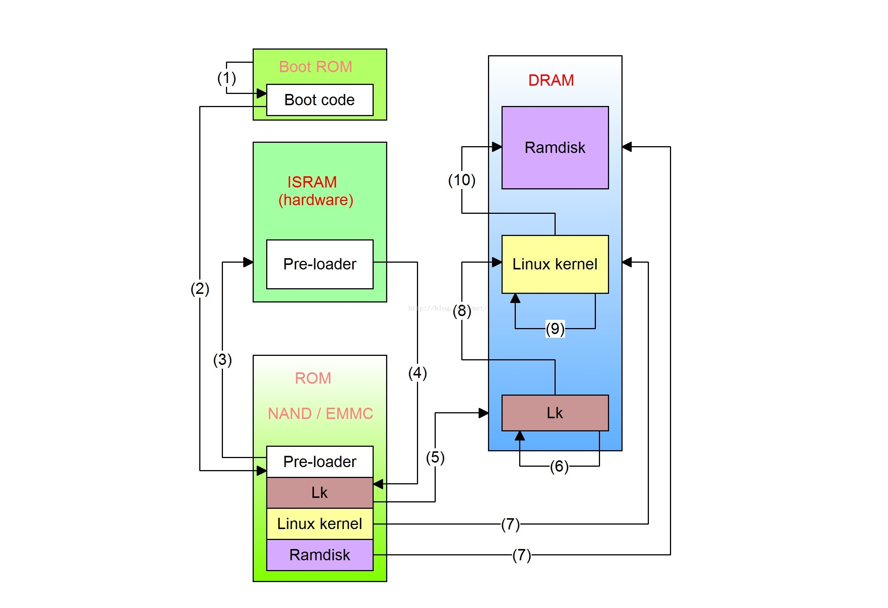
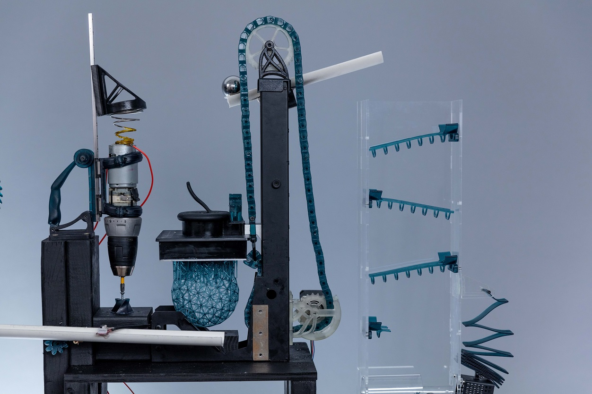

啰里啰唆周刊第63期：A像B不等于B像A

# 科技日常

## 1. RCX - Rclone for Android 
Rclone之前介绍过，Rclone (rsync for cloud storage) 是一个命令行程序,用于同步文件和目录，支持常见的 Amazon Drive 、Google Drive 、OneDrive 、Dropbox 等云存储。

RCX是Rclone的非官方Android客户端，最后更新2021年了，但又不是不能用。

功能特性：
- File Management (list, view, download, upload, move, rename, delete files and folders)
- Streaming (Stream media files, serve files and directories over FTP, HTTP, WebDAV or DLNA)
- Integration (Access local storage devices and share files with the application to store them on a remote)
- Many cloud storage providers (all via rclone config import, some without)
- Storage Access Framework (SAF) for SD card and USB device access.

[https://github.com/x0b/rcx](https://github.com/x0b/rcx)
## 2. musicolet-美观的music player
Musicolet is a small yet powerful offline Music Player for Android,which organizes and plays local audio-files stored on your device. 


功能特性：
- 多队列支持，真离线播放器
- 支持歌词编辑，支持内嵌歌词和歌词文件
- 支持锁屏歌词和队列
- 支持车机

此App虽为闭源软件，但是口碑甚佳。

[https://krosbits.in/musicolet/](https://krosbits.in/musicolet/)

## 3.Language Selector：帮 Android 13 找回应用语言设置
Android 13 更新里加入了「应用语言」设置，允许用户单独为应用设置显示语言。但在一些深度定制的系统中，这个功能入口却莫名其妙地消失了。期待着它的用户发现手上的设备终于吃上了更新却找不到功能入口，颇有种饺子煮好了醋却找不到的感觉。

Language Selector 的作者也遇上了这个问题：基于 Android 13 的 MIUI 目前没有此功能入口，但通过 ADB 命令
```bash
adb shell cmd locale set-app-locales <PACKAGE_NAME> [--user <USER_ID>] [--locales <LOCALE_INFO>]
```
仍然可以单独设置应用的语言，也就是说功能还在，只是入口被隐藏了。于是他为这项功能编写了一个「前端」，即 Language Selector。

[https://github.com/VegaBobo/Language-Selector](https://github.com/VegaBobo/Language-Selector)
## 4.ChinaRailTransit-中国轨道交通数据库
一个关于中国轨道交通非技术类信息的数据库的项目，收集了各省市的地铁支付信息、特殊运营方式等，以及一些地铁常见名词，统计数字等。
比如最长的线路是上海地铁11号线（上海，82.4km），最长的站间距：番禺广场-横沥（广州，18号线，25.8km），最晚的末班车是北京1号线，到达倒数第二站的时间是1:26。
除此外，还收集了机场代号等信息。

[https://ivysauro.github.io/CNRT/](https://ivysauro.github.io/CNRT/)

## 5.当我们谈论解锁 BootLoader 时，我们在谈论什么？
有过刷机经验或者曾经尝试过刷机的童鞋，一定听说过「解锁」这个词。这里的「解锁」全称应该是「解锁 BootLoader」或者简称为「解 BL 锁」。与通过人脸识别或者指纹、数字图案解锁手机屏幕的那种「屏幕解锁」不同，这里的「解锁」完全是另外一个概念。直观来说，解 BL 锁是刷机的前提条件。通常情况下，一旦某个设备无法解锁 BL，基本上就无法在这个设备进行刷机了。

那么，一定会有童鞋关心，解锁 BootLoader 到底意味着什么？为什么它会有限制？我们能绕过限制强制解锁吗？今天，我就尝试来回答一下这几个问题。



[https://weishu.me/2021/07/24/what-is-bootloader-unlock/](https://weishu.me/2021/07/24/what-is-bootloader-unlock/)

## 6.中国国内至国际骨干 ISP 线路整理
其实就是最初在知乎看到一篇文章[国内到国际的各种线路（VPS国际线路大全）](https://zhuanlan.zhihu.com/p/161029409)，非常详尽的介绍了中国国内电信联通移动等运营商国内到国际的 ISP 线路情况，以地区作为分类，单纯的从延时、丢包、Qos等来判断一条 ISP 线路的好坏，比如常见的 电信 CN2，电信 163，联通 169，移动 CMNET，移动 CMI，CUG ，NTT，PCCW，KT等国内外常见线路介绍。

在2022年和网友讨论相关话题时，想到此文于是再次谷歌了一把，发现原作者又在github上更新了此文。增加了更加详细的介绍。近期打算再次拜读时，发现作者清空仓库，2022版在知乎也被删了，于是搬运此文作为备份，以下基本都为作者原文，只修改图片至图床作为备份，修改了部分排版以适应博客的显示样式。

[https://www.tjsky.net/tutorial/633](https://www.tjsky.net/tutorial/633)

## 7.研究人员披露对 Android /鸿蒙设备指纹解锁的暴力破解攻击
腾讯安全玄武实验室和浙江大学的研究人员披露了一种针对 Android 设备指纹解锁的低成本暴力破解攻击。这种攻击方法被称为 BrutePrint，攻击者需要物理控制设备，利用了两个 0day——其一称为 CAMF (cancel-after-match fail) 其二称为 MAL (match-after-lock)——对智能手机指纹验证（SFA）执行无限次的暴力破解攻击。攻击者能在最短 45 分钟内破解手机。

BrutePrint 的核心设备是一块 15 美元的电路板，包含一个来自意法半导体的微控制器 STM32F412、双向双通道模拟开关 RS2117、8GB 闪存卡、连接手机主板和指纹传感器柔性电路板的板对板连接器。此外还需要一个指纹数据库以加载到闪存卡中。研究人员对 10 款手机测试了漏洞，其中包括小米 Mi 11 Ultra、Vivo X60 Pro、OnePlus 7 Pro、OPPO Reno Ace、Samsung Galaxy S10+、OnePlus 5T、华为 Mate30 Pro 5G, 华为 P40、Apple iPhone SE 和 Apple iPhone 7。结果是 8 款 Android 手机都破解了，其中耗时最长的是 Mi 11（2.78 - 13.89 小时），最短的是三星 Galaxy S10+（0.73 -2.9 小时），苹果手机有匹配限制，并加密了指纹数据，因此没能破解。研究人员认为可通过设置额外的错误取消限制阻止 CAMF 漏洞利用，加密指纹传感器和设备处理器之间传输的数据防止中间人攻击。


注1：发送checksum错的指纹数据，这样系统会认为硬件错误，匹配失败也不会增加失败计数
注2：以上两0day均为2021年已知漏洞。该研究不是发现了新漏洞，只是提出一种利用方式。不清楚
注3：鸿蒙自认为非安卓系统，故单独列出

[https://arstechnica.com/information-technology/2023/05/hackers-can-brute-force-fingerprint-authentication-of-android-devices/](https://arstechnica.com/information-technology/2023/05/hackers-can-brute-force-fingerprint-authentication-of-android-devices/)
# 读书与影视分享

## 1.日漫改编中剧《棋魂》

《棋魂》是由刘畅执导，胡先煦、张超、郝富申、赵浩闳、韩沐伯、孙灿等主演的青春奇幻网剧。

该剧改编自堀田由美原作、小畑健作画的日本同名漫画《棋魂》。讲述了时光在机缘巧合之下发现一个古老的棋盘，从而认识了盘踞在棋盘内、历经千年的南梁围棋第一人——褚嬴，并在他的熏陶下逐渐对围棋产生兴趣，并励志成为职业围棋手的故事，该剧于2020年播出。

> 8集毕，我要认真安利了！《棋魂》也是我私心最爱的日漫，千万不要因为对原著的热爱而戴着有色眼睛看剧。不油腻不矫饰，小畑健的高度当然是无法企及，但能够本土化改编到这样自然细腻的程度已经是极大的惊喜了。完全抓住了原漫中二、热血、深情的内核：以命运交换造成的身份错位为根，以神迹降临与庸常之苦的矛盾为骨，以恒久陪伴的承诺必将破碎为血肉。无信任不围棋，无对手不围棋，无痴情不围棋，无痛苦不围棋。

## 2.《失落的一代》
《失落的一代：中国的上山下乡运动1968-1980》是2013年中国大百科全书出版社出版的图书，作者是(法)潘鸣啸。

理所当然，此书目前已为禁书。

1968年12月22日，《人民日报》引述首领指示：“知识青年到农村去，接受贫下中农的再教育，很有必要。”随即，知识青年“上山下乡”运动达到了轰轰烈烈的高潮。这场人类历史上罕见的人口大迁移不仅改变了一代人的命运，也深刻影响了中国的政治、经济和文化。这一代人被称为“失落的一代”。

作者潘鸣啸(Michel Bonnin)，法国汉学家，在巴黎获哲学学士、中国语言与文化学硕士及历史学博士学位，曾任清华大学中法人文社会科学研究中心主任，现于法国社会科学高等研究院教授中国当代史。主要研究范围为当代中国社会的各种问题：民主运动、就业、民工等，并对中国政治制度进行探讨。早在20世纪70年代，即开始进行有关中国知青上山下乡运动的研究，在多种法文和中文刊物上发表论文。20史记90年代初，出任在香港成立并由法国政府资助的法国当代中国研究中心主任，创办杂志《神州展望》法语版及英语版。

> 曾经看到有些知青事后宣称青春无悔，其实评价一个时代是好是坏很简单，就看他愿不愿意让自己的孩子过那样的日子就可以了。

# 图论

## 1.My life


"100 Sassy Animals" has been 3 years in the making and is the follow-up to my surprise viral hit "100 Grumpy Animals", created in my spare time in between juggling a regular 9-5 office job and being a father to two tiny humans. Both books are now available worldwide through Amazon.

[http://grumpyanimals.com/](http://grumpyanimals.com/)
[https://www.instagram.com/beastflaps/](https://www.instagram.com/beastflaps/)
## 2.蛊惑者


在缺乏独立判断环境中长大的人们，非常容易接受各种蛊惑，人们最怕的就是与众人和各种权威不合拍或意见不同。发生这种情况时，人们会本能地感觉到孤立或缺乏安全感，觉得自己可能会招惹麻烦。 蛊惑者利用的就是人们的这种焦虑和害怕的感觉。

[@江山--戴老板](https://weibo.com/u/7533138820)

# 谈天说地

## 1.Language lessons with an extraordinary ape
 **21 minutes (6,022 words) **
 
I had been volunteering at the ape house for four months before I was invited to meet Nathan. It was December and I’d just spent my first Christmas with the apes. Everyone but the director and I had left for the day. The night sky spilled over the glass-ceilinged, central atrium we called the greenhouse. Despite the snow outside, the greenhouse air was warm and ample. Moving toward the padlocked cage door, I felt light, as if I was about to float up into that dotted black expanse above me, rather than enter a room I’d cleaned feces and orange peels out of hours earlier.

In the adjacent room, watching everything I did through the glass portion of a mechanical sliding door, was Nathan. Five years old to my 21. He was stout, wide-shouldered, with thick muscled arms, but almost twiggy legs. Nathan was, simply put, a cool little dude. We studied one another as we waited for my supervisor to turn the key and remove the barrier between us. His eyes were as big and soft as three-quarter moons, always holding a question. Though, more often than not, that question was really a dare.

> 一只猿猴的世界。
[https://longreads.com/2023/05/09/nathan/](https://longreads.com/2023/05/09/nathan/)
## 2.全飞秒近视手术过程和恢复记录
5 月中旬做了一个全飞秒近视手术，在这里记录一下当天、术后的感受，希望可以给到好奇的同学一些参考。

长话短说，实际手术过程 2 分钟搞定。

4 月份突发奇想不戴眼镜是不是很爽，然后就去检查了下适合做什么的，好多台机器验了下眼睛，最后发了 2 瓶眼药水在术前 3 天开始滴。

到了做的那天，先去交钱，验光，然后排队等到叫，换上手术服，不能带手机，眼睛等外部东西，先洗眼睛 10mim，不停用药水去冲，挺酸爽。然后给脸部用酒精全消毒，接着坐到手术室门口等叫号。

叫到号后，会先在眼睛里面滴麻药眼药水，然后就扶进去了，躺到机器上，一只眼睛一只眼睛做，过程就是盯着绿灯看 20s，然后告诉你非常棒，最后一边几秒钟用镊子夹出切割体，最后用机器观察了下，没问题直接出手术室。

[https://tw93.fun/2023-05-17/eyes.html](https://tw93.fun/2023-05-17/eyes.html)
## 3.谁是鲁布·戈德堡？什么是鲁布·戈德堡机器？
你见过鲁布·戈德堡(Rube Goldberg)机器吗？ 鲁布·戈德堡机器是一个超酷的、复杂的装置，可以用荒谬复杂的方式完成简单的任务。

例如，想知道如何摆脱老鼠？ 简单 - 有一个专门的鲁布·戈德堡机器。 它是一个老鼠陷阱，用一幅奶酪的画作诱饵。它会让老鼠踏上一个热炉灶，跳上一个自动扶梯，摔在一个拳击手套上，然后被打飞进入一枚火箭，最终送它去月球。 还有什么比这更简单的呢？

老鼠陷阱是鲁布·戈德堡的许多连锁反应发明之一。根据旧金山当代犹太博物馆的前首席策展人Renny Pritikin所说，鲁布·戈德堡是20世纪初期美国的“摇滚巨星”漫画家。戈尔德伯格创作了数千幅荒谬发明的漫画，这些漫画在美国的各种报纸上刊登。

他的名字与有趣荒谬的连锁反应机器成为了同义词。根据史密森尼学会的说法，1931年，麦里韦伊姆斯特词典收录了“鲁布·戈德堡”的词条，使戈尔德伯格成为唯一一个在词典中列为形容词的人。



鲁布·戈德堡于1883年在旧金山出生，最初是一名工程师。他于1904年毕业于加州大学伯克利分校的采矿工程学院。

他花费了六个月的时间绘制水和污水管道图纸，直到他再也无法忍受。然后他接受了旧金山纪事报的卡通工作，薪水更低。

“他最关心的是他是否能让你笑，”他的孙女Jennifer George在2018年接受我们采访时说道。她2013年出版的书《鲁布·戈德堡的艺术》描述了他在1970年去世之前广泛的漫画、写作甚至雕塑创作。

[https://science.howstuffworks.com/innovation/famous-inventors/who-was-rube-goldberg-and-what-are-his-contraptions.htm](https://science.howstuffworks.com/innovation/famous-inventors/who-was-rube-goldberg-and-what-are-his-contraptions.htm)

## 4.怎么区分皇帝的谥号，庙号和年号呢？
我们称呼古代的某一位皇帝，可以叫他的名字，也可以称他的庙号，谥号和年号。比如明朝的开国皇帝朱元璋，可以叫他 明太祖，洪武大帝。不高兴了还可以叫他朱重八。
太祖就是朱元璋的庙号，洪武是他的年号，至于他的谥号是 开天行道肇纪立极大圣至神仁文义武俊德成功高皇帝，一大长串非常难记。
我们一般称唐朝之前的皇帝叫他的谥号，唐朝到明朝的皇帝叫他的庙号，因为从唐朝开始，皇帝的谥号越来越长，越来越长，人们一般记不住。明清的皇帝一般不改元，我们叫他的年号。

那么我们怎么区分谥号，庙号和年号呢？

比如唐太宗李世民
庙号 太宗
谥号 唐文帝
姓名李世民
年号 贞观

庙号始于西汉，止于清朝。一般开国皇帝称祖，如汉高祖、唐高祖、宋太祖、明太祖、辽太祖等；后继者称宗，如唐太宗、宋太宗、明神宗等。在隋以前，按照典制只有文治武功和德行卓著者方可入庙奉祀。唐朝以后，除了某些 “亡国之君” 及短命皇帝之外，每个皇帝都有了庙号。
谥号是指古代帝王、贵族、大臣死后据其生前事迹评定的带有褒贬色彩的称号。比如汉武帝，汉明帝，隋炀帝等等。

周初始制谥法，至秦废止，汉复其旧，历代因袭，直至清朝灭亡。

年号是中国古代皇帝用以纪年的名号，由汉武帝首创。

公元前 140 年，汉武帝即位，称为建元元年，第二年称建元二年，依此类推。新君即位或遇军国大事、重大祥瑞、灾异，常常改变年号，称为改元。有的甚至一年之中一改再改，如汉武帝一生就用了十一个年号，女皇帝武则天也曾改元十二次。自朱元璋开始，明清两代皇帝一般不改元，不论在位时间长短，一个皇帝只用一个年号（当然也有例外，曾经去蒙古瓦剌狩猎明英宗就朱祁镇在夺门之变之后就改元了，还有清朝的同治皇帝在辛酉政变前的年号是祺祥，还铸造铜钱而且这种铜钱现在还不便宜），如明成祖朱棣在位年号永乐，清朝爱新觉罗・弘历在位年号乾隆，因此往往也就用年号来称呼皇帝。

ref:[@米格战斗飞机联合体]

# 一句话快讯

1.乌克兰总统泽连斯基乘坐法国军机从沙特起飞，穿越中国领空前往日本参加G7峰会。

2.网信办5月21日发布公告表示，网络安全审查办公室依法对美光在华销售产品作出不予通过网络安全审查的结论。按照《网络安全法》等法律法规，我国内关键信息基础设施的运营者应停止采购美光公司产品。

3.当地时间周日，SpaceX 将四名私人宇航员运往国际空间站，其中包括来自沙特阿拉伯的首位女性宇航员。

4.人社部、财政部宣布2023年,企业和机关事业单位退休人员基本养老金上调3.8%。

# 联系方式

啰里啰唆是一份针对互联网和生活爱好者的数字杂志，旨在发现和分享一切有趣的东西。话题不固定，每期大约十五分钟阅读量，暂定每周四发布。部分内容来自互联网采编，如果为有来源的转载，均会注明转载地址或保留水印。

这是一个关注人文和科技的newsletter。

使用方法建议或素材提供

频道：notonlyshare

邮箱：auokyob@outlook.com

github地址：[https://github.com/iminto/luoliluosuo-weekly](https://github.com/iminto/luoliluosuo-weekly)