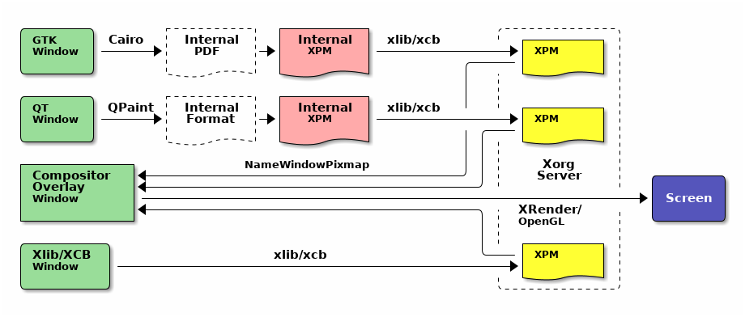
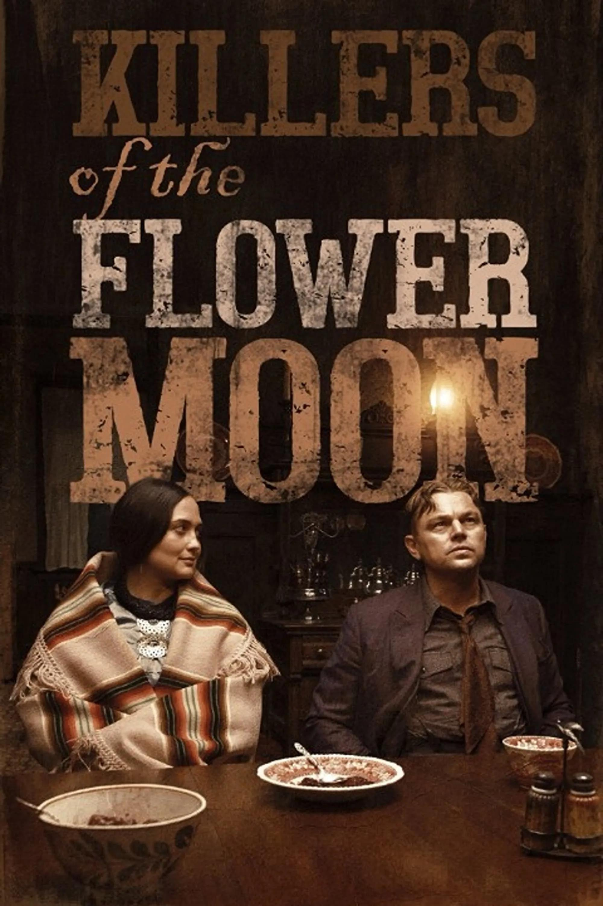
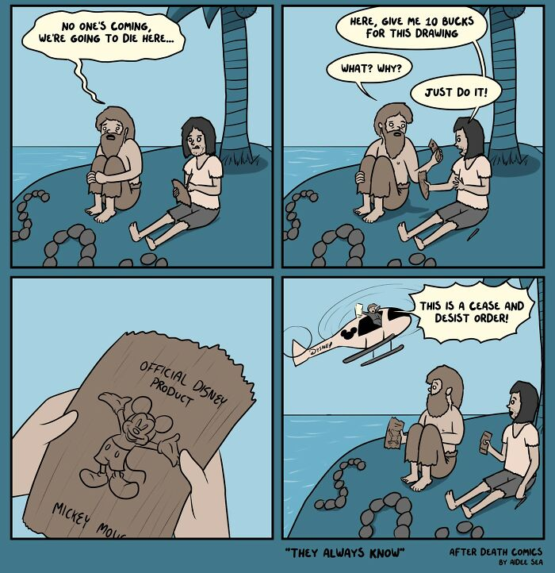

啰里啰唆周刊第64期：由来豪杰士，不必待文王

# 科技日常
## 1.PlainApp-轻量简约的手机管理和文件传输工具
PlainApp is an open-source application that allows you to manage your phone through a web browser. Access files, videos, music, contacts, sms, calls, and more from your desktop using a secure, easy to use web interface!
功能特性：
- 开源免费无广告,无隐私跟踪
- 文件管理、笔记管理
- 联系人、短信、通话记录管理
- 支持markdown编辑器
- RSS阅读器
- 视频和音频播放器
- APK文件提取
- 支持网页端管理

可以视为是AirDroid的开源增强版本。

[https://github.com/ismartcoding/plain-app](https://github.com/ismartcoding/plain-app)

## 2.Gifski-跨平台的高质量 GIF 编码器
Gifski是一个跨平台、开源、基于 Pngquant 的高质量命令行 GIF 编码器。

Pngquant 是一个针对 PNG 图片的无损压缩命令行工具，Pngquant 是一个非常优秀的 PNG 无损压缩工具，它可以将 PNG 图片最高压缩  70%而不会损失图片的原有质量并保存了所有的阿尔法透明度。经过压缩的图片可以在所有的网络浏览器和系统中使用。而 Gifski 是基于 Pngquant 的，它使用 Pngquant 的功能来创建高质量的 GIF 动图。

Gifski 能够创建每帧包含上千种颜色的 GIF 动图。

简单来说，从视频转为GIF的流程分两步
- 使用ffmpeg将视频文件转为PNG帧
- 使用 Gifski 将PNG转为GIF，其中使用了Pngquant进行压缩

Gifski没有GUI，不过[ScreenToGif](https://github.com/NickeManarin/ScreenToGif) 这款软件在其导出选项中增加了 gifski 引擎，从而提供了从视频转 PNG 图像帧到 PNG 图像帧生成 GIF的全流程支持。方法也很简单，打开其编辑器将视频拖入即可，如果视频文件本身较大，在拖入时就可以预先选择帧率、尺寸等。

[https://github.com/ImageOptim/gifski](https://github.com/ImageOptim/gifski)

## 3. 对“fcitx5 依赖 boost 和 KDE, 探讨继续使用 fcitx4 的可行性“的回应
原贴：[https://forum.suse.org.cn/t/topic/15817/7](https://forum.suse.org.cn/t/topic/15817/7)

首先，要对其中的几个所谓的错误说法进行驳斥。

1、Fcitx 5 依赖 KDE 和 Boost？

这是错误的，作为高度模块化的项目，核心库和服务器，输入法引擎，配置界面都是分离的代码库。

核心部分，反而比以前要精简得多，因为 gtk 和 qt im module 都变成了独立的项目，事实上，如果你乐意，可以编译出一个和图形库无关的 fcitx，这也是 fcitx5 能被移植到 android 上的基础。

2、Fcitx 5 的拼音支持变少了？

表面上来说，是这样的，曾经有自带拼音，libgooglepinyin，sunpinyin，libpinyin，看起来仿佛百花齐放非常热闹

> 作者是fctix的核心开发者，他的博客中可以了解到fctix的许多技术细节和最新进展，如果在使用fctix的话，很值得一看

[对“fcitx5 依赖 boost 和 KDE, 探讨继续使用 fcitx4 的可行性“的回应](https://www.csslayer.info/wordpress/fcitx-dev/%e5%af%b9fcitx5-%e4%be%9d%e8%b5%96-boost-%e5%92%8c-kde-%e6%8e%a2%e8%ae%a8%e7%bb%a7%e7%bb%ad%e4%bd%bf%e7%94%a8-fcitx4-%e7%9a%84%e5%8f%af%e8%a1%8c%e6%80%a7%e7%9a%84%e5%9b%9e%e5%ba%94/)

## 4. X 和 Wayland 的主要区别
最近在写一个 Wayland Compositor，虽然我以前大概知道这是什么，但是并不是很清楚它和 Xserver 有什么区别，虽然 [fc 老师的这篇文章](https://farseerfc.me/compositor-in-X-and-compositext.html) 写的相当不错，但我一点也不懂 X 所以看的迷迷糊糊。偶然读了 [这篇文章 ](https://magcius.github.io/xplain/article/)发现十分不错，但因为是英文文章读起来很累，打算把一些理解的内容记下来。顺便说一下，原文是带示例的，效果非常不错，建议有时间的人慢慢看一遍。

X 协议设计于 1980 年代，那时候窗口界面刚刚起步，人们还没什么 3D 特效一类的想法，而且机能也不允许，放到今天任何一个有点桌面基础的人都能理解应该给每个窗口一个 buffer 然后把这些 buffer 里的 texture 贴出来的设计逻辑，但 **那时候可没那么多内存让你给每个窗口一个 buffer**。所以就如同各种常见的领域一样，有个小天才一拍脑子想，反正 **最后显示到桌面上的都是一个屏幕大小**，我们只要准备这么大一块内存就行了嘛！换句话说，每个窗口的 buffer 要去掉自己被覆盖住的内存，整体内存大小就是可控的，** 在内存里是直接没有被覆盖的部分的**。

[https://sh.alynx.one/posts/Difference-between-X-and-Wayland/](https://sh.alynx.one/posts/Difference-between-X-and-Wayland/)

## 5.Xlist 一个 Alist 客户端
Xlist 是一个 Alist 客户端，你可以在这里配置多个 Alist 服务器进行文件管理和预览，支持多种视频格式和文档格式的在线预览。

- 支持文件的下载、重命名、移动和复制等功能。
- 支持 doc、docx、xls、xlsx、ppt、pptx、pdf 等格式的文件在线预览。
- 支持 mp4、mkv、avi、flv 等大部分视频的在线预览，同时支持 srt 和 vtt 字幕外挂。
- 支持 jpg、png、gif 等格式的图片在线预览。
- 文件后台下载功能，下载完成后可以用其他 App 打开预览文件。

注：当前只有iOS版本，尚无安卓版。
[https://xlist.site/](https://xlist.site/)
# 读书与影视分享

## 1.花月杀手 Killers of the Flower Moon
美国名导马丁-斯科塞斯2023年的新片《花月杀手》,影片改编自大卫·格兰所著同名畅销书，讲述著名的印第安人谋杀疑案——1920年代的美国俄克拉何马州，奥色治族印第安人部落中渐渐开始有人死于非命。此事也事关FBI的诞生和初期发展：随着死亡人数的上升，新成立的联邦调查局着手调查此案，揭开了可怕的阴谋，这是美国历史上最骇人听闻的罪行之一：白人为了利益而屠杀印第安人。

《花月杀手》在戛纳首映后将会通过派拉蒙于十月在全球上映，之后也会在Apple TV+上映。 这次以苹果原创之名全球上映的计划对俄克拉荷马州以及北美飞速发展的美洲原住民影视行业来说都是一件大事。同时《花月杀手》也可能会参与各种奖项角逐，也会为苹果公司最近公布的新发行策略打响第一炮。此前苹果原创电影大多只是线上发布，很少有影院公映。

《花月杀手》在卢米埃尔厅首映结束，照例赢得满场观众起立喝彩，而且媒体评价也彻底盖过了不少已经首映的参赛片，目前影评网站“烂番茄”上的好评率高达97%。
## 2.纽约开锁匠纪录短片 “Keys to the City”
任何把自己锁在汽车或建筑物之外的人都知道，当你认为理所当然的门不再打开时，那种恐慌的脆弱感就会出现。导演兼摄影师伊恩·穆巴耶德（Ian Moubayed）几年前发现自己处于这种情况，当时他在半夜被锁在纽约市的公寓外。他找到了一个锁匠来帮助他重新进入，他意识到锁匠对纽约人的生活有一个独特的窗口 - 他们在压力巨大的时刻被召唤，来自各种背景和各种故事的客户。这种互动是穆巴耶德的短片纪录片《城市的钥匙》的催化剂。

当穆巴耶德遇到沃尔佩和他的锁匠马修·巴拉德（Matthew Ballard）时，他已经在这个行业工作了四十七年，巴拉德将在一个多月后退休。当穆巴耶德问巴拉德关于拍摄纪录片的事情时，锁匠告诉他：“你真的应该和乔治谈谈。这就是我在退役前必须训练的人。“城市钥匙”跟随他们两人，巴拉德准备他的年轻同事接手，传授贸易课程以及如何保持长期职业生涯。

Moubayed mostly shot the documentary before the COVID-19 pandemic hit. He has come to see the story, of one tradesmith handing off knowledge to the next, as a metaphor for the way that the city, and the people in it, evolve with time. “At the heart of it, it’s really about coming to peace with change in different shades,” he said.

注：纪录片视频在纽约客原文顶部Banaer区，无需登录。

[https://www.newyorker.com/culture/the-new-yorker-documentary/keys-to-the-city](https://www.newyorker.com/culture/the-new-yorker-documentary/keys-to-the-city)

## 3.《雄狮少年》日语配音版在日本全国上映

> 没有异能的天分！没有神奇的血缘！不会转生异世界！
尽管如此，他们仍然有着希望去实现的梦想！这就是现代最纯正的热血运动传说！
——《刀剑神域》、《你好世界》导演 伊藤智彦

> 被影片的水平完全压倒了。城镇的光与影、与同伴的相遇、各种对比表现令人叫绝。
只要不忘记自己的喜好，就会坚持尝试百折不挠。当少年与狮子成为一体时，请屏住呼吸，祈祷奇迹。
这部作品让人重新想起了曾经一度被自己遗忘了的那份心气！
——《美少女战士》、《少女革命》导演 几原邦彦

ref:[https://gaga.ne.jp/lionshonen/](https://gaga.ne.jp/lionshonen/)
# 图论

## 1.Tibetan Fairy Tales

在他为迪斯尼创造心爱的斑比角色的二十年前，艺术家和博物学家莫里斯“杰克”戴（1892 年 7 月 2 日 - 1983 年 5 月 17日）将他的时间和才华投入到一个不寻常的项目——展示了一系列西藏魔术故事，这些故事与关于生活最基本方面的古老智慧相结合：智慧的意义，善良的尺度，对转变的渴望，残忍和傲慢的代价，如何去爱，如何与我们人类的易犯错误共存。

[https://www.themarginalian.org/2023/05/11/jack-day-wonder-tales-from-tibet/](https://www.themarginalian.org/2023/05/11/jack-day-wonder-tales-from-tibet/)

注：该图集已进入公版领域，可免费下载。[https://www.gutenberg.org/ebooks/66443](https://www.gutenberg.org/ebooks/66443)
## 2.After Death Comics

After Death Comics have managed to gather more than 55k followers on Instagram. People seem to like the author's very peculiar sense of humor in the comic strips. Combining characters from pop culture and other original ones created particularly for this comic series, Aidee has managed to get many fans of After Death Comics. 

[https://www.instagram.com/afterdeathcomics](https://www.instagram.com/afterdeathcomics)

# 谈天说地

## 1.Inside the Delirious Rise of ‘Superfake’ Handbags
> 从 2023 年 5 月开始：你能分辨出 10，000 美元的香奈儿包和 200 美元的仿冒品之间的区别吗？几乎没有人能做到，它正在颠覆奢侈时尚。

Once upon a time, the legend goes, Theseus slew the Minotaur and sailed triumphantly home to Athens on a wooden ship. The vessel was preserved by Athenian citizens, who continually replaced its rotting planks with strong, fresh timber so a pilgrimage to Delos could be made each year in their hero’s name. Fascinated by this mythical tale, the philosopher Plutarch found it to embody a “logical question of things that grow”: After Theseus’s ship had been stripped of all its original material, could it still be considered the same ship? His question has caromed through centuries of Western thought. What if, Thomas Hobbes wondered, someone rustled up a second boat out of the discarded planks; would you now have two original vessels? And what about our own era of machine-made duplication — does replication strip away the soul of creation?

Not long ago, I found myself wandering through Paris with a fake Celine handbag slung over my shoulder. In France, a country that prides itself on originating so much of the world’s fashion, punishments for counterfeiting are severe, to the point that I technically risked three years in prison just by carrying my little knockoff around. But the bag’s fraudulence was undetectable to human eyes. I was toting around a delicious, maddening secret: Like a ship remade with identical wood, the bag on my arm had been built on the same plan, with seemingly the same gleaming materials, as the “original.” Yet it was considered inauthentic, a trick, a cheat.
[https://silk-news.com/2023/05/04/magazine/inside-the-delirious-rise-of-superfake-handbags/](https://silk-news.com/2023/05/04/magazine/inside-the-delirious-rise-of-superfake-handbags/)

## 2.被詛咒的河南家族
致死性家族性失眠症(fatal familialinsmnia,FFI)是一种罕见的、由朊病毒引起的一类人畜共患、致死性中枢神经系统退行性脑病,发病率在世界范围内每年百万分之一，病死率100%。FFI属世界新发传染病,其有遗传性特点,又具传染性危险;潜伏期长，始发症状隐匿多样，极易被误诊和漏诊。可长时间通过遗传或医源途径传播危害人类健康，目前被列为世界第三大遗传性朊病毒病。

2006年8月发现的河南省豫西某县 FFI 发病家族,是目前世界上发现的第二大FFI家系，目前已列为国家和省重点研究项目。

第一大家族位于威尼斯，自18世纪以来的记录就显示有怪病（两人中就会有一人发病），导致村民会在背后议论，保险公司也拒保。后来在一位家族女性的牵头下大量收集病死成员的大脑供给科学家研究，其中一位科学家，S.Prusiner因此获得诺奖。

ref：
河南省致死性家族失眠症家系遗传生物学分析【文章编号:1001-0580(2011)06-0712-05】
[https://www.nytimes.com/2001/05/06/magazine/3-case-study-fatal-familial-insomnia-location-venice-italy-to-sleep-no-more.html](https://www.nytimes.com/2001/05/06/magazine/3-case-study-fatal-familial-insomnia-location-venice-italy-to-sleep-no-more.html)
[克雅病(CJD) 亚急性海绵样脑病](https://www.msdmanuals.cn/professional/neurologic-disorders/prion-diseases/creutzfeldt-jakob-disease-cjd)

## 3.昆明城投之困境
中国历史上的第一座机场是北京的南苑机场，第二座机场，是在云南。
1922年，云南都督兼民政部长唐继尧聘请旅美华侨到云南组建空军，并修建了中国第二个机场：
**昆明巫家坝机场。**
为建设这些基础工程，云南人民付出了巨大的代价。1926年，唐继尧命令云南富滇银行增发纸币3860万，省政府借用2940万，云南因此币值暴跌，百元纸币仅换银元四十左右。唐继尧又命令强发地方公债，盐税、锡税等各类税费一律加倍征收。 

那个引起云南财政危机的巫家坝机场，在抗日战争爆发后，作为著名的驼峰航线的终点，成了世界上最繁忙的机场，为抗战输送了大量物资。哪怕是新中国成立后，也是最重要的国际口岸机场。 

前几天，《昆明城投专业会议纪要》流传甚广，让地方债的问题，再一次曝光在大家面前。有关部门很快辟谣了，但还是有人想起恒大的那封求救信。
引起这次对话的，是昆明城投的债务压顶——下半年有200多亿债务到期，财政鸭梨山大。 

读懂昆明城投，或许可以从唐继尧修的巫家坝机场说起。
2012年，昆明新的主力机场——长水机场投入使用。将近百年历史的巫家坝机场退出历史舞台。
长水机场总投资230亿，其中160亿是借来的，利息也不低。昆明很快发现，长水机场运行一年，政府就要亏损近20亿。
他们想了个办法：

    **把老机场的土地变卖了还债。**

巫家坝机场搬迁后，腾挪出昆明主城区最大一块土地。当时昆明每亩地平均出让价格大约500万，巫家坝机场总占地面积有4300亩，估算能卖个二三百亿，解决债务问题是小意思。 

[https://mp.weixin.qq.com/s/4r6HF2NcOllLi796P1ZFnQ](https://mp.weixin.qq.com/s/4r6HF2NcOllLi796P1ZFnQ)

## 4.无人机配送已成深圳日常生活一部分
> 近日，国际权威科学杂志 MIT Technology Review（麻省理工科技评论）发布了题为《无人机配送已成深圳日常生活一部分》的报道。文中记者到访深圳，在亲身体验美团无人机配送服务后，感叹「无人机配送成为日常的愿景，感觉比以往任何时候都更加真实。」

在中国深圳一个热闹的市区，几座摩天大楼空隙之间，我看到一架黄黑相间的无人机降落在路边的一个取货柜上。自动售货机大小的取货柜顶部缓缓打开，无人机就降落在上面，一个装着我的饮料的白色纸盒被放进去。半小时前，我在手机上下了订单，应用程序内显示无人机会在下午 2 点 03 分将货物送达，而恰好在那个时刻，无人机准时降落。

我所尝试的无人机送货服务是由一家名为美团的公司运营，美团是中国最受欢迎的外卖平台。2022 年，有近 600 万名外卖员在该平台上接单送货，期间交付了数十亿份订单。2017 年，这家公司开始研发无人机配送服务。过去一年多，美团也在深圳这个成熟的无人机供应链之都，持续运营着无人机配送。

中文译文：[https://www.jiqizhixin.com/articles/2023-05-26-7](https://www.jiqizhixin.com/articles/2023-05-26-7)
英文原文：[https://www.technologyreview.com/2023/05/23/1073500/drone-food-delivery-shenzhen-meituan/](https://www.technologyreview.com/2023/05/23/1073500/drone-food-delivery-shenzhen-meituan/)
# 一句话快讯
1. 5月26日，武汉市财政局、武汉长江资产经营管理有限公司在《长江日报》发布一整个版面的债务催收联合公告，详细列举了259家债务单位名称、借款本金余额（截至2018年底），总额超过1亿元。 

2.记者采访教师溺亡案被打，官方：打人者系派出所副所长等3人，已被拘。

3.5月28日，国产大型客机C919开启全球首次商业载客飞行，从上海虹桥机场飞往北京首都机场。

4.据国家统计局消息，1—4月份，全国规模以上工业企业实现利润总额20328.8亿元，同比下降20.6%。 

5.网约配送员与平台是否存在劳动关系？典型案例表示，因平台企业和网约配送员双方之间的人格从属性、组织从属性较弱，不完全符合确立劳动关系的情形，不足以认定劳动关系。

6.俄罗斯在白罗斯部署战术核武器于星期四（5月25日）启动。

7.据外交部官网消息，5月30日，国务委员兼外长秦刚在北京会见了马斯克。

8.英伟达于5月底成为第一家市值突破 1 万亿美元的芯片公司。此前进入万亿美元俱乐部的公司包括苹果、微软、Alphabet/Google 和亚马逊。

# 联系方式

啰里啰唆是一份针对互联网和生活爱好者的数字杂志，旨在发现和分享一切有趣的东西。话题不固定，每期大约十五分钟阅读量，暂定每周四发布。部分内容来自互联网采编，如果为有来源的转载，均会注明转载地址或保留水印。

这是一个关注人文和科技的newsletter。

使用方法建议或素材提供

频道：notonlyshare

邮箱：auokyob@outlook.com

github地址：[https://github.com/iminto/luoliluosuo-weekly](https://github.com/iminto/luoliluosuo-weekly)