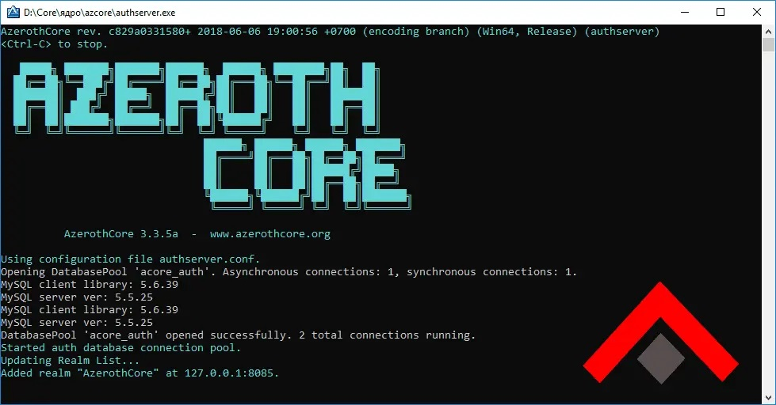
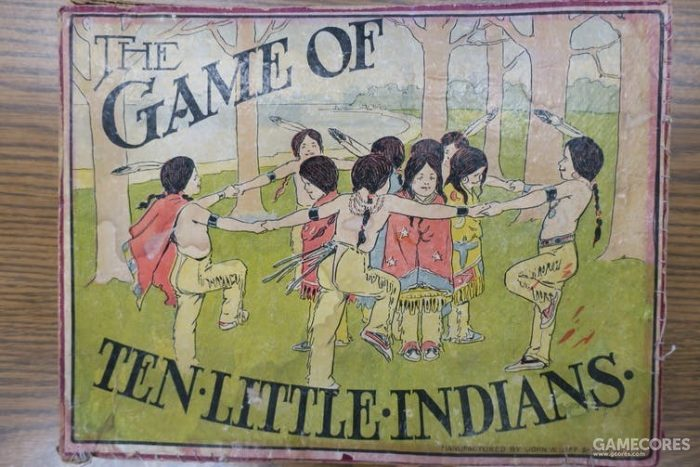

啰里啰唆周刊第65期：我与我周旋久，宁作我

# 科技日常

## 1. 用 NM-dispatcher 实现 WiFi 开关的自动控制
平时在家用的笔记本由于从来没移动过位置，为了网络稳定就直接插上有线使用了。由于无线网络开着会一直扫描 WiFi 热点，也会占用一些资源，于是我就把无线开关直接关掉了。但是偶尔笔记本也要带出去或者在其它地方用一下，这时候拔掉网线后又要去打开无线网络的开关，就很烦。于是索性直接利用 NetworkMangaer 的 dispatcher 功能：实现了在有线插入时，自动关掉无线；有线网络拔出时，自动打开无线这个功能。

NetworkManager是Linux发行版本中比较强大好用的网络管理套件了，它提供了一个NetworkManager-dispatcher服务，可以用来添加一些“钩子”脚本，在网络发生特定变化的时候进行一些自定义操作。例如在网络连接成功后自动连接VPN等。
[https://blog.sbw.so/u/nm-dispatcher-auto-switch-between-wifi-ethernet.html](https://blog.sbw.so/u/nm-dispatcher-auto-switch-between-wifi-ethernet.html)
## 2. 把彩蛋🥚藏到音频里去

这篇文章会介绍几种我所知道的在音频里藏彩蛋的方法，例如Morse code、DTMF、SSTV、Backmasking和Spectrogram等，中间也会穿插一些奇奇怪怪但轻松有趣的知识。

本来打算把这篇文章的内容录制成播客，但想到这篇文章需要大量的图表展示，还是写成博客比较直观，这样也方便随时进行查阅，同时，我也有理由继续咕咕咕我的第0期播客了哈哈哈（其实已经想好一些要聊的话题了，敬请期待~）

这篇文章稍微有点长，你可以分几次看完，或者直接跳转到你感兴趣的部分阅读即可，每一小节都可以独立阅读，没有前后关联的知识，放轻松阅读，不要有压力~

这篇文章中的很多内容参考了好和弦NiceChord的视频[把秘密訊息偷偷藏入音樂中！](https://www.youtube.com/watch?v=a5hAVTXjjEc)，感谢好和弦NiceChord频道创作的免费且质量超高的乐理课。
...
不知道你有没有想过，在使用座机拨打电话的时候，电信公司是如何知道我们所拨打的电话号码的，以及，为什么拨号键盘上的每个数字按下的声音听起来都有点不太一样。

和Morse code类似，Dual-tone multi-frequency其实是对拨号键盘每个按键的编码，简称为DTMF。如果把Dual-tone multi-frequency翻译成中文就是双音多频，从字面意思来理解，每个拨号按键都是由两个不同频率的声音来组成的。

DTMF的映射关系是这样的：

[https://lgiki.net/post/build-your-own-audio-easter-egg/](https://lgiki.net/post/build-your-own-audio-easter-egg/)

## 3.SimpleNote-跨平台可免费同步的便签软件
SimpleNote是一款跨平台可免费同步的便签软件，支持 iOS, Android, Mac, Windows, Linux, browser。

特点：
- 支持MarkDown语法（不支持可视化编辑）
- 支持明文导出到本地，方便迁移
- 免费同步，无广告。同步额度未知。
- 支持多标签，支持todo list
- 支持将文件发布到网络上共享

缺点：
- 不支持插入图片等附件，仅支持文本信息
- 不支持彩色和布局切换，色调和样式比较单一。

SimpleNote是wordpress母公司[Automattic](https://automattic.com/)下的产品，因此产品稳定性还是有保障的，目前是免费同步。其App也有付费计划，不过年付200刀的费用太过于离谱。

如果你对颜值有较高要求，可以考虑下之前介绍过的[PockerPlan](https://github.com/RayLeaf-Studios/PocketPlan)(高颜值，无云同步)，或者[Bundler Notes](https://bundlednotes.com/)（有免费云同步额度，免费版无跨平台功能）。

[https://simplenote.com/](https://simplenote.com/)

## 4.plane-Jira的开源平替
Meet Plane. An Open-source software development tool to manage issues, sprints, and product roadmaps with peace of mind.
Plane 完全开源，而且界面要简洁舒服易用很多。 部署方便快捷, 支持 Docker 部署。 还很贴心的支持从 Github 以及 Jira 直接导入。

特性：
- 基于Js和Python开发
- 支持Issue Planning and Tracking
- 支持自定义布局
- 支持项目生命周期管理

官网有在线服务，可以免费体验，免费版最多可以创建1000个issue，无限用户数量。

[https://plane.so/](https://plane.so/)

## 5.azerothcore-wotlk 开源魔兽世界服务
启动你专属的魔兽世界服务。它是用 C++ 编写的开源魔兽世界(WoW)服务器端，支持经典的巫妖王之怒(3.3.5a)游戏版本和 Docker 启动。该项目由社区驱动，运行稳定、社区活跃、对新手友善。

[https://github.com/azerothcore/azerothcore-wotlk](https://github.com/azerothcore/azerothcore-wotlk)

## 6.Jetbrains（捷并思）落地上海
从 2023 年 9 月 4 日起，知名IDE开发商JetBrains的上海公司将负责所有产品在中国大陆的直接销售工作,产品定价将从美元不含税价转为含增值税的人民币价格。

说人话，就是可以开发票了，所以涨价了。

[https://blog.jetbrains.com/zh-hans/blog/2023/06/05/jetbrains-shanghai-office/](https://blog.jetbrains.com/zh-hans/blog/2023/06/05/jetbrains-shanghai-office/)
# 读书与影视分享

## 1.《美国国会 The Congress》

IMDb: tt0272052

微博视频为汉化版。

1. 建国时美国是第一个现代民主国家，对政府制度没有先例，都是靠制宪者构思 
2. 一批各有想法的殖民地拧在一起，最重要的就是妥协，靠智者妥协维持联邦 
3. 而内战后的妥协使重建功亏一篑，但高速发展产生贪婪和不公正的政府 
4. 20世纪处进步主义起步，才掰过这个势头，正说明制度一时会不管用，但终究会管用 
5. 现代国会重心转移到各委员会和调查，而国会这个机制使很多事办起来更难，而本就应该如此

[https://h5.video.weibo.com/show/1034:4906675258196021](https://h5.video.weibo.com/show/1034:4906675258196021)
## 2.《最初的爱情，最后的仪式》
《最初的爱情，最后的仪式》是英国“国民作家”麦克尤恩的处女作兼成名作，荣获毛姆文学奖，“恐怖伊恩”的绰号由此而诞生。全书由八个短篇组成，分别从八个位于童年、青春期和青年等不同阶段的男性视角出发，以意识和潜意识交接地带的经验为揭示对象，有时荒唐，有时伤感，有时温柔，有时骇人，有时魔幻，却都无限接近真实，接近每个人的内心。

麦克尤恩素来擅长以冷静细腻的笔触打磨幽暗题材，赋予其精妙无双的质感。八个故事各如黑晶棱镜之一面，折射出日常生活中平凡人性所可能误陷的种种魔怔与梦魇。平地与深渊，生与死，真实与玄幻，伦常与变态之间的界限恍若蛛丝般轻薄，看后令人或怅然或倒吸凉气，同时又觉得其魔力不可抗拒。

《最初的爱情，最后的仪式》是麦克尤恩的处女作与成名作。

> 你说话的时候，我感到自己就像一张纸，被揉成一团。

> 伊恩·麦克尤恩的短篇小说里藏着一个自卑的卡夫卡、一个希区柯克状态的弗洛伊德、以及一个温柔甜蜜颓丧又变态的托马斯·曼。

## 3.老画报 
老画报是一个专门为连环画和漫画爱好者设计的网站，汇聚了大量上世纪八九十年代的名家名绘、获奖连环画、连环画期刊、小人书等。

又一个情怀网站。

[http://www.laohuabao.com](http://www.laohuabao.com)
# 图论

## 1.insert brain here

Paul Woods, also known as "Woodsy", is a comic artist and cartoonist from Melbourne, Australia. The author of “Insert Brain Here”, a single-panel comic series, captures the essence of humor using only a few words for the dialogues between the characters of his stories. It is nearly impossible to stop giggling while scrolling through Paul’s work. Wood's unique style consists of clever puns and wordplay, breathing life into his creations and leaving his audience smiling.

https://www.instagram.com/insertbrainherecomic/

## 2.百蛛上河图

《蜘蛛侠：纵横宇宙》发布中国独家艺术海报 ——《百蛛上河图》，细节满满
# 谈天说地

## 1.为什么所有的动作英雄都叫杰克、詹姆斯或约翰？

> Capt. James T. Kirk, Johnny Utah, James Bond, John Wick, Jack Ryan, Jason Bourne, and John James Rambo.

I wasn’t the first to make the connection, but once I noticed it, it was everywhere. You walk past a poster for a new movie and think, Why is every action hero named Jack, John, James, or, occasionally, Jason?

I turned to my friends and colleagues, asking desperately if they had also noticed this trend, as I made my case by listing off well-known characters: John Wick, Jason Bourne, Jack Reacher, John McClane, James Bond, Jack Bauer, and double hitter John James Rambo.

I worried I might have fallen victim to the Baader-Meinhof phenomenon. Now that I had become aware of it, was each glimpse of a John Wick ad reaffirming my unsubstantiated theory?

[https://slate.com/culture/2023/03/john-wick-james-bond-action-heroes-j-names.html](https://slate.com/culture/2023/03/john-wick-james-bond-action-heroes-j-names.html)
## 2. 二二八祭-我爹居然是台湾归来的地下党
2017年5月3日傍晚，我乘坐厦航881次航班抵达台北松山机场，揭开两周一人自由行的序幕 ……

为什么是我，一个人，从远在“天边”的英国来台湾自由行？

2012年第39期《中国新闻周刊》在报道1959年中国社科院前身“中国科学院哲学社会科学学部”与人民大学合办的“文艺理论研究生班第一期”的长文《文研班：文艺理论界的黄埔一期》中，第一次公开披露该班“一些同学在文革中不幸罹难。在人大任教的李尚公，曾经在台湾加入共产党，被逼迫交代是潜伏特务。他说我把良心剖给你看，用一根烧红的铁通条插入了自己的胸膛。” 

这里提到的李尚公，就是我父亲，他是这个所谓“文艺理论界黄埔一期”的一员。他当时已经是中国人民大学的讲师了，是人民大学选送到该班的学员。  

节选版原载《南方周末》，作者李杭
[https://mp.weixin.qq.com/s/ZPlDN8z41OUtEgwfQlyCBw](https://mp.weixin.qq.com/s/ZPlDN8z41OUtEgwfQlyCBw)
## 3.人物-王贞仪
我国清朝时期，也有个特别热衷于搞数学、研究天文的女学者，名叫王贞仪。
她的名字，被国际天文学联合会行星系统命名了金星某个陨石坑。
但在我国，却没几个人知道她的名字。
她出生于大清朝乾隆年间，我个人觉得她其实比李清照还要叛逆。
她所处的时代，欧洲已经出现了牛顿，微积分已经被发明出来了，可清朝连“地球是圆的”这事儿都还没搞清楚。
当时，绝大多数国人接受的基础教育依然是社会科学类的，搞自然科学的人特别少，以至于整个社会都“重文轻理”。
所以，我国历史上出现蔡文姬、李清照之类的女文学家，一点都不稀奇。
稀奇的是出现王贞仪。
王贞仪出身在一个官宦人家，父母相对比较开明，所以，她不爱脂粉、不爱女红，只爱读书和钻研，也没怎么受到家庭的打压。而且，在那个女人常被裹小脚的时代，她还得以学习骑射和武术。
小的时候，她跟着父母走南串北，踏遍了大半个中国。
她对数学尤其是天文感兴趣，用更简易的方法证明了三角函数与勾股定理。
接触到哥白尼的“日心说”后，她写了《地圆说》这本科普读物，向人们解释地球是圆的，但为何给人们的“感觉”是“天圆地方”。
她还写了《月食解》，结合自己做的实验，用通俗的语言告诉百姓们月食是怎样形成的。
她每夜坚持观察天象，记录行星轨迹，写了《经星辩》，正确地推导出金木水火土五大行星的旋转方向。
她是一个唯物主义者，以一己之力痛斥佛道的虚伪面，说不如把给佛寺道观的钱都拿去捐给灾民；她也不信风水，说祖辈被埋葬在何处并不影响子孙的福运；她还说相信炼丹术的人都很愚蠢…
搁现在，她都是一个勇敢的科普斗士，更何况那时候还是清朝。
这样的女子，当然有点难嫁，所以，她25岁才找了安徽一个欣赏她的穷秀才结婚。相比15岁就结婚的其他女子，她已经算是那时候的大剩女了。
婚后，她与丈夫相处甚欢。她丈夫支持她钻研这些，还辅助她完成她的学术著作《德风亭初集》，但因为年代久远而且女子做的这些事情很难得到传播，她的大部分著作已失传。
29岁，她去世，死因不明（说是生病，但我怀疑是不是难产）。她的丈夫未曾再娶，而是将她的手稿整理后交给好友，没过几年就追随妻子而去。
王贞仪其实是一个特别具有女权意识的人。
她曾经写过这样两句诗：
“足行万里书万卷，尝拟雄心胜丈夫。”
“始信须眉等巾帼，谁言儿女不英雄。”
她在著作的自序中说，女子同样有写诗作文、创作著述的权利。
她就是一个“一通百通”的聪明人，通星象，精历算，工诗文，擅绘画，通医理.......而女子一旦智商过硬，就懒得把父权社会规训女性的那一套放在眼里了啊。

ps：《国家宝藏》有一节讲述了她的故事，张子枫饰演了她。我总觉得如果她是个男的，她的著作更容易被保存下来，她的故事也更容易被颂扬。

ref:[https://weibo.com/u/1476817753](https://weibo.com/u/1476817753)

## 4.从“十个小印第安人”说起，一段隐藏在桌游中的北美黑历史
“五月花号”给北美大陆带来了新的主人，就在印第安原住民对这些白人还懵懂无知的时候，他们却不知道很快自己脚下的故土就成了这些外来者们炙手可热的财富，而包括自己的性命在内，任何阻挡这些外来者们野心的事物都将在枪炮的降维打击面前被统统抹去。

大家好，我是瞬间思路。

北美洲拓荒时代一直是桌游设计领域的热门主题，尤其是通过好莱坞电影工业的输出渲染之后，人们对这个时代更多的认知已经是枭雄遍地、冒险精神、快意恩仇、纵马狂奔、遍地淘金之类的元素符号，但对白人如何在一个本不属于他们的土地上做到这些的过程却几乎闭口不提。其实以前我在和老杨做的播客节目  桌游十分钟跑题一小时 |《西部传奇》中的西部传奇 就曾谈及此事，殖民时代的北美历史一直在被人为地通过娱乐和流行文化来进行美化和掩盖。运用娴熟的双标手法，用人权为借口来攻击任何对手，却对自己的血腥过往闭口不提，美洲的殖民者后裔们一直在热衷于抹除或颠倒那段黑历史。而桌游作为一种大众娱乐形式，却在无意中记录了其中一些过程。

以刻板的形象塑造来向大众灌输某些观念是其中最容易实现的操作，桌游这种“寓教于乐”的形式自然也属于其中不可或缺的一项，尤其是在电子游戏还没诞生的年代更是如此。萨斯喀彻温大学历史系助教：本杰明·霍依，在他的文章The hidden history of Indigenous stereotypes in tabletop games 中将这样一个罕有人关注到内容为切入角度，展现了一些与众不同的内容。

[https://www.gcores.com/articles/166652](https://www.gcores.com/articles/166652)
# 一句话快讯

1.6月1日0时01分接到群众报警，浙江海宁市黄湾镇闸口村一临时工棚发生一起爆燃事故，致5人死亡。

2. 印度于6月2日晚间7时20分许因信号问题发生三列火车相撞事故，导致至少 275 人死亡，逾 1175 人受伤。 

3.“武汉小学生校内被老师开车撞死”事件中的小孩母亲，因不堪网络暴力和相关部门压力等因素，在小区内跳楼身亡。

4.据央视新闻，6月4日6时许，四川省乐山市金口河区永胜乡鹿儿坪国有林场附近发生高位山体垮塌，造成19人遇难。

5.浙江省生态资源厅国土空间生态修复处原处长陈东，在杭州地铁上以用生殖器贴蹭女子臀部，被行政拘留12天，后被降职为副县级。

6.俄罗斯联邦安全局（FSB）揭露美国对俄的间谍活动，指责美国政府利用先进监控软件，入侵数千部苹果手机，苹果否认指控。

# 联系方式

啰里啰唆是一份针对互联网和生活爱好者的数字杂志，旨在发现和分享一切有趣的东西。话题不固定，每期大约十五分钟阅读量，暂定每周四发布。部分内容来自互联网采编，如果为有来源的转载，均会注明转载地址或保留水印。

这是一个关注人文和科技的newsletter。

使用方法建议或素材提供

频道：notonlyshare

邮箱：auokyob@outlook.com

github地址：[https://github.com/iminto/luoliluosuo-weekly](https://github.com/iminto/luoliluosuo-weekly)