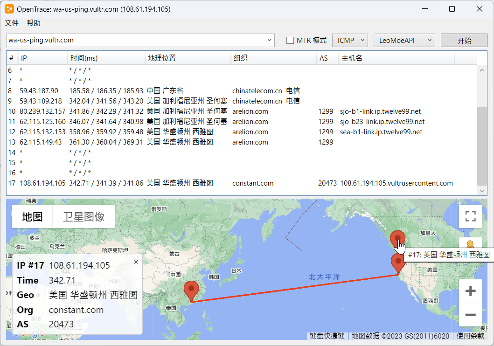
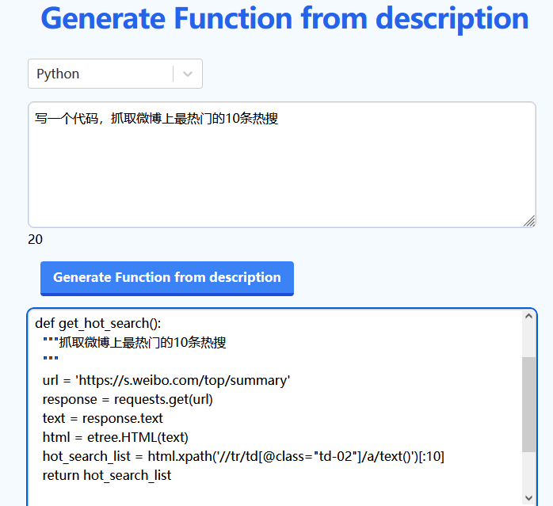
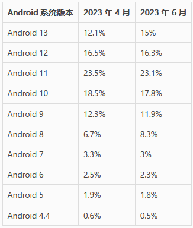
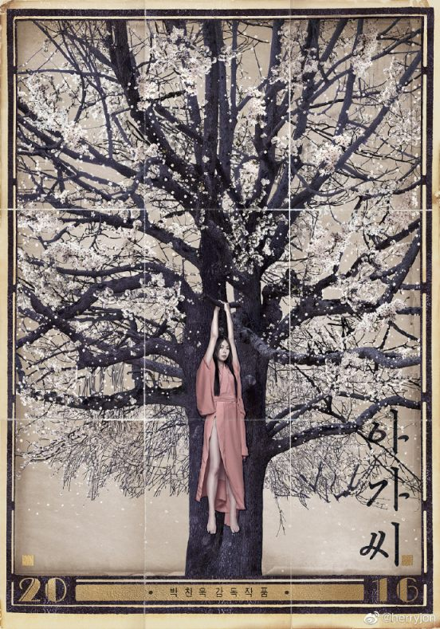

啰里啰唆周刊第66期：破碎的四月

# 科技日常

## 1. EasySpider-可视化爬虫工具
一个可视化爬虫软件，可以使用图形化界面，无代码可视化的设计和执行爬虫任务。只需要在网页上选择自己想要爬的内容并根据提示框操作即可完成爬虫设计和执行。同时软件还可以单独以命令行的方式进行执行，从而可以很方便的嵌入到其他系统中。该项目是浙大某学生的[硕士论文](https://github.com/NaiboWang/EasySpider/blob/master/Docs/面向WEB应用的智能化服务封装系统设计与实现.pdf)配套项目。

这是一个JavaScript 项目，故而相比后端语言，在爬虫实现上有很大优势。利用前端，甚至是浏览器插件做爬虫，早在十多年前就是一种简单有效的思路。

[https://github.com/NaiboWang/EasySpider](https://github.com/NaiboWang/EasySpider)

## 2. ghostwriter-KDE的开源markdown编辑器
ghostwriter 是一个跨平台的、具有美感的、无干扰的 Markdown 编辑器。它内建了 Sundown 处理器支持，还可以自动检测 pandoc、MultiMarkdown、Discount 和 cmark 处理器。它试图成为一个朴实的编辑器。

ghostwirter 在 Linux 和 Windows 系统上均可用。在 Windows 系统上还有一个便携式的版本可用。为数不多的没有使用Electron套壳的MD编辑器（虽然它在Win下的打包体积也不小，KDE环境的话，打包体积会很小）

但是缺点不少：
- 不支持实时渲染
- Windows下中文输入法不能光标跟随
- 编辑和渲染窗口不能同时滚动
- 仅支持导出HTML文件，并且中文乱码

如果是Linux KDE环境或许可以试试，毕竟体积小，简单，而且KDE下的软件在KDE桌面环境体验会更好。KDE的另外一款软件[kdeconnect](https://github.com/KDE/kdeconnect-kde)也比较知名，在KDE桌面和Android下体验极好，但是Win下的话，就很凑合了。
[https://github.com/KDE/ghostwriter](https://github.com/KDE/ghostwriter)

## 3.OpenTrace-可视化网络访问显示软件
OpenTrace is a cross-platform GUI wrapper for NextTrace. Bringing you a sense of familiarity. 
这只是NextTrace的可视化GUI，所以使用此软件需要先安装[NextTrace](https://github.com/sjlleo/nexttrace)。

基于C#开发，可跨平台。用来配合VPS使用不错。

[https://github.com/Archeb/opentrace](https://github.com/Archeb/opentrace)

## 4.Generate Function-用AI编程
无需登录，打开这个网站之后，输入自然语言，就可以自动生成代码。 

还挺像那么回事，看起来没多大问题，超出了我的预期。不过也会胡来，我让他生成连接MySQL数据库的JavaScript代码，它直接给我返回个sum求和的函数。当然，更复杂的需求也会导致意想不到的回答，这就需要不断拆分需求了。

[https://www.programming-helper.com/generate-function](https://www.programming-helper.com/generate-function)
## 5.电子游戏存储介质的技术与发展
电子游戏的发展往往也是各种硬软件技术发展的应用与映射，不同时期电子游戏依赖的存储技术也反映了当时的硬件存储技术。不过短短半个世纪，电子游戏的形式从最开始专门的固定设备和游戏机，变化为方便购买和更换的磁带和光盘，不过这些也为之后的硬件更新和向后兼容带来了挑战。如今，数字技术发展飞快，超越了过往的物理媒体，大多数的游戏都已经通过数字形式在各个平台上发行，玩家只需要从网络上将它们下载下来即可。

让我们先暂时地关掉Steam，将手柄放在一边。我们将会回到电子游戏的幼儿时期，从那开始，看一看电子游戏如何随着硬件发展而变化，神奇的游戏数据是怎样存储在这些设备上的。

- 集成电路
- ROM卡带
- PC游戏中的软盘与磁带
- 磁带机
- 软盘
- 步入光学媒体

[https://www.gcores.com/articles/165597](https://www.gcores.com/articles/165597)

## 6.Google 更新 Android 各版本用户占比，Android 11 仍位居榜首
过去，Google 会十分透明和公开地公布 Android 系统的各个版本在所有 Android 设备中的占比。如今，这个数据只能从 Android Studio 中[获得](https://twitter.com/MishaalRahman/status/1665823671192100864)，而且 Google 更新数据的周期也变得不定期。不过，收集这些统计数据的方式倒是十分简单明了，就是在给定的时间内统计连接到 Play Store 的设备信息，并将收集到的数据通过 Android Studio 提供给开发者。

近日，Google 在 Android Studio 中更新了 2023 年 6 月份的 Android 各系统版本占比的统计数据。

根据最新的数据，去年发布的 Android 13（T） 目前在全球所有 Android 设备中大约占有 15% 的份额，仍落后于 Android 10、11 和 12。目前使用人数最多的 Android 系统版本是 2020 年发布的 Android 11，其用户占比约为 23.1%。

在这个统计数据中，目前最古老的系统是 2013 年发布的 Android KitKat，即便已经经过 10 年历史，目前仍然有 0.5% 的用户在使用。

## 7.BBC做了个调查报道，追踪一个经营痴汉系偷拍网站的大陆团伙
BBC 曝光了一个通过社交网络传播的跨国偷拍团伙，其核心成员包括了一名《最终幻想 15》的 Cosplayer，他的用户名就来自游戏的主角 Noctis Lucis Caelum。记者在调查“痴汉（Chikan）”这一性犯罪现象时发现了一个叫“顶不住”的中文网站销售各种偷拍视频，视频拍摄地点包括了日本、韩国、香港、台湾和大陆。通过卧底相关 Telegram 群组以及挖掘付费使用 PayPal 邮箱，发现了三位核心人物：创办人猫咪 aka 齐叔；管理员 Noctis Zang（臧新宇）——也就是曾公开参与《最终幻想 15》推广的 Cosplayer，他还组建了一个叫 The VERSUS 的乐队；以及管理员 LUPUS。他们的付费会员超过 1 万人，大部分来自中国大陆。在被记者曝光之后，主谋猫咪（汤卓然）已经从日本逃回了大陆。

这期报道把偷拍网站核心成员都曝光了，有名字有视频，但似乎不见得有实际效果，偷拍网站还在，臧新宇的B站账号也还在，猫咪人没事，他们的推特推广账号也还在，搞笑的是BBC去问推特要回应，推特只给他们发了个表情。

目前，所有犯罪分子平安无事，主犯汤卓然据说目前没有入境。

> 广州警方回应BBC报道的偷拍产业链事件。“去他家走访，没有人，已经让物业留意。”

[https://www.bbc.com/japanese/features-and-analysis-65817476](https://www.bbc.com/japanese/features-and-analysis-65817476)
# 读书与影视分享

## 1.韩国高分电影《小姐》
公爵（河正宇饰）为了得到日本贵族秀子小姐（金敏喜饰）的财产，意欲娶她为妻，而后以其患上精神疾病为由将秀子送入精神病院。为了实现自己的阴谋，公爵将出生于小偷世家的南淑熙（金泰璃 饰）送到秀子的身边担任女佣，如此一来两人里应外合，深闺之中不谙世事的秀子和她的万贯家财根本就是他们的囊中之物。

在南淑熙的眼中，秀子天真而又脆弱，善良但是敏感，随着时间的推移，朝夕相处的两人之间产生了真挚的情谊，而公爵虚伪而又贪婪的假面渐渐令南淑熙意欲作呕。可是，面对高额的报酬，南淑熙选择了背叛，在她的游说之下，秀子和公爵私奔，举行了结婚仪式，就在这时，发生了一件令南淑熙再也想不到的意外。

> 最喜欢的一个镜头是：两个人趁着夜色，提着行李，以相同的频率打开一扇又一扇的门，然后跑过巨大的樱花树，去呼吸自由的空气去拥抱广阔的天地。

> 「我只是個喜歡骯髒故事的老頭子罷了。」 這句話是朴贊郁的自白吧！
## 2.《破碎的四月》
《破碎的四月》是阿尔巴尼亚当代最著名的作家和诗人伊斯梅尔·卡达莱（1936-）的代表作之一。最早出版于1978年。小说讲述了阿尔巴尼亚高原地区的残酷复仇故事，极力讽刺和批判了荒谬的卡努法典。2001年曾被巴西导演沃尔特·塞勒斯改编成电影《太阳背后》。

这是一个关于世代血仇的故事。乔戈，一个二十出头的年轻人，因为哥哥被仇家杀死，于是要为他复仇；在击伤仇家的儿子之后，自己踏上了买命与逃命之途。
乔戈的哥哥被仇家杀死，从那一刻起，乔戈的生活便离他而去。根据统治阿尔巴尼亚北部高原地区的卡努法典：如果一个人被杀死，他的家人必须为他报仇。乔戈无法摆脱宿命，三月十七日，他成功地射杀了那个凶手。在被死者家属追杀之前，他被允许了三十天的休战协定，于是他的四月破碎成了两部分：在四月十七日之前，是“白色”的，安全的；之后便是“黑色”的，亡命的。

与乔戈的命运交织在一起的是一对新婚夫妇。他们来自都市，对高原文化充满向往。新娘迪安娜对被死亡威胁着的乔戈一见钟情，与此同时，乔戈也想在四月转成黑色之前再次邂逅迪安娜。

当人一降生在这个世界上，就陷入一场追杀或者杀人的宿命中，生命只能如破碎的四月般短暂和仓煌。《破碎的四月》以简洁、诗一般的笔调讲述了一个人一个月的故事，却反映了一个民族几百年的固扰和悲剧性。

> 叙事手法无甚新意，三条线索（女人、男人和审判者）分别引出，最后汇聚在一起。值得注意的是关于家族世仇这部分主题，感性之中悲壮，而理性的人其实也会被其所吸引——复仇何尝不是解决争端的最纯粹和简单的方式？以客为尊，责任比山大。原始的法典较文明社会的对比？原以为是讲述民族冲突和人类学般的猎奇，后发现此中有一个完整的似乎更健全的社会，遗憾或期许？

> 卡夫卡式的洞察力和写作力度，昆德拉式的反讽意味，史高沃列斯基般对历史的敏锐感，这些与卡达莱本身娴熟的写作技巧结合在一起，使《破碎的四月》成为一本无可指摘的杰作。

# 图论

## 1.艺术二维码

人眼很难想象出这是一张可以被识别出来的二维码。这是一张被设计的、AI生成的二维码，实现了二维码和背景的完美融合。

注：原理很简单，就是二维码的原理就是深色块代表1，浅色块代表0，并不要求必须是黑色和白色，也不要求必须是正方形色块。要实现二维码和设计的融合，需要很大工作量，这里是借助了AI来实现。

[https://mp.weixin.qq.com/s/i4WR5ULH1ZZYl8Watf3EPw](https://mp.weixin.qq.com/s/i4WR5ULH1ZZYl8Watf3EPw)

## 2.银翼杀手

加拿大野火烟霾笼罩美东,纽约市空气污染指数在7日下午突破400，刷新数十年来的最高纪录。

图源来自New Yorker

# 谈天说地

## 1.The strange survival of Guinness World Records

A couple of summers ago, I went to the Guinness Storehouse in Dublin. I’d spent a lot of time in the city before, but I’d never visited the brewery. The tour is good. You can learn about how barrels are made, get your face printed in the head of a pint and, at the end, have a drink in a bar with a 360-degree view of the city. But what stayed with me most was something I saw there by accident.

One of the exhibit rooms was closed off, but only partially. Curiosity got the better of me, and behind the door, I found a room that was empty but for a table. On the table, there were a handful of editions of the Guinness Book of Records. I hadn’t thought about this book since I was in primary school. Back then, the Guinness Book of Records meant a big, brightly coloured, hardback volume containing 500-odd pages of pictures of people doing things like growing their hair very long or juggling knives. These were books that children gleefully unwrapped on Christmas Day and argued over with their siblings. As I flicked through the old editions – 1994, 2005, 2012 – I thought about the connection between Guinness the stout and Guinness the book for the first time, as well as a hundred questions I hadn’t thought to ask as an eight-year-old marvelling at the man with the stretchiest skin or the most needles inserted into his head.

> 半个多世纪以来，一个组织一直在对生活中所有最高级的东西进行编目。但是，它是否已经从追求知识变成了简单的另一项大生意？

[https://www.theguardian.com/news/2023/may/25/guinness-world-records-norris-mcwhirter-ashrita-furman](https://www.theguardian.com/news/2023/may/25/guinness-world-records-norris-mcwhirter-ashrita-furman)
## 2.如此努力的苏联，为什么还是输掉了与美国的“芯片冷战”
谈到苏联及其整个华约集团的解体，世人总结的原因可能众说纷纭，但有一点是毋庸置疑的。即便苏联能继续存在，但西方集团对其高新技术及其产品的全面封锁下，它也将错过整个信息时代——请想象一下，如果三十年后的今天，一个国家如果在计算机芯片等关键几个技术领域被断供、普及不了电脑、智能手机、电视还是模拟信号的，甚至因为芯片匮乏，连导弹都要省着打……

这样一个国家，别说持续进行冷战对抗了，其经济也将远远被其对手甩开。

而事实上，到了苏联末期，这种征兆已经开始出现了。

1985年，莫斯科科学计算机中心的工程师阿列克谢·帕基特诺夫在上班摸鱼期间发明了著名的电子游戏——俄罗斯方块。

该游戏经过匈牙利传到西方后一炮而红。 

几年后，日本游戏公司任天堂和另一家英国游戏商展开了对该游戏版权的争夺，任天堂紧急派代表去莫斯科与帕基特诺夫谈判，想购买该游戏的版权。

可是当任天堂的谈判代表到达莫斯科后，他们吃惊的发现，与他们谈判的并非帕基特诺夫本人，而是苏联安全局和商贸部的高级代表。这让本来就想来谈个游戏版权的日本人大吃一惊。 

...
 原因是，当时日本刚刚在一起非常严重的对苏技术泄露事件中挨了美国的敲打。日本东芝公司将四台民用数控机床以35亿美元（注：原文错误，实际是35亿日元）的高价卖给了苏联。东芝当时觉得这没什么——这些技术在日本都是民用的么，你苏联人拿去用好了。

可是，这四台机床车出来的螺旋桨帮助苏联潜艇大大降低了航行中的噪音，以至于第二年，美国设在波罗的海的监听系统，就听不到苏联核潜艇从港口出航的声音了。 

> 明明技术、资金，国家重视一帮不缺，他们为什么还是输了。 

** 注：文章中有几处事实性错误，可以有保留地阅读。** 

[https://mp.weixin.qq.com/s/Vqd2tg0Rlx0bSaPxUYc9Cg](https://mp.weixin.qq.com/s/Vqd2tg0Rlx0bSaPxUYc9Cg)
## 3.老黄教语文

声明
——关于16岁学生获得高考作文大赛满分，遭受非议一事

此次高考作文大赛，官方意在掀起全民写作热潮，来推进高考作文的改革，并帮助来年的考生打开视野，提供大量优质案例以借鉴，是很有意义的，是利国利民的，建议官方将此行成固定活动。

需要注意的是，这是一场模拟考场写作的活动，是应试行为，而非正统文学的比拼。我作为比赛评委，一定是从考试的角度出发，严格按照高考标准——800字内写出符合材料要求的章句，不偏离题意——来给各位参赛应试者评分。

其中有一位高一的女生@渝Happiest。写出的文章《乘合作扁舟一叶，渡共赢玉鉴琼田》，无论是作文标题，还是开篇的立论，还是整体论述的文意方向，还是遣词造句的手法，在学生群体中的都是绝对的佼佼者——这一点其他老师都和我一样看到了，我高中教学14年，这是我见过的为数不多的紧紧贴题不偏题且在800字内完成了任务的应试作文，因此判了满分60分。其他老师大多与我意见相同，因为根据考纲，我们找不到扣分的理由。

谁料立马引发一些非教育工作者的吐槽，说这样的文章是八股文，没有阅读性，像公务员文，等等，巴拉巴拉一堆。
问题就出在这。1，他们没有学生应试作文的样本，不知道其他学生写的怎么样，单独看的它；2，他们是以文学标准来看待这个学生的作文，而不是应试的标准。3，他们认为，既然应试写出来的作文是这样的，那语文教育是失败的。

我想说的是：国家不专门培养作家，你想成为作家是你自己私人的理想。另外，大学也不专门招作家，因此高考作文这件事，如果你的文字有个性有艺术性，那是锦上添花用的，而你的解题能力、答如所问的能力才是最基本最主要的。

更何况，当下的语文教育是以为国家培养社会人才为主，而不是培养作家。无论是公务员，还是生活中的工作者（抑或单纯做一件事的人），无不是在按照要求来作答，无一不是在规则内跳舞。例如，国家需要完善法律，这个时候，像这位满分作文考生，一定是最先推荐拿去用的，而那些讲究个性、文学艺术性的人，则要先放一放。
换个场景，假如现在国家搞文艺复兴，要办文学比赛，那么那些人就可以作为观众评委，来选出自己喜爱的作品。当然，那个时候，我相信这位满分作文考生写出来的应该也会比他们好，因为她曾有过大量学习和练习，而你们，遇见自己不理解的，不喜爱的，超出自己认知的，就只做一件事：先拿粪泼他。此低劣格局注定写不出好的文学作品。

不同领域有不同类型的文章，不理解就出言恶意谩骂，仿佛世界只要没按照他喜欢的方式运行就要喷之而后快，是很幼稚的。
文无第二，就算下次搞文学比赛，也希望有些人能有包容心，少暴露自己的教养。

> 这不就是按高考规则来写的吗，在规则内办事，高考就写适合高考规则的文章，按高考规则来说就是满分啊，你们说的那种不空洞的深刻好文章到时候用考官阅卷十几秒的时间去品味其中深意是不是太浪费了，高考就写适合高考的文章，想看更厉害的好文章就去其他什么文学竞赛找啊，参赛者时间充裕，阅卷时间也够 

> 有些人就是为了口嗨，为了想批判而批判！批判的如此空洞又没内涵！在批判的人里也没看到写出多出彩的应试命题作文。一个有文学文化修养的人应该先懂得尊重和发现美，才能赋予文字生命力！ 

> 这位高中语文老师博主的声明恰恰反映了当下基础语文教育的荒谬，一篇看似古雅的文章，却是空洞无物。这些学生进入本科、研究生、甚至博士阶段，却写不出一篇清晰明了的文章，分不清事实与观点，甚至根本就没有观点，只会把事实毫无条理的堆砌，就像高中阶段只会堆砌那些似懂非懂的华丽词藻一样。 

> 作为一名高校理工科的导师，我就是对你们培养出来的只会堆砌华丽辞藻写假大空作文的“社会人才”很不满。我每次给本科生和研究生修改毕业论文都无比痛苦，怀疑他们接受的到底是什么样的语文教育和写作训练。这些学生也是高分考进不错大学，却写不出一篇逻辑清晰的文章。不是个别学生，而是普遍现象。 

想起高中时候，学过宋词和现代派意识流手法后，语文老师曾让我们模仿写过类似作文，语文老师的评语是“蹒跚中见情致”，年少时觉得自己文笔华丽，现在回想起来更多是作呕。二三十年过去了，似乎语文教育也没啥长进。

ref:[https://weibo.com/u/6187150007](https://weibo.com/u/6187150007)

## 4.为什么说《呼啸山庄》比《简·爱》更伟大
《简·爱》是这样一部作品，它非常强烈地说我爱，我恨。而《呼啸山庄》说的是“我们，整个人类”和“你们，永恒的力量”。

——弗吉尼亚·伍尔夫

老舍在一篇文章里说过：爱情的题材往往是两类作家写的，一类是九流作家，还有就是最好的作家。我想它为什么会成为九流作家那么热衷的题材呢？那是因为这些九流作家的任务是制造人生的美梦，爱情为他们提供了材料。因为爱情带有幻象的特征。但是我要特别强调：九流作家所创造的人生的美梦，和我说的心灵世界有根本的区别，虽然它们都带有不真实的虚无的表面。

日常生活那么枯燥、乏味，没有奇遇，那么在小说里面做做梦，补偿一下现实的缺陷。而真正的心灵世界它解决不了任何问题，手头的问题它一个也解决不了，它告诉你根本看不见的东西，这东西需要你付出思想和灵魂的劳动去获取，然后它会照亮你的生命，永远照亮你的生命。

...
所以，《呼啸山庄》的心灵世界与作为建筑材料的现实世界的关系是一种类似否定之否定的曲折关系，它是从神话到现实再到神话的关系，它是用貌似神话的现实材料，再制作一个神话。作为爱情这么一种特殊的材料，它可说是物尽其用。

这样，我们所看到的《呼啸山庄》就是这样一个景象：我们先是听见一个传说，遥远的地方有一个古怪的传说，然后我们走进去，却看见它的存在和发生合情合理，没有违背常规的地方，其实是一桩现实，我们便很自然地迈步其间，不由身处其境，这才发现它的现实已上升为一个幻景。

ref:[凤凰网读书](https://mp.weixin.qq.com/s?src=11&timestamp=1686548705&ver=4585&signature=xGHSDpOcSyKzEMquZpXNmil9hLHlV0YW3lPibZrKgOoN3zrsulPvk85rswLlPPoSkYoyuZgF06PKu9T8Md-Fk75tn9TTbvCTin9NwHttl*ZADOkAWau311VyHKgPf4M0&new=1)

## 5.能分清石香菜、留兰香、薄荷的举手
中原地区如河南，食谱比较贫瘠，但石香菜是个例外，虽然其在整个河南的知名度也不特别高。

**石香菜**（拉丁学名：Mosla chinensis Maxim.）别称石香薷（rú），也叫麝香菜、十香菜。唇形科石荠苎属直立草本植物，为石香薷的全草。列入《世界自然保护联盟濒危物种红色名录》（IUCN）无危（LC）。

石香菜株高达40厘米；茎基部多分枝或不分枝，被白色柔毛；叶线状长圆形或线状披针形；总状花序头状，长1到3厘米；花梗疏被短柔毛；花萼长约3毫米；小坚果灰褐色，球形，径1.2毫米。花期6到9月，果期7到11月。产山东、江苏、浙江及台湾等地。

叶卵圆形，对生，叶缘锯齿状，茎四棱形，分支能力强。根紫红色。以红梗长椭圆叶为最佳，青梗长叶次之，大椭圆叶略类薄荷者再次之。石香菜是一种类似于薄荷的植物，有大叶和小叶两种，但叶子都比薄荷叶子小很多，植株也小很多，有明显的薄荷香味。

**留兰香**（Mentha spicata L.）是唇形科薄荷属多年生草本本植物。全株高1.3米，具匍匐茎，叶为卵状长圆形或长圆状披针形，具不规则尖锯齿；轮伞花序组成圆柱形穗状花序；花冠淡紫色，两面无毛。花期7—9月。  明代《滇南本草》记载为升阳菜，整理本考订改为留兰香。

留兰香原产南欧、加那利群岛、马德拉群岛、俄罗斯，中国河北、江苏、浙江、广东、广西、四川，贵州、云南等地有栽培或逸为野生，新疆有野生。

这俩是网上常提到的跟薄荷比较接近的两种植物，在形态上，它两跟薄荷有90%以上的相似度，但是也有一些细微差别。

搜狗百科上，石香菜和留兰香是两个不同的词条。这是错误的。

其实，石香菜就是留兰香（河南人习惯叫做石香菜），而留兰香是薄荷的同属植物，留兰香也叫绿薄荷，荷兰薄荷。留兰香虽与薄荷为同科属植物，但因其品种不同，所以其植物形态、成分都有明显差异。譬如，留兰香的茎较长一点，上面没有毛，颜色多为绿色，并有叶槽和条纹，不发育的枝条则贴着地面生长。薄荷的茎部较矮一些，上面有凹糟，还分布有许多柔毛，并且分枝也多。留兰香的叶子不存在叶柄，形状为卵状长圆形或披针的形状，叶子前面比较尖，到了基部就有点圆，且叶边处有锯齿，其颜色上面为绿色，下面为灰绿色。薄荷的叶子为长圆状披针形，且有些许柔毛。

而薄荷之所以叫薄荷，是因为薄荷原产于中国，从欧洲引入的留兰香虽然和薄荷很像而且同属，但自然不能再叫薄荷了。就这么简单。薄荷属中有约30种，我国栽培种共约有12种，其中就有薄荷M. haplocalyx Briq.、留兰香M.spicata L. 、皱叶留兰香M. crispata Schrad. 及柠檬留兰香M. citrata Ehrh等。

所以，只要你愿意，他们都叫薄荷。

注：专业的植物学分类上通常用拉丁语，而不是英语和中文，避免歧义。在国际上，任何一个拉丁名，只对应一种植物，任何一种植物，只有一个拉丁名。这就保证了植物学名的唯一性，解决了同名异物现象。
# 一句话快讯

1.中国部分公立高校继续涨学费，涨幅30-50%左右，当中有些学校为20年来首次上调。

2.近日，有网友发文反映其在自如租房时看到合同上写超40岁无法租住。就此事自如官方回应称，友家房源超过40周岁是没办法签约入住的。

3.中华全国总工会消息，全国快递员、外卖配送员等新就业形态劳动者达8400万人，网约车司机去年1月到今年4月增加了140万。

4.6月8日15：25左右中国电信出现大规模无服务问题，截至 19:24 ，广东省内电信网络已经全面恢复。官方初步认定为思科网络设备故障

5.最新数据显示，2022届本科、高职毕业生月收入分别为5990元、4595元，较2021届分别增长了3%、2%。近六成本科生、超八成高职生起薪在6000元以下。

6.天津河东区6月13日20点只有，两处居民楼爆炸致3人死亡，系嫌犯用烟花爆竹作案。

7.浙江义乌一教师因体罚学生被教育局责令学校解除聘用合同，多名家长在群里感激老师，称其是尽心尽责的好老师。

# 联系方式

啰里啰唆是一份针对互联网和生活爱好者的数字杂志，旨在发现和分享一切有趣的东西。话题不固定，每期大约十五分钟阅读量，暂定每周四发布。部分内容来自互联网采编，如果为有来源的转载，均会注明转载地址或保留水印。

这是一个关注人文和科技的newsletter。

使用方法建议或素材提供

频道：notonlyshare

邮箱：auokyob@outlook.com

github地址：[https://github.com/iminto/luoliluosuo-weekly](https://github.com/iminto/luoliluosuo-weekly)