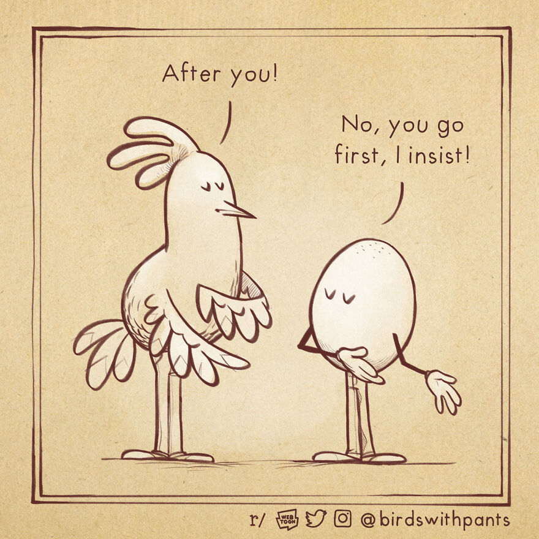
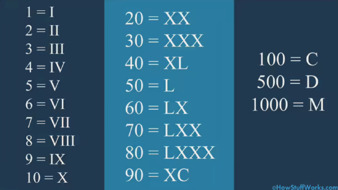

啰里啰唆周刊第67期：芙蓉镇

# 科技日常

## 1. 一款新的C++ IDE - edx
一款个人开发的软件，界面类似vscode的IDE（非套壳Electron），体积小巧（不到10M），绿色无污染，开箱即用。

能快速打开大型文件，轻松编辑有千万行内容的文本
支持C/C++，LUA，JavaScript，Java，D，HTML，XML，
CSS，CMake，JSON等格式的高亮显示
内建C/C++调试器。支持Win32/64及Linux程序的调试
内建lua脚本，用户可自由扩展功能
内建对MSVC，MSYS2/Mingw，clang，Intel oneAPI，
WSL，llvm-mingw等工具集的支持
C/C++支持基于clangd的语法提示，补全，跳转等基本操作

作者还细心地提供了GCC v13.1 + Binutils 2.40优化版 + GDB v13.1优化版 + CMake v2.26.3 + Ninja-Build v1.11.1 + clangd v16.0.2的整合包，体积不到60M。

[https://www.ed-x.cc/index.html](https://www.ed-x.cc/index.html)
## 2. Cosmopolitan-真正的一次编译，到处运行

Cosmopolitan Libc 使C语言实现像 Java 一样一次编写到处运行的特性，而且不需要 JVM 之类的虚拟机，代码是纯原生的。它可以在 Linux + Mac + Windows + FreeBSD + OpenBSD + NetBSD + BIOS 上执行，保持了C语言的高性能与小体积。

它不需要虚拟机，也不是像GoLang那样，分平台编译出不同平台的可执行文件来实现跨平台的。它就是真正意义的“一次编译，到处运行”

Cosmopolitan是怎么让同一个文件在不同的操作系统下都可以被识别并执行的呢？简单来说就是使用了一种叫APE的文件格式，然后在运行时将您你的程序转换为系统本地格式，并映射到内存中执行。

而APE的原理就是“将Windows Portable Executable文件编码为UNIX第六版shell脚本”。具体实现原理可以看此：[https://justine.lol/ape.html](https://justine.lol/ape.html)

作者用APE开发了不少软件，比如这个叫[redbean](https://redbean.dev/)的web server,一个文件通吃各种操作系统，不再需要区分操作系统。

[https://github.com/jart/cosmopolitan](https://github.com/jart/cosmopolitan)

## 3.emotext-中文文本情感分析
使用大连理工大学情感本体库,使用python实现。
大连理工情感词典（以下简称 DLUT）把情感分成了 7 大类（乐哀怒好惧恶惊），21 小类。

例如：
> 后悔也都没有用 还不如一切没有发生过 不过就是又少一个诗人 换一个人沉迷你的笑

分析结果是Emotion(PA=0.0, PE=0.0, PD=0.0, PH=0.0, PG=0.2428551306285703, PB=0.0, PK=0.0, NA=0.0, NB=0.0, NJ=0.41260819965515805, NH=0.175202571704109, PF=0.0, NI=0.0, NC=0.0, NG=0.0, NE=0.1693340980121628, ND=0.0, NN=0.0, NK=0.0, NL=0.0, PC=0.0)，获取到了 NJ、PG、NH、NE 的情感，即：失望，相信，内疚，和烦闷。

[https://github.com/murchinroom/emotext](https://github.com/murchinroom/emotext)

## 4.Zulip Server 7.1 发布，开源团队协作工具
Zulip Server 7.1 现已发布。Zulip 是一个开源团队协作工具，一款专为实时和异步对话而设计的现代团队聊天应用程序，支持快速搜索、拖放文件上传、图像预览、组私人消息、可听通知、错过电子邮件消息提醒与桌面应用等。

这是一个web程序，后端基于Python开发，官方提供免费cloud部署方案，提供5G存储空间。

当然，zulip也有套壳桌面端和手机端，基本实现了跨平台。

[https://github.com/zulip/zulip](https://github.com/zulip/zulip)

## 5.麦当劳发布新 GBC 游戏
快餐连锁店麦当劳发布了一款像素风格的复古游戏《Grimace's Birthday》，可以通过模拟器在手机或 PC 的浏览器上玩，也可以在任天堂的掌机 Game Boy Color 上玩。GBC 是 1998 年上市的掌机，C 代表彩色，它相对于 Game Boy 掌机的区别是使用了彩色屏幕，它在 2003 年停产。《Grimace's Birthday》的主角是紫色奶酪球 Grimace，玩家的任务是通过一个个关卡及时找到朋友吹灭蜡烛并沿途收集生日祝福。

它由新泽西的独立工作室 Krool Toys 开发。游戏组合了 2D 平台和滑板，它只有四个关卡和一个奖励关卡，有得分攻击和自由滑板模式，它是作为麦当劳的促销活动推出的。 

[https://grimacesbirthday.com/](https://grimacesbirthday.com/)

## 6.教你做个毛：《寄生绒毛》 开发技术分享
说是技术分享，其实就是把我平时的“开发日志”拿出来给大家看看，而且由于这个所谓的日志本来是我自己用来做总结记录的文字笔记，所以大部分内容看起来是不成系统不成体系的，有些甚至前言不搭后语（就我自己能看懂）。在这种情况下，我只能摘取其中比较能看的部分出来给有兴趣的朋友做参考。

还要说明的是，这段技术分享中的内容是《寄生绒毛》这个作品比较早期时的实验结果，后期做了很多调整和优化，这里只提供最基本的思路，同时，《寄生绒毛》中使用到的绒毛技术要比这段技术分享中所阐述的技术内容更加复杂，模块也更多。这段技术分享只为抛砖引玉（还有我想要的徽章），如果你也想做这么一个绒毛系统，还需付出更多努力。

- compute shader 离线构造绒毛网格
- vertex shader 模拟绒毛
- 绒毛的裁剪效果

[https://www.gcores.com/articles/167127](https://www.gcores.com/articles/167127)
# 读书与影视分享

## 1.低俗喜剧《电影43》
《电影43》是伊丽莎白·班克斯等11位导演执导的喜剧电影，艾玛·斯通、科洛·莫瑞兹、伊丽莎白·班克斯、安娜·法瑞丝、杰克·麦克布瑞尔、杰拉德·巴特勒、克里斯汀·贝尔出演，于2013年1月25日上映。该片中众多大明星们在分组短片中做出各种稀奇古怪的行为竭力搞笑。

影片于2014年3月，获得最差影片、最差导演、最差剧本。

《电影43》也是一部多人执导的，充满了大明星的拼盘类电影，《电影43》里的小故事却是有联系的，最后汇总成一条线。这些故事或是一味地搞笑，或是走冷幽默的路线；甚至还有的短片已经拿超级英雄开开涮了…

其实这就是一部低俗喜剧，纯图一乐。

> 就是一堆人自己攒了点段子拍着玩的。只不过加了几个大牌，大俗的东西，反而有了逼格。。。
就当是费玉清说黄段子吧。。。

## 2.1987年电影《芙蓉镇》
芙蓉镇讲述了位于湘、粤、桂三省交界处的芙蓉镇上，人称“芙蓉姐”的漂亮女人胡玉音在“四清运动”及“文化大革命”中的遭遇。

1963年，凭着热情周到的服务，胡玉音与丈夫桂桂经营的米豆腐摊子前渐渐成为早市上最热闹的一道风景，加上夫妻俩省吃俭用，手中积攒了一 笔数目可观的财富。镇党支书也是胡玉音干哥的黎满庚、粮站主任谷燕山及乡邻们都为他们高兴。当他们盖好新房准备日子更上一层楼时，迎上“四清运动”，一直嫉妒胡玉音的原国营饮食店经理、今县商业局科长李国香与二流子王秋赦联手，趁机将她定性为“反革命五类分子”中的“富农婆”，将之派去与原县文化馆馆长、今被人称作“秦癫子”的“右派”秦书田一起清扫大街，桂桂身亡。

1966年，大运动开始，世道的荒谬从不停调换角色的李国香与王秋赦两人身上便可窥见。一起扫街时，胡玉音将自己的悲惨遭遇归罪于秦书田，后者曾在她与桂桂成亲之时唱了后被认为反革命的贺喜歌、在她新房子建成之时写了后被认为反革命的贺喜联。对于胡玉音的怨恨，秦书田并不多做辩解，相反时常暗中将她帮助。慢慢地，两人生出感情，计划着成为一家人好好生活，但前路充满血风腥雨。而在他们最艰难时，谷燕山从没忘伸手一帮。

> 到如今看，依旧是一部牛逼闪闪的片子！刘晓庆美的不成活，男女间的情爱也自然真实不装逼。最后送给大家那句话：要像牲口一样活下去！别人践踏你，你不能也作贱自己。

> 《活着》《霸王别姬》《芙蓉镇》讲述的都是中国同一段沉痛的史诗。《活着》戏谑荒诞，《霸王别姬》撕心裂肺，《芙蓉镇》直接将人间描述成无间地狱。

> 片尾一幕。 “运动咯！运动咯！”疯了的王秋赦敲锣大喊，引发众人连连嘲笑。 谷燕山故意逗他：“运动咯？” 王秋赦连忙附和着，“是该运动了，该运动了！晚饭后集合！” 秦书田神色凝重且严峻：“世道不变，要是不防着点，他说的兴许是道理。” 原本嬉笑成一团的众人，脸刷的一下变得惊慌失措和失去了血色。 34年过去了，我也觉得好恐怖。 
# 图论

## 1.Bird with Pants

[instagram](https://www.instagram.com/birdswithpants/)|[twitter](https://twitter.com/birdswithpants)
## 2.Visualizing Annual Working Hours in OECD Countries

注：中华人民共和国属于OECD强化合作伙伴，非会员。

[https://www.visualcapitalist.com/annual-working-hours-in-countries-2023/](https://www.visualcapitalist.com/annual-working-hours-in-countries-2023/)
# 谈天说地

## 1.What Is a Weed?
Steve Brill’s first stop was the greenery behind the bike racks. Brill, who is known as Wildman Steve, picked up a weed with heart-shaped seed pods and a small, four-petalled white flower. About thirty of us were gathered for a three-hour foraging tour through Prospect Park, in Brooklyn. The plant was shepherd’s purse, a name that references the seed pods’ resemblance to the containers shepherds used to make from the bladders of sheep. “It’s in the mustard family,” Brill said. “Most all of the flowers in the mustard family are four petals in the shape of a cross.” He encouraged everyone to take a bite, and to tell him what vegetable it tasted like. Someone asked whether we should worry about pesticides. “Don’t worry, they don’t have the money for pesticides,” Brill responded. “And, anyhow, they’re pretty good at Prospect Park. In Central Park—don’t eat anything there.” He was exaggerating; he’s been doing foraging tours off and on in Central Park for some forty years, and was once even arrested there, for eating plants, after which he was brought on David Letterman’s show to make a foraged salad.

[https://www.newyorker.com/news/our-local-correspondents/what-is-a-weed](https://www.newyorker.com/news/our-local-correspondents/what-is-a-weed)
## 2.阶层旅行者
读到描述“凤凰男”“凤凰女”的一个学术名词——“阶层旅行者”（class traveller）。

对于通过教育实现阶层向上流动的人来说，阶层跨越当然带来了喜悦，但也伴随着一些代价和痛苦。
在中国，他们经常被称为“凤凰男”或“凤凰女”，意思是“山窝窝里飞出了金凤凰”。在西方研究里，这样的人则被称为“阶层旅行者”（class traveller）。

阶层旅行者通常有一些共同特质：三重羞耻感，对家庭的愧疚和回报，对贤能主义的笃信和幻灭，缺乏文化归属感。

①三重羞耻感：
他们面对更高阶层的机构和社会时，无法自如应对，经常难以融入，自卑尴尬，这是第一重羞耻感；
他们还会因家人、朋友的“不恰当”的言行举止感到羞耻，因为家人朋友同样难以融入，这是第二重羞耻感；
他们又深知家人为自己做出的牺牲奉献，因此对“自己嫌弃家人”这件事，感到第三重羞耻感。

ref:[https://weibo.com/u/1783475181](https://weibo.com/u/1783475181)

## 3.蚕豆叶酒糟
最早的几期提到过蚕豆，蚕豆浑身是宝，除了果实，花可以吃外，茎叶都有大用。晒干的茎叶磨碎以后就是豆糠，相比稻壳磨碎后的米糠，豆糠虽然品相不好，但是来源广泛成本更低，是很好的🐖饲料。比起豆粕来，豆糠得成本低多了。

而新鲜的蚕豆茎叶，则是另外一种饲料的绝佳原材料，那就是蚕豆叶酒糟。

蚕豆叶酒糟的做法很简单，就是摘下新鲜的蚕豆茎叶，拌上民间制作米酒的酒曲，搅拌均匀后放置于汽油桶中，密封三四天。酒曲是用来糖化发酵的，但与酵母菌的作用不同，酒曲是将谷物中淀粉糖化，不同酒曲能起到不同的效果。酒曲是酒的灵魂，但是对于制作饲料而言，要求就不是很严格了，可以自己做，也可以购买几毛钱一包的制成品。

经过三四天的发酵后，蚕豆叶在酒曲的作用下，淀粉转化为糖和酒精，成了猪的绝佳饲料，对改善胃口和催肥有很好的效果。一旦饲料不再密封，饱含糖分和水分的饲料会立马吸引果蝇来产卵，再过三四天，饲料中就会出生大量的果蝇幼虫。果蝇幼虫虽然是蛆，但是比起厕所里的蛆，要干净和健康多了。以前电视节目里有用鸡蛋养果蝇的，并且现炒现吃。比起鸡蛋，蚕豆叶养果蝇的成本就低多了。

这时的果蝇幼虫，喂鸡是极好的，喂猪也是可以的。说到果蝇，传统的民间酱油酿造也是特别容易生蛆的，清洗不及时的酱缸和地面特别容易招惹果蝇，虽然果蝇对身体健康影响不大，毕竟现代人很喜欢吃的杨梅特别容易带果蝇，很多人都是一口闷。说到酱油和果蝇，有一个典故，据说某个喜欢吃红烧肉的大人物，改进了红烧肉的做法，不使用酱油提色，就是因为自家做过酱油，有了阴影。

如果只是喂鸡，民间还有更省事的，稻草剪断，埋于地下，每日泼淘米水，一周过后，挖出稻草，即可得到大量小虫。比起单纯吃粮食和草叶，这种低廉地获取蛋白质得方法更能有效利用资源。

顺便提下，云南有种在外地人看来较“凶残”的吃法，蚕豆芽。黄豆，绿豆，黑豆，蚕豆，只要是豆就能做豆芽菜，即使不是豆子，花生芽也很受欢迎。不过蚕豆芽一般没有黄豆芽那么长，让其长至一厘米就可以了，这样能让干蚕豆吃出鲜蚕豆的味道来。没吃过的不妨一试。

## 4.如何阅读罗马数字
曾经看到某物上的XVI或XCV标签而感到非常困惑吗？你可能并不孤单，因为如今罗马数字系统的教学和使用越来越少。

近几个世纪以来，几乎全世界都已过渡到现代数字系统(也称为阿拉伯数字或印度-阿拉伯数字)，该系统使用10个符号(数字0至9)来表示所有其他数字。然而，在此之前，罗马人创造了主要的数字系统之一。与许多其他古代系统不同，罗马数字至今仍在使用，尽管范围有限。

如果较大的数字后面跟着较小的数字，只需将两者相加。例如，XI等于11，因为X是10，I是1。所以，10+1=11。

然而，如果较小的数字在较大的数字之前，就减去它。例如，CD是400，因为C是100，D是500。由于较小的数字在前，所以减去它：500-100=400。

为了防止数字失控，罗马人决定同一个数字不能连续使用超过三次。

想知道为什么相对现代的西方赛事超级碗会使用罗马数字吗？事实证明，这其中有一些方法。联盟开始使用罗马数字，因为超级碗是在新历年开始后进行的，但却是上一年赛季开始的冠军比赛。通过使用罗马数字，人们可以更容易地说某个球队赢得了超级碗XL，或者类似的比赛，而不必提及年份。

[https://science.howstuffworks.com/math-concepts/roman-numerals.htm](https://science.howstuffworks.com/math-concepts/roman-numerals.htm)
# 一句话快讯

1.欧盟反垄断官员将批准美国芯片制造商 Broadcom（博通）以 610 亿美元收购云计算和虚拟化技术公司 VMware。这是有史以来最大的技术收购之一，仅次于戴尔 670 亿美元的 EMC 收购案和微软 690 亿美元的暴雪收购提案。

2.美国国务卿布林肯在星期天（6月18日）早上抵达中国北京，展开两天访华之行。

3.当地时间6月18日上午，由OceanGate建造并拥有的“泰坦号”潜水器在加拿大东南部海岸失联。该潜水器共载5人（1名驾驶员和4名乘客），下潜大约1小时45分钟后失去联系，后被证实乘员全部遇难。

4.当地时间6月19日下午，国务院总理李强在柏林同德国工商界代表座谈交流。李强指出，不合作才是最大的风险，不发展才是最大的不安全 。 

5.俄罗斯媒体当地时间24日晚报道，瓦格纳组织创始人普里戈任接受白俄罗斯总统卢卡申科有关停止该组织在俄境内行动并采取进一步措施缓和紧张局势的建议，俄总统普京已经保证普里戈任能够前往白俄罗斯并将撤销其刑事立案。

6.日本预计于7月将福岛核电厂的污水排入大海，东亚地区国家反对声连连，中国社媒平台更掀起抵制日本化妆品的行动，日本官员和媒体反指中国核电厂的废水辐射物质含量比福岛高6.5倍。 

# 联系方式

啰里啰唆是一份针对互联网和生活爱好者的数字杂志，旨在发现和分享一切有趣的东西。话题不固定，每期大约十五分钟阅读量，暂定每周四发布。部分内容来自互联网采编，如果为有来源的转载，均会注明转载地址或保留水印。

这是一个关注人文和科技的newsletter。

使用方法建议或素材提供

频道：notonlyshare

邮箱：auokyob@outlook.com

github地址：[https://github.com/iminto/luoliluosuo-weekly](https://github.com/iminto/luoliluosuo-weekly)